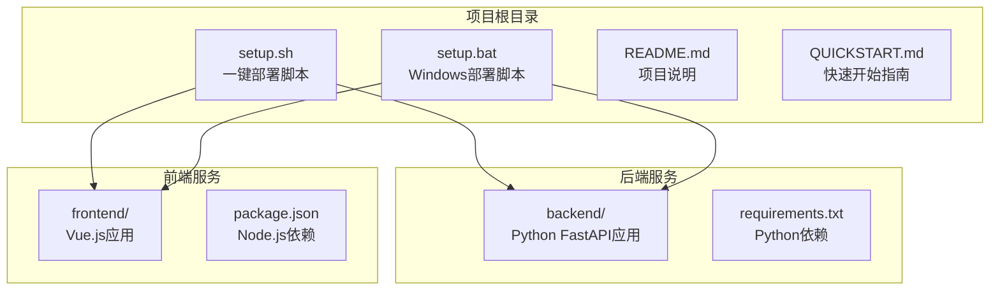
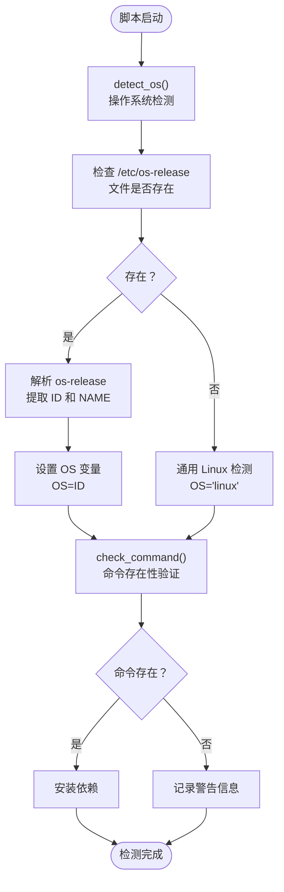
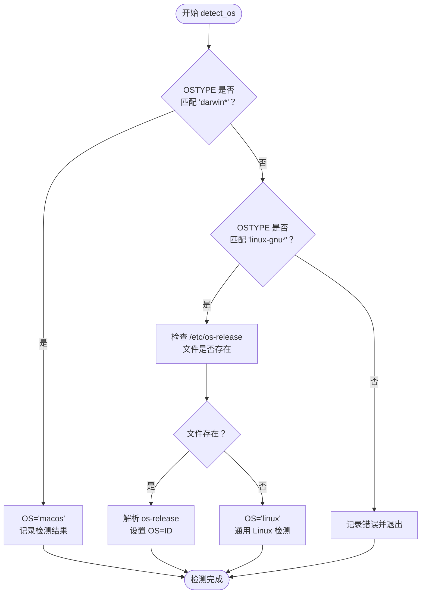
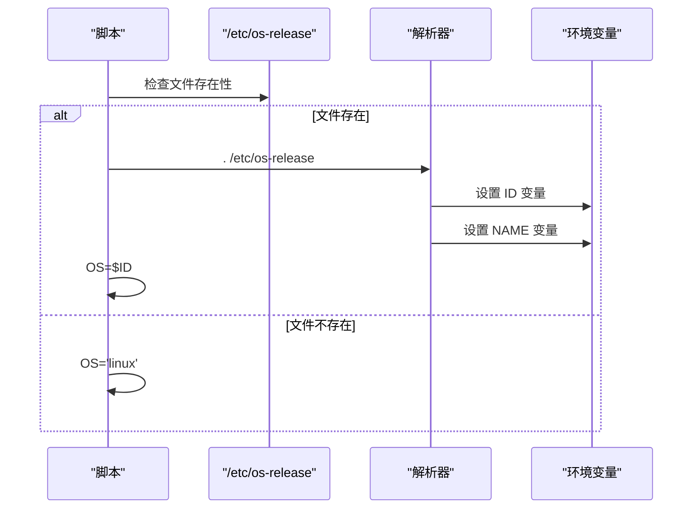
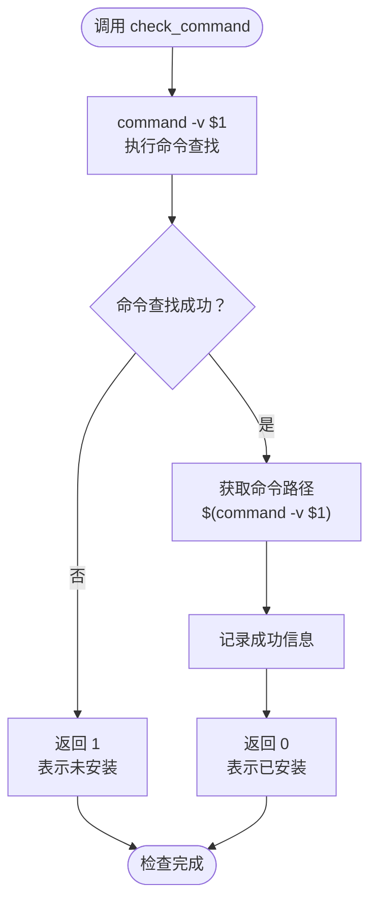

# 环境检测机制

<cite>
**本文档引用的文件**
- [setup.sh](file://setup.sh)
- [setup.bat](file://setup.bat)
- [README.md](file://README.md)
- [QUICKSTART.md](file://QUICKSTART.md)
</cite>

## 目录
1. [引言](#引言)
2. [项目结构](#项目结构)
3. [核心组件](#核心组件)
4. [架构概览](#架构概览)
5. [详细组件分析](#详细组件分析)
6. [依赖关系分析](#依赖关系分析)
7. [性能考虑](#性能考虑)
8. [故障排除指南](#故障排除指南)
9. [结论](#结论)

## 引言

本文档深入分析了 Universal BI 项目中 setup.sh 脚本的环境检测机制，重点阐述了操作系统检测函数如何通过 OSTYPE 变量识别 macOS 和各类 Linux 发行版，以及命令存在性验证函数的工作原理。该脚本提供了跨平台的环境检测和依赖管理功能，支持 macOS、Ubuntu、Debian、CentOS 等主流操作系统。

## 项目结构

该项目采用前后端分离的架构设计，包含完整的部署脚本支持：



**图表来源**
- [setup.sh](file://setup.sh#L1-L318)
- [setup.bat](file://setup.bat#L1-L213)

**章节来源**
- [setup.sh](file://setup.sh#L1-L318)
- [setup.bat](file://setup.bat#L1-L213)

## 核心组件

### 操作系统检测组件

setup.sh 脚本的核心功能之一是通过 OSTYPE 环境变量进行操作系统检测。该机制提供了对多种操作系统的支持：

- **macOS 检测**：通过 `OSTYPE` 变量匹配 "darwin*" 模式
- **Linux 检测**：通过 `OSTYPE` 变量匹配 "linux-gnu*" 模式
- **降级处理**：当 `/etc/os-release` 文件不存在时，回退到通用 Linux 检测

### 命令存在性验证组件

check_command 函数提供了跨平台的命令存在性检查功能，使用 `command -v` 命令进行验证，确保在不同 shell 环境下的兼容性。

**章节来源**
- [setup.sh](file://setup.sh#L51-L80)

## 架构概览

环境检测机制的整体架构如下：



**图表来源**
- [setup.sh](file://setup.sh#L51-L80)

## 详细组件分析

### detect_os 函数深度分析

detect_os 函数是整个环境检测机制的核心，其工作流程如下：

#### macOS 检测逻辑



**图表来源**
- [setup.sh](file://setup.sh#L52-L69)

#### Linux 发行版识别策略

当检测到 Linux 系统时，脚本采用两阶段识别策略：

1. **第一阶段**：检查 `/etc/os-release` 文件是否存在
2. **第二阶段**：如果存在则解析文件内容，提取 `ID` 和 `NAME` 变量
3. **第三阶段**：如果不存在，则回退到通用 Linux 检测

#### /etc/os-release 文件解析机制



**图表来源**
- [setup.sh](file://setup.sh#L57-L64)

**章节来源**
- [setup.sh](file://setup.sh#L51-L69)

### check_command 函数工作机制

check_command 函数提供了统一的命令存在性验证接口：

#### 核心验证逻辑



**图表来源**
- [setup.sh](file://setup.sh#L72-L80)

#### 跨平台兼容性处理

check_command 函数使用 `command -v` 命令进行验证，这种实现具有以下优势：

- **Shell 兼容性**：`command` 是 POSIX 标准命令，在各种 shell 环境中都可用
- **路径解析**：`command -v` 返回命令的完整路径，便于后续使用
- **错误处理**：使用 `&> /dev/null` 重定向标准错误输出，避免干扰日志显示

**章节来源**
- [setup.sh](file://setup.sh#L71-L80)

### 包管理器集成策略

根据不同操作系统，脚本集成了相应的包管理器：

#### macOS 支持

- **Homebrew**：使用 `brew install` 命令安装软件包
- **版本指定**：明确指定 Python 3.10 和 Node.js 18 版本

#### Linux 发行版支持

- **Ubuntu/Debian**：使用 `apt-get` 包管理器
- **CentOS/RHEL**：使用 `yum` 包管理器
- **更新机制**：在安装前执行包索引更新

**章节来源**
- [setup.sh](file://setup.sh#L91-L98)
- [setup.sh](file://setup.sh#L111-L119)

## 依赖关系分析

### 环境检测依赖链

```mermaid
graph TD
subgraph "环境检测层"
DetectOS[detect_os)<br/>操作系统检测
CheckCommand[check_command)<br/>命令存在性验证
end
subgraph "系统组件"
OSTYPE[OSTYPE 环境变量]
OSRelease[/etc/os-release<br/>系统信息文件]
CommandV[command -v<br/>命令查找工具]
end
subgraph "包管理器"
Brew[Homebrew<br/>macOS包管理器]
Apt[Aptitude<br/>Ubuntu/Debian包管理器]
Yum[YUM<br/>CentOS/RHEL包管理器]
end
DetectOS --> OSTYPE
DetectOS --> OSRelease
CheckCommand --> CommandV
DetectOS --> Brew
DetectOS --> Apt
DetectOS --> Yum
```

**图表来源**
- [setup.sh](file://setup.sh#L51-L80)

### 跨平台兼容性矩阵

| 操作系统 | OSTYPE 值 | /etc/os-release | 包管理器 | 版本检测 |
|----------|-----------|----------------|----------|----------|
| macOS | darwin* | 无 | Homebrew | brew --version |
| Ubuntu | linux-gnu* | 存在 | apt-get | apt --version |
| Debian | linux-gnu* | 存在 | apt-get | apt --version |
| CentOS | linux-gnu* | 存在 | yum | yum --version |
| RHEL | linux-gnu* | 存在 | yum | yum --version |

**章节来源**
- [setup.sh](file://setup.sh#L52-L64)

## 性能考虑

### 检测效率优化

1. **早期退出机制**：使用 `set -e` 确保检测失败时立即终止
2. **最小化系统调用**：仅在必要时检查 `/etc/os-release` 文件
3. **缓存检测结果**：将检测结果存储在全局变量中供后续使用

### 内存使用优化

- **流式输出**：使用 `cat << EOF` 进行大文本输出，避免额外的文件处理开销
- **条件加载**：仅在需要时解析系统配置文件

## 故障排除指南

### 常见识别问题及解决方案

#### OSTYPE 变量异常

**问题描述**：`OSTYPE` 变量值不符合预期格式

**诊断方法**：
```bash
echo "当前 OSTYPE 值: $OSTYPE"
```

**解决方案**：
- 检查 shell 环境变量设置
- 验证系统是否正确识别操作系统类型

#### /etc/os-release 文件缺失

**问题描述**：系统缺少标准的 `/etc/os-release` 文件

**诊断方法**：
```bash
ls -la /etc/os-release
file /etc/os-release
```

**降级处理策略**：
脚本已内置降级处理机制，当文件不存在时：
1. 设置 `OS='linux'`
2. 使用通用 Linux 检测逻辑
3. 通过包管理器进行软件安装

#### 命令查找失败

**问题描述**：`command -v` 无法找到指定命令

**诊断方法**：
```bash
which $COMMAND_NAME
whereis $COMMAND_NAME
echo $PATH
```

**解决方案**：
- 检查 PATH 环境变量配置
- 验证包管理器是否正确安装
- 确认用户权限是否足够

#### 包管理器安装失败

**问题描述**：包管理器命令执行失败

**诊断方法**：
```bash
# 检查网络连接
ping packages.linuxmint.com

# 检查包管理器状态
sudo apt-get update  # Ubuntu/Debian
sudo yum clean all   # CentOS/RHEL
```

**解决方案**：
- 检查网络连接和代理设置
- 更新包管理器索引
- 验证防火墙和安全软件设置

### 调试方法

#### 启用详细日志

```bash
# 设置调试模式
export DEBUG=true
bash setup.sh dev

# 或者直接运行
set -x
bash setup.sh dev
```

#### 环境变量检查

```bash
# 检查关键环境变量
echo "OSTYPE: $OSTYPE"
echo "PATH: $PATH"
echo "HOME: $HOME"
echo "USER: $USER"
```

#### 系统信息收集

```bash
# 收集系统信息
uname -a
cat /etc/os-release
whoami
id
```

**章节来源**
- [setup.sh](file://setup.sh#L51-L80)

## 结论

Universal BI 项目的环境检测机制展现了优秀的跨平台兼容性和健壮性设计。通过 OSTYPE 变量检测和 /etc/os-release 文件解析相结合的方式，脚本能够准确识别各种操作系统环境，并提供相应的依赖管理策略。

主要特点包括：

1. **多层次检测机制**：从 OSTYPE 变量到具体发行版信息的完整检测链
2. **优雅降级策略**：当标准文件缺失时的回退处理
3. **跨平台兼容性**：统一的命令存在性验证接口
4. **详细的错误处理**：清晰的错误信息和故障排除指导

这套环境检测机制为项目的自动化部署提供了坚实的基础，确保用户能够在不同的操作系统环境中获得一致的部署体验。