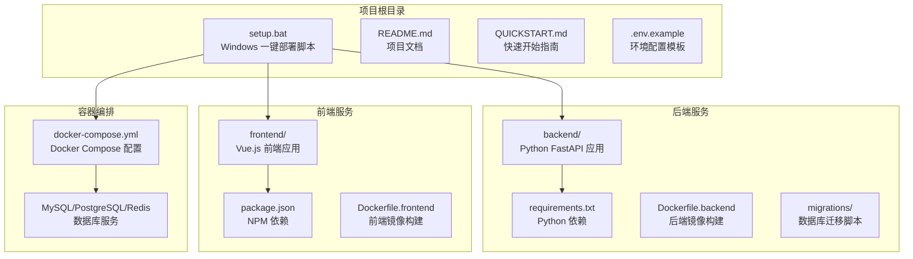
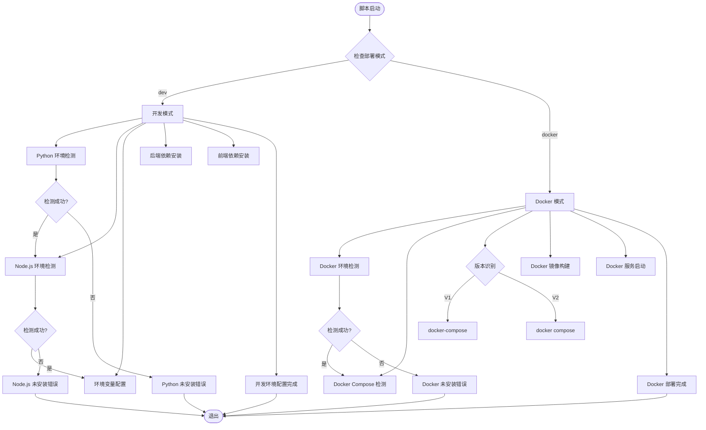
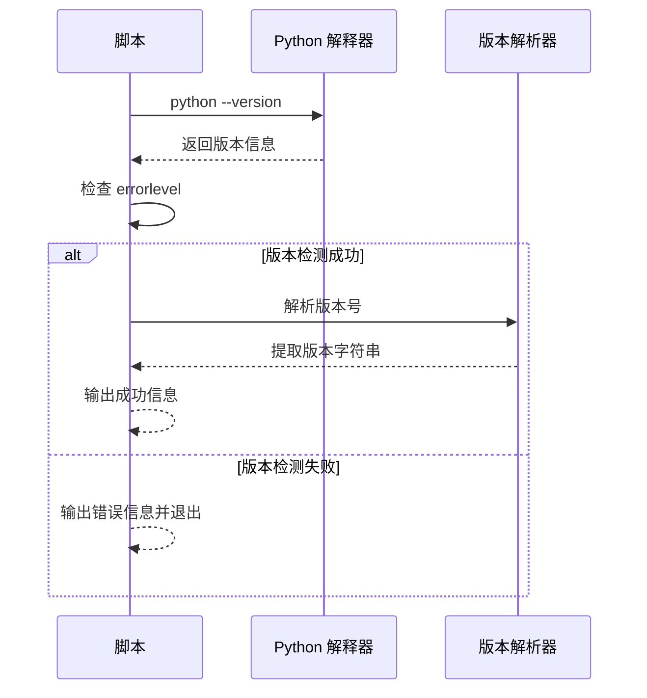
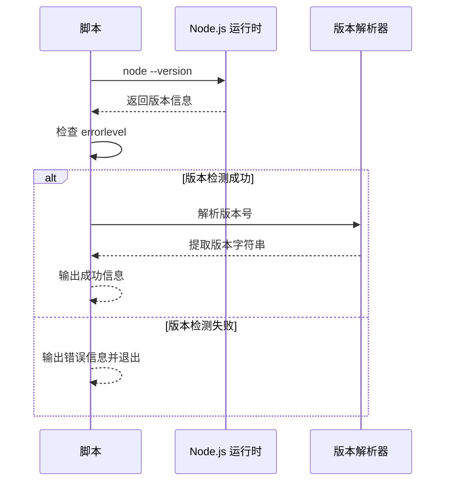
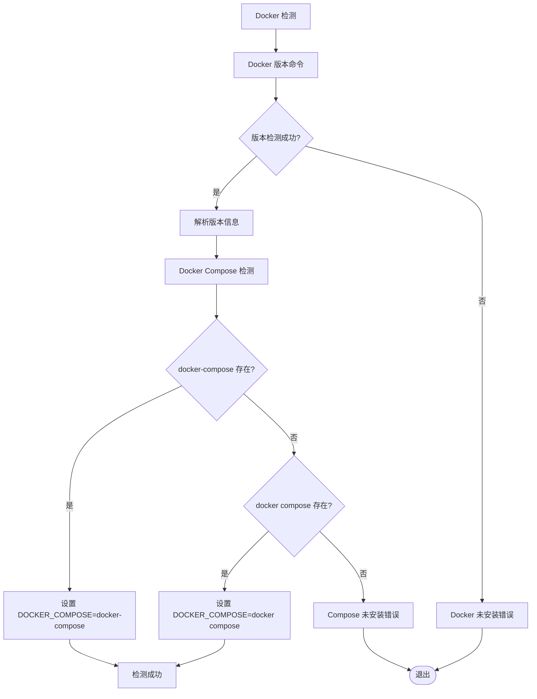
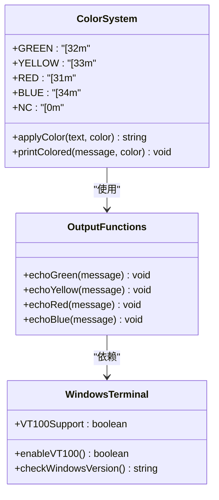
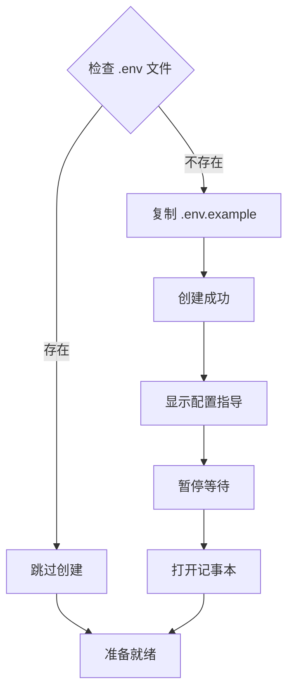
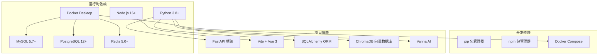
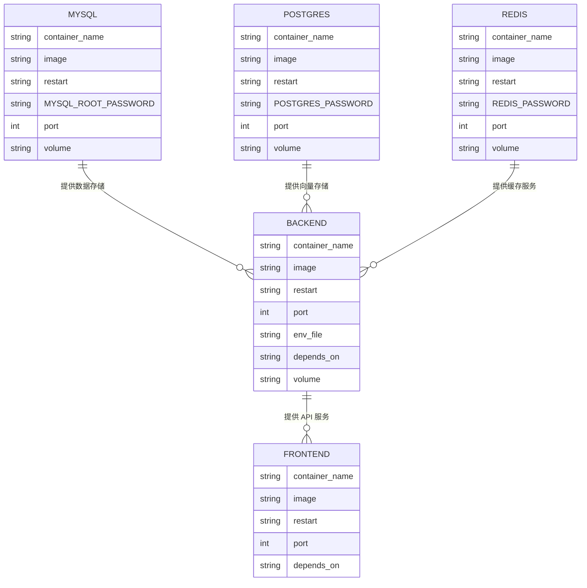

# Windows 环境检测机制

<cite>
**本文档引用的文件**
- [setup.bat](file://setup.bat)
- [README.md](file://README.md)
- [QUICKSTART.md](file://QUICKSTART.md)
- [.env.example](file://.env.example)
- [docker-compose.yml](file://docker-compose.yml)
- [requirements.txt](file://requirements.txt)
- [package.json](file://package.json)
</cite>

## 目录
1. [引言](#引言)
2. [项目结构](#项目结构)
3. [核心组件](#核心组件)
4. [架构概览](#架构概览)
5. [详细组件分析](#详细组件分析)
6. [依赖关系分析](#依赖关系分析)
7. [性能考虑](#性能考虑)
8. [故障排除指南](#故障排除指南)
9. [结论](#结论)

## 引言

Universal BI 是一个基于 AI 的智能数据分析平台，提供了完整的 Windows 环境检测机制。本文档深入解析 setup.bat 脚本中 Windows 环境检测的实现逻辑，重点关注 Python 和 Node.js 的安装状态检测、版本号提取与验证方式，以及 Docker Desktop 服务检测和 Docker Compose 版本识别机制。

该脚本采用批处理语言编写，实现了全面的环境检查、依赖管理和部署自动化功能，为用户提供了一键部署的便捷体验。

## 项目结构

该项目采用前后端分离的架构设计，包含完整的开发和部署工具链：

**图表来源**
- [setup.bat](file://setup.bat#L1-L213)
- [docker-compose.yml](file://docker-compose.yml#L1-L141)

**章节来源**
- [setup.bat](file://setup.bat#L1-L213)
- [README.md](file://README.md#L1-L507)

## 核心组件

### 环境检测组件

setup.bat 脚本的核心功能是环境检测和依赖管理，主要包含以下组件：

1. **Python 环境检测**：验证 Python 3.8+ 是否正确安装
2. **Node.js 环境检测**：验证 Node.js 16+ 是否正确安装  
3. **Docker 环境检测**：检查 Docker Desktop 服务状态
4. **Docker Compose 版本检测**：区分 V1 (docker-compose) 和 V2 (docker compose) 命令
5. **ANSI 颜色输出**：在 Windows 终端中实现彩色输出

### 部署模式组件

脚本支持两种部署模式：
- **开发模式**：本地安装依赖，手动配置环境
- **Docker 模式**：容器化部署，自动管理依赖

**章节来源**
- [setup.bat](file://setup.bat#L55-L169)

## 架构概览

**图表来源**
- [setup.bat](file://setup.bat#L29-L47)
- [setup.bat](file://setup.bat#L52-L139)
- [setup.bat](file://setup.bat#L144-L212)

## 详细组件分析

### Python 环境检测机制

Python 环境检测是通过直接调用 `python --version` 命令来实现的：

**图表来源**
- [setup.bat](file://setup.bat#L55-L63)

检测流程特点：
- 使用 `>nul 2>&1` 重定向输出，避免显示版本信息
- 通过 `errorlevel` 检测命令执行状态
- 使用 `for /f "tokens=2"` 提取版本号中的第二段作为版本信息

**章节来源**
- [setup.bat](file://setup.bat#L55-L63)

### Node.js 环境检测机制

Node.js 环境检测与 Python 检测逻辑相同：

**图表来源**
- [setup.bat](file://setup.bat#L65-L73)

检测流程特点：
- 直接调用 `node --version` 命令
- 使用 `for /f` 循环提取版本信息
- 错误处理与 Python 检测一致

**章节来源**
- [setup.bat](file://setup.bat#L65-L73)

### Docker 环境检测机制

Docker 环境检测采用了更复杂的逻辑来处理不同版本的 Docker Compose：

**图表来源**
- [setup.bat](file://setup.bat#L147-L169)

检测逻辑特点：
- 首先检查 Docker Desktop 服务状态
- 通过 `docker-compose --version` 和 `docker compose version` 区分版本
- 将检测到的命令存储在 `DOCKER_COMPOSE` 环境变量中

**章节来源**
- [setup.bat](file://setup.bat#L147-L169)

### ANSI 颜色输出机制

setup.bat 脚本实现了 Windows 10+ 的 ANSI 颜色支持：

**图表来源**
- [setup.bat](file://setup.bat#L11-L16)
- [setup.bat](file://setup.bat#L56-L73)

颜色系统特点：
- 定义了绿色、黄色、红色、蓝色和普通颜色代码
- 使用 `echo %COLOR%[MESSAGE]%NC%` 的格式输出彩色文本
- 适用于 Windows 10 及以上版本的 VT100 支持

**章节来源**
- [setup.bat](file://setup.bat#L11-L16)
- [setup.bat](file://setup.bat#L56-L73)

### 环境变量配置机制

脚本实现了智能的 .env 文件管理：

**图表来源**
- [setup.bat](file://setup.bat#L75-L89)

配置流程特点：
- 自动检测 .env 文件是否存在
- 不存在时自动复制模板文件
- 提供详细的配置指导和自动编辑功能

**章节来源**
- [setup.bat](file://setup.bat#L75-L89)

## 依赖关系分析

### 环境依赖关系

**图表来源**
- [requirements.txt](file://requirements.txt#L1-L15)
- [package.json](file://package.json#L1-L8)
- [README.md](file://README.md#L49-L55)

### Docker 服务依赖

**图表来源**
- [docker-compose.yml](file://docker-compose.yml#L7-L121)

**章节来源**
- [docker-compose.yml](file://docker-compose.yml#L1-L141)

## 性能考虑

### 环境检测性能

setup.bat 脚本的环境检测具有以下性能特征：

1. **命令执行效率**：每个外部命令调用都会产生进程开销
2. **版本解析复杂度**：O(n) 时间复杂度，其中 n 为版本字符串长度
3. **文件操作开销**：.env 文件复制和编辑操作
4. **网络依赖**：Docker 镜像拉取可能影响整体性能

### 内存使用

- 批处理脚本内存占用相对较小
- 版本字符串解析使用临时变量存储
- 颜色代码字符串常量存储在内存中

## 故障排除指南

### Python 环境问题

**问题症状**：
- 脚本提示 Python 未安装
- 版本检测失败

**诊断步骤**：
1. 在命令提示符中运行 `python --version`
2. 检查 PATH 环境变量是否包含 Python 路径
3. 验证 Python 安装完整性

**解决方案**：
- 重新安装 Python 3.8 或更高版本
- 确保安装时勾选 "Add to PATH" 选项
- 手动添加 Python 到系统 PATH

### Node.js 环境问题

**问题症状**：
- 脚本提示 Node.js 未安装
- npm 依赖安装失败

**诊断步骤**：
1. 运行 `node --version` 和 `npm --version`
2. 检查 Node.js 安装目录
3. 验证 npm 缓存状态

**解决方案**：
- 安装 Node.js 16 或更高版本
- 清理 npm 缓存：`npm cache clean --force`
- 更新 npm：`npm install -g npm@latest`

### Docker 环境问题

**问题症状**：
- Docker 未安装错误
- Docker Compose 版本识别失败

**诊断步骤**：
1. 运行 `docker --version` 和 `docker info`
2. 检查 Docker Desktop 服务状态
3. 验证 Docker Compose 命令可用性

**解决方案**：
- 安装 Docker Desktop
- 重启 Docker 服务
- 安装 Docker Compose（V2）

### PATH 环境变量配置

**手动添加 PATH 的步骤**：

1. **查找安装路径**：
   - Python：通常在 `C:\Python39\` 或 `C:\Users\[用户名]\AppData\Local\Programs\Python\Python39\`
   - Node.js：通常在 `C:\Program Files\nodejs\`
   - Docker：通常在 `C:\Program Files\Docker\Docker\`

2. **添加到系统 PATH**：
   - 右键"此电脑" → 属性 → 高级系统设置
   - 点击"环境变量"
   - 在"系统变量"中找到"Path"，点击"编辑"
   - 添加上述路径到列表中

3. **验证配置**：
   - 打开新的命令提示符窗口
   - 运行 `python --version` 和 `node --version`
   - 确认命令可以正常执行

**章节来源**
- [setup.bat](file://setup.bat#L58-L70)
- [setup.bat](file://setup.bat#L150-L152)

## 结论

setup.bat 脚本展现了优秀的 Windows 环境检测和管理系统，具有以下特点：

### 技术优势

1. **全面的环境检测**：覆盖 Python、Node.js、Docker 和 Docker Compose 的完整检测
2. **智能版本识别**：能够区分不同版本的 Docker Compose 命令
3. **友好的用户界面**：彩色输出和详细的错误提示
4. **灵活的部署模式**：支持开发模式和 Docker 模式的无缝切换

### 实现特色

1. **ANSI 颜色支持**：在 Windows 10+ 上实现彩色输出
2. **智能环境变量管理**：自动创建和配置 .env 文件
3. **错误处理机制**：完善的错误检测和用户指导
4. **跨平台兼容性**：针对 Windows 环境的专门优化

### 最佳实践建议

1. **环境准备**：确保所有依赖软件正确安装并配置 PATH
2. **权限管理**：以管理员权限运行脚本以获得完整功能
3. **网络配置**：确保网络连接稳定以便下载依赖
4. **磁盘空间**：预留足够的磁盘空间用于 Docker 镜像和数据卷

该脚本为 Universal BI 项目提供了可靠的 Windows 部署解决方案，简化了复杂的环境配置过程，为用户提供了良好的开发和部署体验。