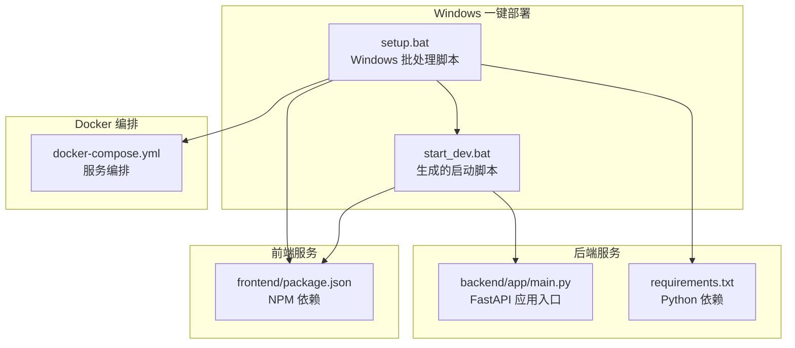
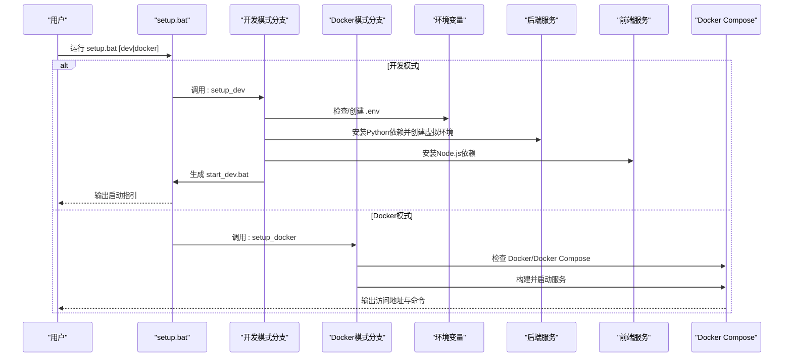
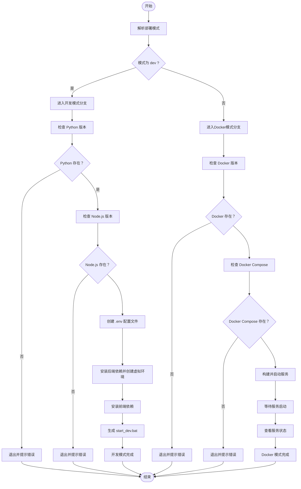
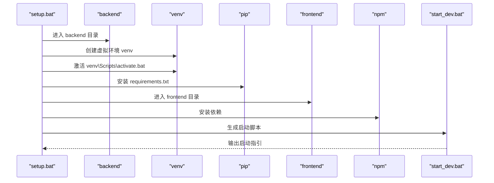
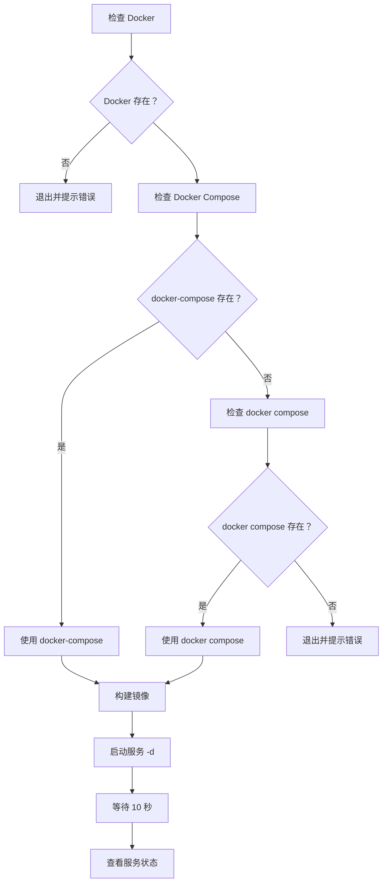
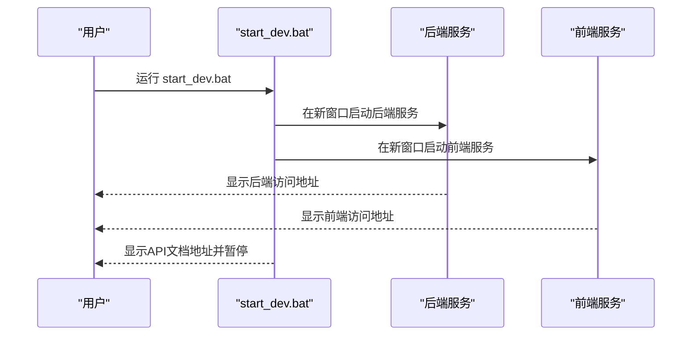
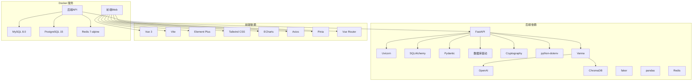

# Windows 部署指南

<cite>
**本文引用的文件**
- [setup.bat](file://setup.bat)
- [docker-compose.yml](file://docker-compose.yml)
- [QUICKSTART.md](file://QUICKSTART.md)
- [README.md](file://README.md)
- [.env.example](file://.env.example)
- [requirements.txt](file://requirements.txt)
- [package.json](file://package.json)
- [backend/app/main.py](file://backend/app/main.py)
- [frontend/package.json](file://frontend/package.json)
- [setup.sh](file://setup.sh)
</cite>

## 目录
1. [简介](#简介)
2. [项目结构](#项目结构)
3. [核心组件](#核心组件)
4. [架构总览](#架构总览)
5. [详细组件分析](#详细组件分析)
6. [依赖关系分析](#依赖关系分析)
7. [性能考虑](#性能考虑)
8. [故障排除指南](#故障排除指南)
9. [结论](#结论)
10. [附录](#附录)

## 简介
本指南面向Windows平台用户，提供一键部署的完整说明，重点解析Windows批处理脚本setup.bat的实现机制。内容涵盖：
- Windows环境下的特殊处理：颜色输出的ANSI转义序列兼容性、错误处理（errorlevel检测）、路径分隔符适配
- 开发模式下Python和Node.js的版本检查与激活流程，特别是虚拟环境（venv）在Windows下的激活命令（call venv\Scripts\activate.bat）和后台服务启动机制（start命令）
- Docker模式对Docker Desktop的依赖性检查，以及Docker Compose在Windows下的双重检测逻辑（docker-compose vs docker compose）
- 启动脚本（start_dev.bat）的生成过程，包括多窗口服务启动的cmd /k命令使用
- Windows特有的常见问题解决方案，如权限问题、路径空格处理、防火墙配置等

## 项目结构
项目采用前后端分离架构，包含后端（FastAPI + Python）、前端（Vue 3 + Vite）、数据库（MySQL/PostgreSQL）、缓存（Redis）及向量数据库（ChromaDB）等服务。Docker Compose负责编排这些服务，形成完整的开发与生产环境。

**图表来源**
- [setup.bat](file://setup.bat#L1-L213)
- [docker-compose.yml](file://docker-compose.yml#L1-L141)
- [backend/app/main.py](file://backend/app/main.py#L1-L35)
- [frontend/package.json](file://frontend/package.json#L1-L40)

**章节来源**
- [setup.bat](file://setup.bat#L1-L213)
- [docker-compose.yml](file://docker-compose.yml#L1-L141)
- [README.md](file://README.md#L1-L507)

## 核心组件
- Windows一键部署脚本：负责环境检查、依赖安装、配置生成与服务启动脚本生成
- Docker编排文件：定义MySQL、PostgreSQL、Redis、后端API、前端Web等服务
- 启动脚本生成器：在开发模式下生成start_dev.bat，实现多窗口并行启动后端与前端
- 环境变量模板：提供API Key、数据库连接、缓存配置等关键参数

**章节来源**
- [setup.bat](file://setup.bat#L1-L213)
- [docker-compose.yml](file://docker-compose.yml#L1-L141)
- [.env.example](file://.env.example#L1-L72)

## 架构总览
Windows一键部署的整体流程如下：
- 解析部署模式（dev或docker）
- 开发模式：检查Python/Node.js版本，创建并激活虚拟环境，安装依赖，生成start_dev.bat
- Docker模式：检查Docker与Docker Compose，构建镜像并启动服务，显示访问地址与常用命令

**图表来源**
- [setup.bat](file://setup.bat#L29-L47)
- [setup.bat](file://setup.bat#L52-L139)
- [setup.bat](file://setup.bat#L144-L212)

## 详细组件分析

### Windows批处理脚本（setup.bat）实现机制
- 颜色输出兼容性：使用Windows 10+支持的ANSI转义序列，通过设置变量模拟颜色输出，避免直接调用color命令导致的兼容性问题
- 错误处理：广泛使用errorlevel检测，任何关键步骤失败都会立即退出并提示错误信息
- 路径分隔符适配：统一使用反斜杠（\），符合Windows路径规范
- 模式选择：支持dev与docker两种模式，默认为dev

**图表来源**
- [setup.bat](file://setup.bat#L29-L47)
- [setup.bat](file://setup.bat#L52-L139)
- [setup.bat](file://setup.bat#L144-L212)

**章节来源**
- [setup.bat](file://setup.bat#L1-L213)

### 开发模式（dev）详解
- Python版本检查：通过python --version检测，若不存在则提示安装地址并退出
- Node.js版本检查：通过node --version检测，若不存在则提示安装地址并退出
- 虚拟环境（venv）激活：使用call venv\Scripts\activate.bat激活，确保pip与uvicorn在正确的环境中执行
- 后端依赖安装：在backend目录下创建venv，激活后使用requirements.txt安装依赖
- 前端依赖安装：在frontend目录下使用npm安装依赖
- 启动脚本生成：生成start_dev.bat，包含后端与前端的多窗口启动命令

**图表来源**
- [setup.bat](file://setup.bat#L91-L107)
- [setup.bat](file://setup.bat#L109-L127)

**章节来源**
- [setup.bat](file://setup.bat#L52-L139)

### Docker模式详解
- Docker检查：通过docker --version检测Docker Desktop是否安装
- Docker Compose双重检测：优先检测docker-compose，若不存在则检测docker compose（新版Docker将compose作为子命令）
- 服务编排：使用docker-compose.yml定义MySQL、PostgreSQL、Redis、后端API、前端Web等服务
- 服务启动：构建镜像并以后台模式启动，等待10秒后检查服务状态

**图表来源**
- [setup.bat](file://setup.bat#L147-L169)
- [docker-compose.yml](file://docker-compose.yml#L1-L141)

**章节来源**
- [setup.bat](file://setup.bat#L144-L212)
- [docker-compose.yml](file://docker-compose.yml#L1-L141)

### 启动脚本（start_dev.bat）生成机制
- 多窗口并行启动：使用start命令在独立窗口中启动后端与前端服务
- 后端启动：在backend目录下激活虚拟环境并启动uvicorn
- 前端启动：在frontend目录下启动npm run dev
- 用户提示：输出服务访问地址与API文档地址，并暂停等待用户确认

**图表来源**
- [setup.bat](file://setup.bat#L109-L127)

**章节来源**
- [setup.bat](file://setup.bat#L109-L127)

### 环境变量与配置
- .env.example模板：包含应用基础配置、JWT安全配置、数据库配置、AI大模型配置、Redis缓存配置、向量数据库配置、Docker专用配置、应用端口配置等
- 必填项：DASHSCOPE_API_KEY（通义千问API Key）与数据库连接信息
- Docker模式：通过环境变量控制MySQL、PostgreSQL、Redis的端口与密码

**章节来源**
- [.env.example](file://.env.example#L1-L72)
- [docker-compose.yml](file://docker-compose.yml#L11-L92)

## 依赖关系分析
- 后端依赖：FastAPI、Uvicorn、SQLAlchemy、Pydantic、数据库驱动、Cryptography、dotenv、Vanna、OpenAI、ChromaDB、faker、pandas、Redis
- 前端依赖：Vue 3、TypeScript、Vite、Element Plus、Tailwind CSS、ECharts、Axios、Pinia、Vue Router等
- Docker服务：MySQL 8.0、PostgreSQL 15、Redis 7-alpine、后端API、前端Web

**图表来源**
- [requirements.txt](file://requirements.txt#L1-L15)
- [frontend/package.json](file://frontend/package.json#L1-L40)
- [docker-compose.yml](file://docker-compose.yml#L1-L141)

**章节来源**
- [requirements.txt](file://requirements.txt#L1-L15)
- [frontend/package.json](file://frontend/package.json#L1-L40)
- [docker-compose.yml](file://docker-compose.yml#L1-L141)

## 性能考虑
- Docker模式：通过独立容器隔离服务，便于资源分配与扩展；使用健康检查确保服务可用性
- 开发模式：虚拟环境隔离Python依赖，减少全局污染；并行启动后端与前端提升开发效率
- 网络与端口：合理配置端口映射，避免冲突；使用桥接网络实现服务间通信

## 故障排除指南
- 权限问题
  - Windows权限：以管理员身份运行命令提示符或PowerShell
  - Docker权限：确保Docker Desktop已安装并运行，必要时重启Docker服务
- 路径空格处理
  - 批处理脚本已使用引号包裹路径，避免空格导致的路径解析错误
- 防火墙配置
  - 开放本地端口：8000（后端）、3000（前端）、3306（MySQL）、5432（PostgreSQL）、6379（Redis）
- 常见错误
  - Python/Node.js未安装：根据提示下载并安装相应版本
  - Docker Compose检测失败：确认使用的是docker compose（新版Docker）而非docker-compose
  - API Key错误：在.env中正确配置DASHSCOPE_API_KEY并重启服务
  - 数据库连接失败：检查.env中的SQLALCHEMY_DATABASE_URI配置

**章节来源**
- [setup.bat](file://setup.bat#L56-L73)
- [setup.bat](file://setup.bat#L148-L169)
- [.env.example](file://.env.example#L29-L33)
- [QUICKSTART.md](file://QUICKSTART.md#L192-L250)

## 结论
Windows一键部署脚本通过精心设计的批处理逻辑，实现了对Windows环境的全面适配，包括颜色输出兼容性、错误处理与路径分隔符适配。开发模式提供了便捷的虚拟环境与并行启动能力，Docker模式则通过容器化编排简化了部署流程。结合完善的故障排除指南，用户可以在Windows环境下快速完成项目的部署与运行。

## 附录
- 快速开始：参考QUICKSTART.md中的Docker与开发模式部署步骤
- 环境要求：Python 3.8+、Node.js 16+、Docker & Docker Compose（可选）
- 访问地址：前端页面http://localhost:3000、后端API http://localhost:8000、API文档 http://localhost:8000/docs

**章节来源**
- [QUICKSTART.md](file://QUICKSTART.md#L1-L274)
- [README.md](file://README.md#L49-L98)