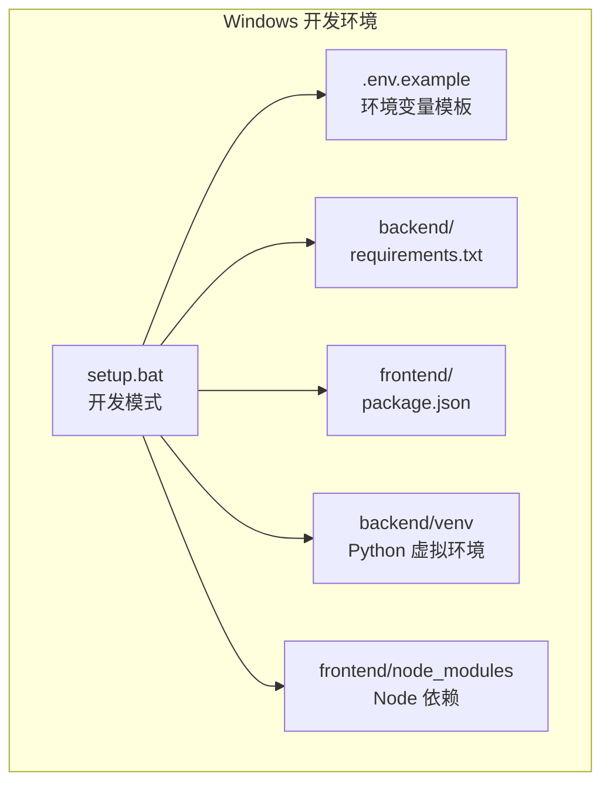
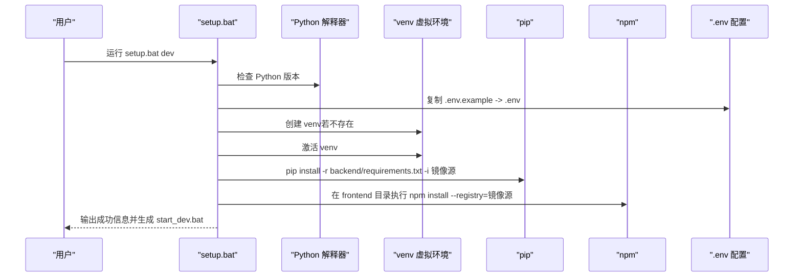
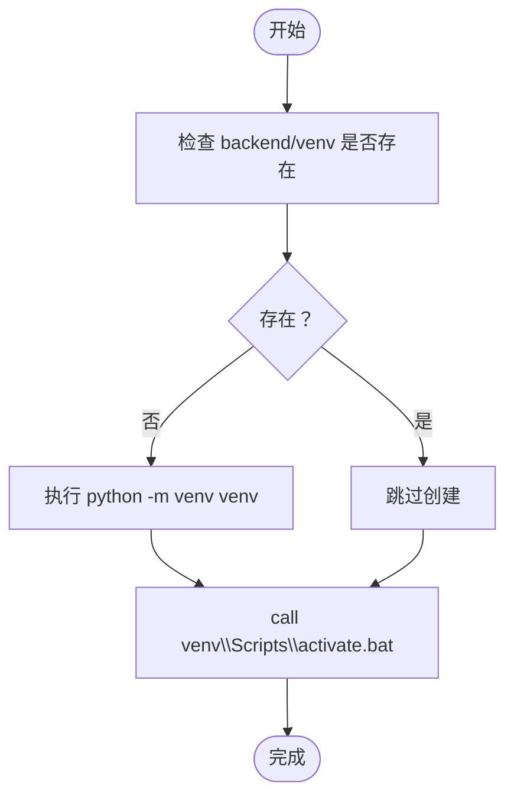
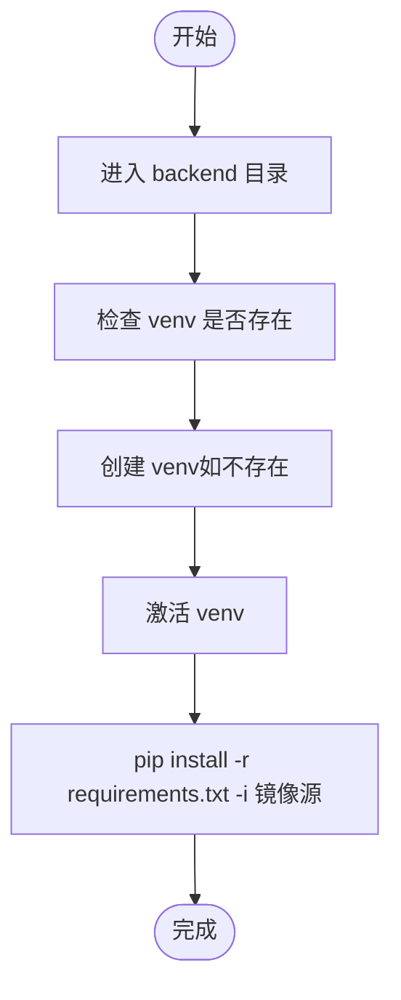
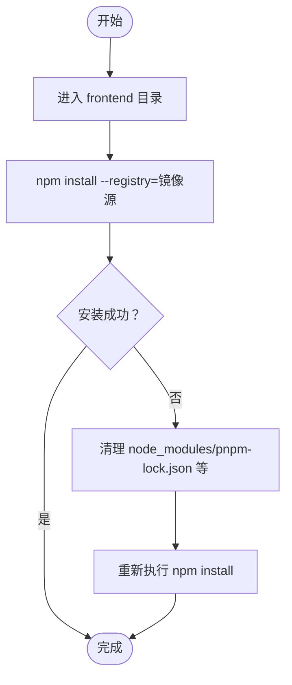
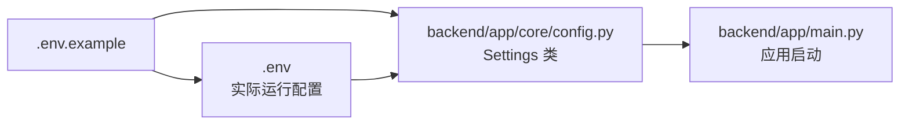
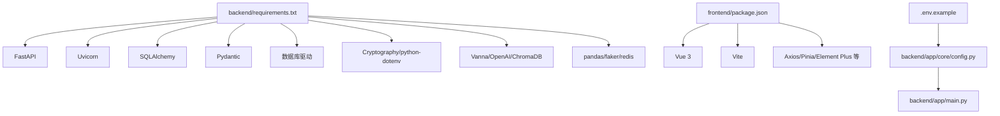

# 依赖安装与虚拟环境配置

<cite>
**本文引用的文件列表**
- [setup.bat](file://setup.bat)
- [setup.sh](file://setup.sh)
- [requirements.txt](file://requirements.txt)
- [backend/requirements.txt](file://backend/requirements.txt)
- [frontend/package.json](file://frontend/package.json)
- [.env.example](file://.env.example)
- [backend/app/core/config.py](file://backend/app/core/config.py)
- [backend/app/main.py](file://backend/app/main.py)
- [docker-compose.yml](file://docker-compose.yml)
- [QUICKSTART.md](file://QUICKSTART.md)
</cite>

## 目录
1. [简介](#简介)
2. [项目结构](#项目结构)
3. [核心组件](#核心组件)
4. [架构总览](#架构总览)
5. [详细组件分析](#详细组件分析)
6. [依赖关系分析](#依赖关系分析)
7. [性能考虑](#性能考虑)
8. [故障排查指南](#故障排查指南)
9. [结论](#结论)

## 简介
本文件面向Windows用户，系统性说明setup.bat脚本在Windows环境下如何完成前后端依赖安装与Python虚拟环境（venv）的创建与激活流程；同时覆盖npm在前端目录中安装依赖的机制、错误捕获与回滚策略建议，以及pip源配置优化与常见依赖冲突的解决方案。内容基于仓库中的实际脚本与配置文件进行分析，确保可操作性与准确性。

## 项目结构
该仓库采用前后端分离的典型结构：
- 后端：Python + FastAPI，使用venv隔离依赖，通过requirements.txt声明依赖。
- 前端：Vue 3 + Vite，通过package.json声明依赖。
- 配置：.env.example提供环境变量模板，backend/app/core/config.py从.env读取配置。
- 部署：提供setup.bat（Windows）与setup.sh（Unix系），支持开发模式与Docker模式。

图表来源
- [setup.bat](file://setup.bat#L92-L107)
- [.env.example](file://.env.example#L1-L72)
- [backend/requirements.txt](file://backend/requirements.txt#L1-L19)
- [frontend/package.json](file://frontend/package.json#L1-L40)

章节来源
- [setup.bat](file://setup.bat#L1-L213)
- [.env.example](file://.env.example#L1-L72)
- [backend/requirements.txt](file://backend/requirements.txt#L1-L19)
- [frontend/package.json](file://frontend/package.json#L1-L40)

## 核心组件
- Windows一键部署脚本（开发模式）：负责检查Python/Node版本、创建/激活虚拟环境、安装后端依赖、安装前端依赖、生成启动脚本等。
- Python虚拟环境（venv）：在backend目录下创建并激活，隔离后端依赖。
- npm依赖安装：在frontend目录下执行，使用国内镜像源加速。
- 环境变量配置：通过.env文件注入后端配置，前端通过Vite读取。

章节来源
- [setup.bat](file://setup.bat#L52-L139)
- [backend/requirements.txt](file://backend/requirements.txt#L1-L19)
- [frontend/package.json](file://frontend/package.json#L1-L40)
- [.env.example](file://.env.example#L1-L72)

## 架构总览
下图展示Windows开发模式下的依赖安装与环境配置流程，映射到实际脚本与配置文件。

图表来源
- [setup.bat](file://setup.bat#L52-L139)
- [backend/requirements.txt](file://backend/requirements.txt#L1-L19)
- [frontend/package.json](file://frontend/package.json#L1-L40)
- [.env.example](file://.env.example#L1-L72)

## 详细组件分析

### Python虚拟环境（venv）创建与激活流程
- 创建步骤：当backend目录下不存在venv时，调用python -m venv venv创建虚拟环境。
- 激活步骤：调用call venv\Scripts\activate.bat激活虚拟环境，后续pip安装均在该环境中执行。
- 作用域：仅影响当前命令会话，避免污染系统Python环境。

图表来源
- [setup.bat](file://setup.bat#L94-L97)

章节来源
- [setup.bat](file://setup.bat#L94-L97)

### 后端依赖安装（pip）与源配置优化
- 安装位置：backend目录下，使用pip install -r requirements.txt安装。
- 源配置：通过-i https://mirrors.aliyun.com/pypi/simple/指定阿里云镜像源，提升国内下载速度。
- 依赖清单：backend/requirements.txt包含FastAPI、Uvicorn、SQLAlchemy、Pydantic、数据库驱动、加密库、dotenv、Vanna、OpenAI、ChromaDB、faker、pandas、Redis等。

图表来源
- [setup.bat](file://setup.bat#L92-L100)
- [backend/requirements.txt](file://backend/requirements.txt#L1-L19)

章节来源
- [setup.bat](file://setup.bat#L92-L100)
- [backend/requirements.txt](file://backend/requirements.txt#L1-L19)

### 前端依赖安装（npm）与错误捕获与回滚建议
- 安装位置：frontend目录下，执行npm install。
- 源配置：通过--registry=https://registry.npmmirror.com使用淘宝镜像源，提高国内下载速度。
- 错误捕获与回滚建议（基于脚本行为推断）：
  - 若npm install失败，建议清理缓存与依赖后重试：删除node_modules与package-lock.json或pnpm-lock.yaml，然后重新执行npm install或切换包管理器（如pnpm）。
  - 若因网络波动导致部分包下载失败，可重复执行npm install，或使用--legacy-peer-deps/--force参数（谨慎使用）。
  - 若出现版本冲突，优先锁定关键依赖版本，或使用npm-check-updates工具逐项升级验证。

图表来源
- [setup.bat](file://setup.bat#L103-L107)
- [frontend/package.json](file://frontend/package.json#L1-L40)

章节来源
- [setup.bat](file://setup.bat#L103-L107)
- [frontend/package.json](file://frontend/package.json#L1-L40)

### 环境变量与配置注入
- .env.example提供完整的配置模板，包括数据库连接、AI模型API Key、Redis、向量数据库、ChromaDB、端口等。
- 后端通过pydantic-settings从.env读取配置，设置默认值与类型约束，保证运行时一致性。
- 前端通过Vite读取环境变量（如VITE_前缀），但本仓库主要依赖后端配置。

图表来源
- [.env.example](file://.env.example#L1-L72)
- [backend/app/core/config.py](file://backend/app/core/config.py#L1-L51)
- [backend/app/main.py](file://backend/app/main.py#L1-L35)

章节来源
- [.env.example](file://.env.example#L1-L72)
- [backend/app/core/config.py](file://backend/app/core/config.py#L1-L51)
- [backend/app/main.py](file://backend/app/main.py#L1-L35)

### Docker模式对比（便于理解差异）
- Docker模式通过docker-compose.yml编排MySQL、PostgreSQL、Redis、后端、前端服务，环境隔离更彻底。
- 与Windows开发模式相比，Docker模式无需手动安装Python/Node，但需要Docker与Docker Compose。

章节来源
- [docker-compose.yml](file://docker-compose.yml#L1-L141)
- [setup.sh](file://setup.sh#L241-L287)

## 依赖关系分析
- 后端依赖与Python版本：backend/requirements.txt要求FastAPI≥0.109.0，建议使用较新的Python版本以兼容。
- 前端依赖与Node版本：frontend/package.json声明Vue 3、Vite等，建议使用Node 16+以匹配脚本要求。
- 环境变量与后端配置：backend/app/core/config.py从.env读取配置，确保数据库、AI模型、Redis、向量数据库等参数一致。

图表来源
- [backend/requirements.txt](file://backend/requirements.txt#L1-L19)
- [frontend/package.json](file://frontend/package.json#L1-L40)
- [.env.example](file://.env.example#L1-L72)
- [backend/app/core/config.py](file://backend/app/core/config.py#L1-L51)
- [backend/app/main.py](file://backend/app/main.py#L1-L35)

章节来源
- [backend/requirements.txt](file://backend/requirements.txt#L1-L19)
- [frontend/package.json](file://frontend/package.json#L1-L40)
- [.env.example](file://.env.example#L1-L72)
- [backend/app/core/config.py](file://backend/app/core/config.py#L1-L51)
- [backend/app/main.py](file://backend/app/main.py#L1-L35)

## 性能考虑
- pip源优化：使用阿里云镜像源（-i https://mirrors.aliyun.com/pypi/simple/）显著提升国内下载速度。
- npm源优化：使用淘宝镜像源（--registry=https://registry.npmmirror.com）提升前端依赖安装效率。
- 依赖锁定：建议在生产环境固定依赖版本，减少升级带来的不确定性。
- 并行安装：Windows环境下可并行启动后端与前端安装任务（如分别在不同终端执行），但需注意资源占用。

章节来源
- [setup.bat](file://setup.bat#L98)
- [setup.bat](file://setup.bat#L105)

## 故障排查指南
- Python未安装或版本过低
  - 现象：脚本报错提示未找到Python。
  - 处理：安装Python 3.8+，确保在PATH中可用。
- Node.js未安装或版本过低
  - 现象：脚本报错提示未找到Node.js。
  - 处理：安装Node.js 16+。
- pip安装失败
  - 现象：后端依赖安装中断。
  - 处理：更换pip源、清理缓存、重试；必要时使用--trusted-host参数临时信任源。
- npm安装失败
  - 现象：前端依赖安装中断。
  - 处理：清理node_modules与锁文件，重试；若仍失败，尝试使用pnpm或切换网络。
- 依赖冲突
  - 现象：安装过程中报版本冲突。
  - 处理：锁定关键依赖版本，或使用兼容性更强的版本组合；逐步升级验证。
- 环境变量未生效
  - 现象：后端无法连接数据库或AI模型。
  - 处理：确认.DASHSCOPE_API_KEY、数据库连接字符串、Redis地址等配置正确。

章节来源
- [setup.bat](file://setup.bat#L56-L73)
- [setup.bat](file://setup.bat#L98)
- [setup.bat](file://setup.bat#L105)
- [.env.example](file://.env.example#L29-L48)
- [backend/app/core/config.py](file://backend/app/core/config.py#L21-L42)

## 结论
setup.bat在Windows环境下提供了完整的开发环境准备流程：检查并安装Python/Node、创建并激活Python虚拟环境、安装后端pip依赖（使用国内镜像源）、安装前端npm依赖（使用国内镜像源），并生成便捷的启动脚本。结合pip与npm的源配置优化，可在国内网络环境下显著提升依赖安装速度。遇到安装失败时，建议按“清理缓存→重试→锁定版本→逐步升级”的顺序排查，确保项目稳定运行。