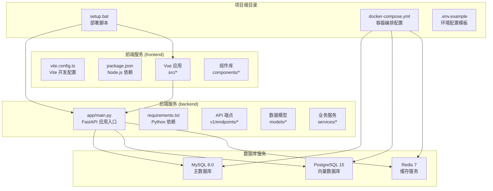
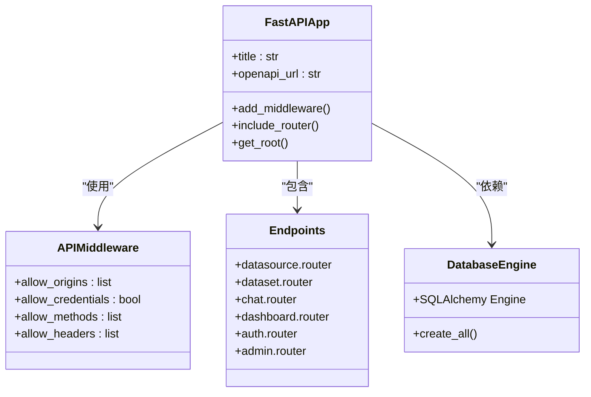
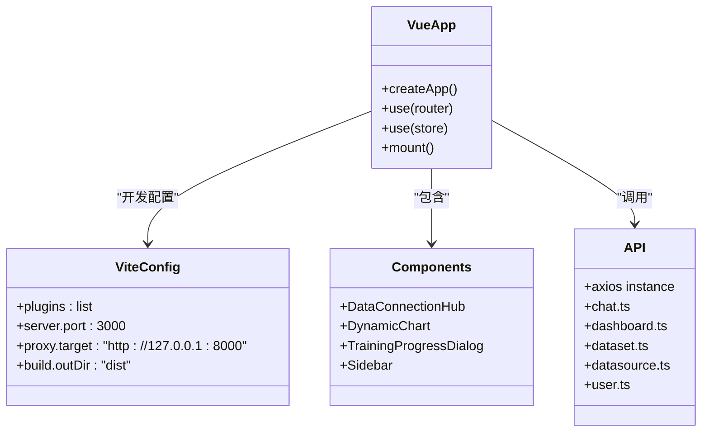
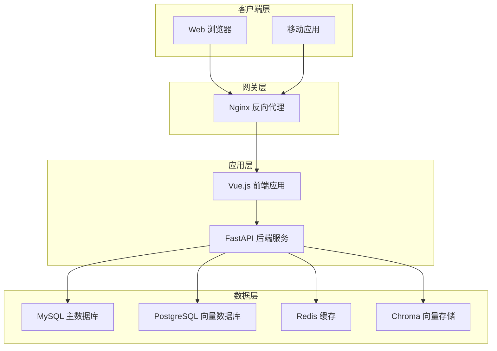
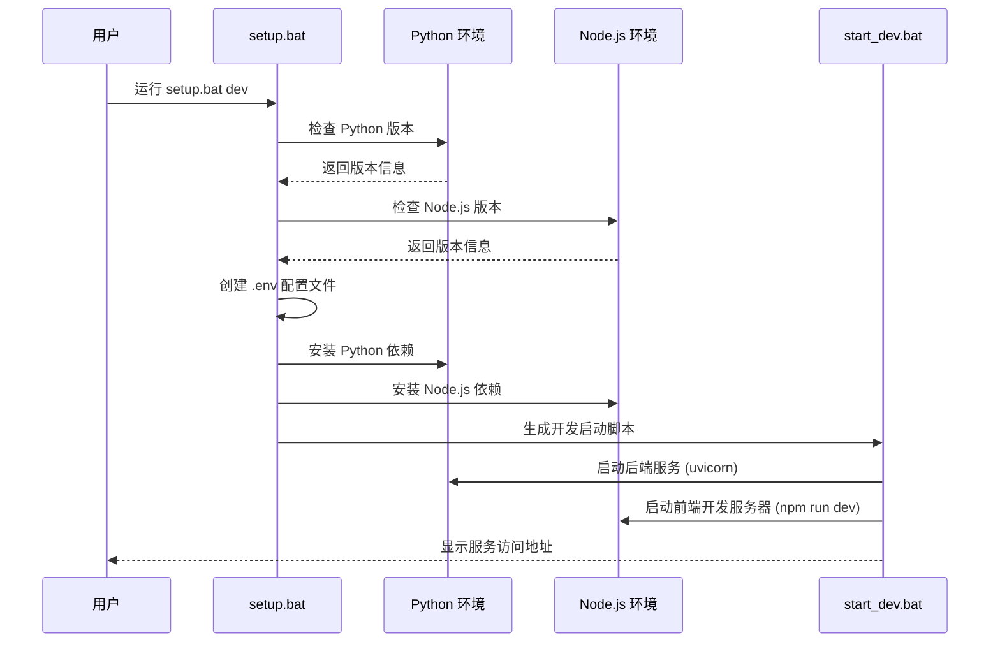
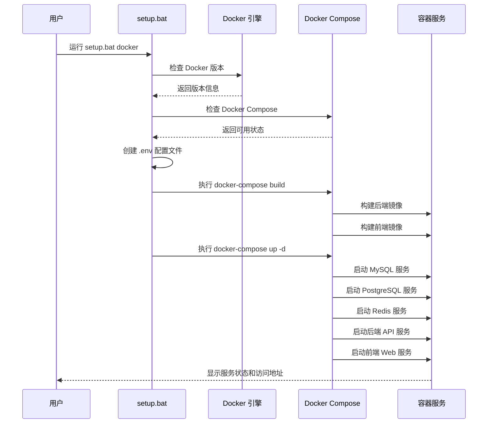
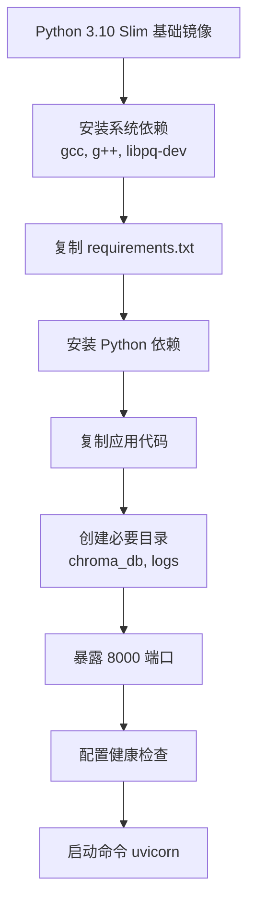
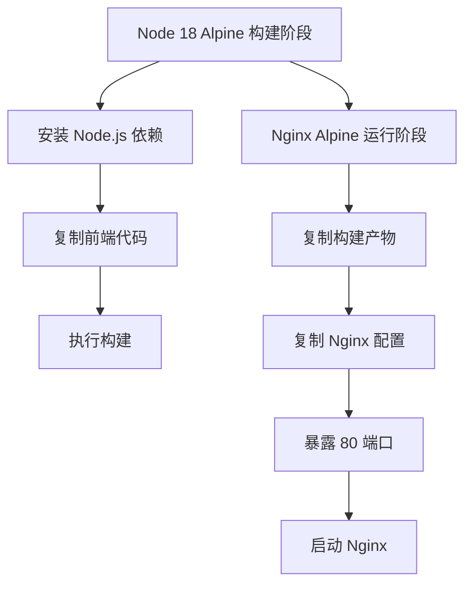
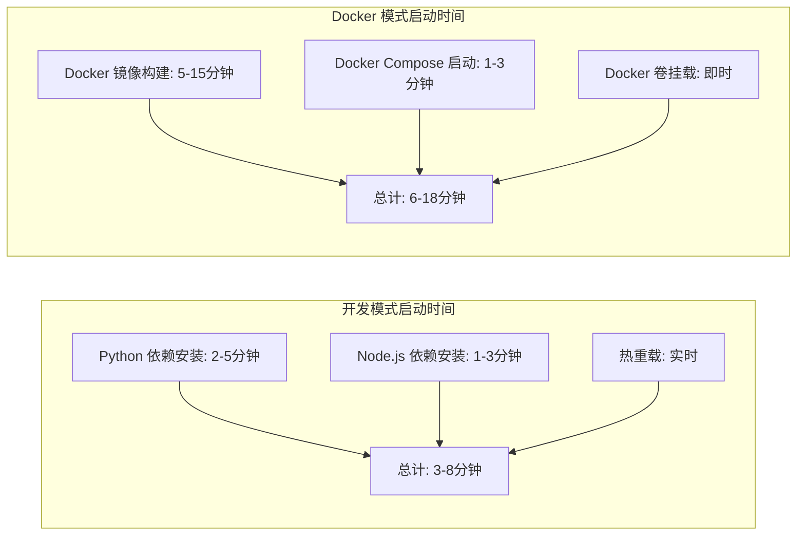

# 部署模式选择与执行

<cite>
**本文引用的文件**
- [setup.bat](file://setup.bat)
- [docker-compose.yml](file://docker-compose.yml)
- [Dockerfile.backend](file://Dockerfile.backend)
- [Dockerfile.frontend](file://Dockerfile.frontend)
- [backend/app/main.py](file://backend/app/main.py)
- [backend/requirements.txt](file://backend/requirements.txt)
- [frontend/package.json](file://frontend/package.json)
- [frontend/vite.config.ts](file://frontend/vite.config.ts)
- [.env.example](file://.env.example)
- [QUICKSTART.md](file://QUICKSTART.md)
</cite>

## 目录
1. [简介](#简介)
2. [项目结构](#项目结构)
3. [核心组件](#核心组件)
4. [架构概览](#架构概览)
5. [详细组件分析](#详细组件分析)
6. [部署模式对比](#部署模式对比)
7. [性能考虑](#性能考虑)
8. [故障排除指南](#故障排除指南)
9. [结论](#结论)

## 简介

Universal BI 是一个基于 AI 驱动的自然语言数据分析平台，提供了两种部署模式：开发模式和 Docker 模式。本文档将全面阐述这两种部署模式的工作原理、适用场景和使用方法，帮助用户根据实际需求选择合适的部署方式。

## 项目结构

该项目采用前后端分离的架构设计，包含完整的后端 API 服务、前端 Vue.js 应用以及多种数据库和缓存服务。



**图表来源**
- [setup.bat](file://setup.bat#L1-L213)
- [docker-compose.yml](file://docker-compose.yml#L1-L141)
- [backend/app/main.py](file://backend/app/main.py#L1-L35)

**章节来源**
- [setup.bat](file://setup.bat#L1-L213)
- [docker-compose.yml](file://docker-compose.yml#L1-L141)

## 核心组件

### 后端服务架构

后端采用 FastAPI 框架构建，提供 RESTful API 服务，支持多数据源连接和 AI 驱动的数据分析功能。



**图表来源**
- [backend/app/main.py](file://backend/app/main.py#L1-L35)

### 前端服务架构

前端基于 Vue 3 和 Vite 构建，提供现代化的数据可视化界面，支持实时聊天和数据分析功能。



**图表来源**
- [frontend/vite.config.ts](file://frontend/vite.config.ts#L1-L27)
- [frontend/package.json](file://frontend/package.json#L1-L40)

**章节来源**
- [backend/app/main.py](file://backend/app/main.py#L1-L35)
- [frontend/vite.config.ts](file://frontend/vite.config.ts#L1-L27)
- [frontend/package.json](file://frontend/package.json#L1-L40)

## 架构概览

系统采用微服务架构，通过 Docker 容器化部署，实现服务间的解耦和独立扩展。



**图表来源**
- [docker-compose.yml](file://docker-compose.yml#L1-L141)
- [Dockerfile.backend](file://Dockerfile.backend#L1-L40)
- [Dockerfile.frontend](file://Dockerfile.frontend#L1-L38)

## 详细组件分析

### 开发模式部署流程

开发模式适用于本地开发和调试场景，提供热重载和实时调试能力。



**图表来源**
- [setup.bat](file://setup.bat#L33-L139)

#### 开发模式关键特性

1. **环境检测**：自动检查 Python 3.8+ 和 Node.js 16+ 的安装状态
2. **依赖管理**：使用虚拟环境隔离 Python 依赖，确保开发环境纯净
3. **热重载支持**：后端使用 uvicorn 的 --reload 参数实现代码变更自动重启
4. **开发工具集成**：前端使用 Vite 提供快速的开发服务器和热更新

**章节来源**
- [setup.bat](file://setup.bat#L52-L139)

### Docker 模式部署流程

Docker 模式提供生产级别的容器化部署，包含完整的数据库和缓存服务。



**图表来源**
- [setup.bat](file://setup.bat#L144-L212)
- [docker-compose.yml](file://docker-compose.yml#L1-L141)

#### Docker 模式关键特性

1. **服务编排**：通过 docker-compose.yml 统一管理多个服务的启动顺序和依赖关系
2. **健康检查**：每个服务都配置了相应的健康检查机制
3. **数据持久化**：使用 Docker 卷确保数据不会因容器重启而丢失
4. **网络隔离**：创建专用的 Docker 网络实现服务间通信

**章节来源**
- [setup.bat](file://setup.bat#L144-L212)
- [docker-compose.yml](file://docker-compose.yml#L1-L141)

### 容器配置详解

#### 后端服务配置

后端服务使用 Python 3.10 Slim 基础镜像，配置了完整的开发环境和生产就绪的健康检查。



**图表来源**
- [Dockerfile.backend](file://Dockerfile.backend#L1-L40)

#### 前端服务配置

前端服务采用多阶段构建策略，优化镜像大小和构建效率。



**图表来源**
- [Dockerfile.frontend](file://Dockerfile.frontend#L1-L38)

**章节来源**
- [Dockerfile.backend](file://Dockerfile.backend#L1-L40)
- [Dockerfile.frontend](file://Dockerfile.frontend#L1-L38)

## 部署模式对比

### 开发模式 vs Docker 模式

| 特性 | 开发模式 | Docker 模式 |
|------|----------|-------------|
| **适用场景** | 本地开发、调试、代码修改 | 生产环境、演示、团队协作 |
| **环境要求** | 仅需 Python 和 Node.js | 需要 Docker 和 Docker Compose |
| **启动速度** | 快速启动，热重载 | 首次构建较慢，后续启动快 |
| **调试便利性** | 代码热重载，IDE 集成好 | 日志查看，容器隔离 |
| **资源占用** | 低，仅运行必要服务 | 中等，包含数据库和缓存 |
| **数据持久化** | 本地文件系统 | Docker 卷持久化 |
| **网络配置** | 本地回环地址 | Docker 内部网络通信 |
| **依赖管理** | 虚拟环境隔离 | 容器镜像标准化 |

### 性能差异分析

#### 启动性能对比



#### 资源消耗对比

| 服务类型 | 开发模式内存 | Docker 模式内存 | CPU 占用 |
|----------|-------------|----------------|----------|
| 后端 API | 50-100MB | 80-120MB | 低 |
| 前端开发服务器 | 100-200MB | 无 | 低 |
| MySQL | 无 | 200-400MB | 中等 |
| PostgreSQL | 无 | 300-500MB | 中等 |
| Redis | 无 | 50-100MB | 低 |
| ChromaDB | 无 | 100-200MB | 低 |

### 调试便利性对比

#### 开发模式调试优势

1. **代码热重载**：修改代码后自动重启，无需手动操作
2. **IDE 集成**：支持断点调试、变量检查等开发工具功能
3. **日志输出**：直接在终端查看详细日志信息
4. **依赖隔离**：虚拟环境避免依赖冲突问题

#### Docker 模式调试优势

1. **环境一致性**：生产环境相同配置，减少环境差异问题
2. **日志聚合**：统一的日志收集和查看方式
3. **服务监控**：容器级别的资源使用情况监控
4. **故障隔离**：单个服务故障不影响其他服务

**章节来源**
- [setup.bat](file://setup.bat#L33-L43)
- [setup.bat](file://setup.bat#L144-L169)

## 性能考虑

### 开发模式优化建议

1. **虚拟环境使用**：确保 Python 依赖隔离，避免全局污染
2. **依赖缓存**：利用 pip 和 npm 的缓存机制提升安装速度
3. **增量构建**：前端使用 Vite 的热更新功能，只重新构建受影响的模块
4. **数据库连接池**：合理配置数据库连接数，避免连接过多导致性能问题

### Docker 模式优化建议

1. **镜像优化**：使用多阶段构建减少最终镜像大小
2. **资源限制**：为容器设置合理的内存和 CPU 限制
3. **数据卷优化**：使用合适的存储驱动和挂载选项
4. **网络优化**：优化容器间通信，减少不必要的网络请求

### 性能监控指标

| 指标类型 | 监控方法 | 告警阈值 |
|----------|----------|----------|
| API 响应时间 | Prometheus + Grafana | >500ms |
| 数据库连接数 | MySQL/PostgreSQL 监控 | >80% |
| 内存使用率 | Docker stats | >85% |
| 磁盘空间 | 系统监控 | <10% |
| Redis 命中率 | Redis INFO | >90% |

## 故障排除指南

### 常见问题及解决方案

#### 开发模式问题

1. **Python 依赖安装失败**
   - 检查网络连接和代理设置
   - 清理 pip 缓存后重试
   - 使用国内镜像源加速下载

2. **Node.js 依赖安装缓慢**
   - 使用 npm 或 pnpm 替代 yarn
   - 配置淘宝镜像源
   - 清理 node_modules 后重新安装

3. **端口被占用**
   - 修改 .env 文件中的端口号
   - 关闭占用端口的其他程序
   - 使用 netstat 检查端口占用情况

#### Docker 模式问题

1. **Docker 服务启动失败**
   - 检查 Docker 引擎状态
   - 确认有足够的系统资源
   - 查看 Docker 日志获取详细错误信息

2. **容器无法启动**
   - 检查环境变量配置
   - 验证数据卷权限设置
   - 确认端口映射没有冲突

3. **数据库连接问题**
   - 检查数据库容器健康状态
   - 验证连接字符串格式
   - 确认防火墙规则允许连接

### 调试工具和命令

#### 开发模式调试命令

```bash
# 后端服务调试
uvicorn app.main:app --reload --host 0.0.0.0 --port 8000

# 前端服务调试
npm run dev

# 数据库连接测试
mysql -h localhost -u root -p
redis-cli ping
```

#### Docker 模式调试命令

```bash
# 查看服务状态
docker-compose ps

# 查看服务日志
docker-compose logs -f

# 进入容器内部
docker-compose exec backend bash
docker-compose exec mysql bash

# 重启特定服务
docker-compose restart backend
docker-compose restart frontend
```

**章节来源**
- [setup.bat](file://setup.bat#L195-L211)
- [QUICKSTART.md](file://QUICKSTART.md#L192-L250)

## 结论

Universal BI 提供了灵活的双模式部署方案，满足不同场景下的部署需求：

### 选择建议

**选择开发模式当且仅当**：
- 需要频繁修改代码并进行实时调试
- 仅需本地开发环境，不需要完整的生产级配置
- 对 Docker 环境不熟悉或受限于系统资源
- 团队成员需要独立的开发环境

**选择 Docker 模式当且仅当**：
- 需要接近生产环境的部署配置
- 团队协作开发，需要一致的环境配置
- 需要完整的数据库和缓存服务
- 准备进行生产部署或演示

### 最佳实践

1. **开发阶段**：优先使用开发模式进行日常开发
2. **测试阶段**：使用 Docker 模式进行集成测试
3. **生产部署**：使用 Docker 模式进行正式部署
4. **环境切换**：建立清晰的环境配置管理机制

通过合理选择和使用这两种部署模式，可以最大化开发效率并确保系统的稳定性和可维护性。