# 一键部署脚本使用指南

<cite>
**本文档中引用的文件**
- [setup.sh](file://setup.sh)
- [setup.bat](file://setup.bat)
- [README.md](file://README.md)
- [QUICKSTART.md](file://QUICKSTART.md)
- [.env.example](file://.env.example)
- [docker-compose.yml](file://docker-compose.yml)
- [Dockerfile.backend](file://Dockerfile.backend)
- [Dockerfile.frontend](file://Dockerfile.frontend)
- [backend/requirements.txt](file://backend/requirements.txt)
- [frontend/package.json](file://frontend/package.json)
</cite>

## 目录
1. [简介](#简介)
2. [项目结构概览](#项目结构概览)
3. [核心组件](#核心组件)
4. [架构总览](#架构总览)
5. [详细组件分析](#详细组件分析)
6. [依赖关系分析](#依赖关系分析)
7. [性能考虑](#性能考虑)
8. [故障排除指南](#故障排除指南)
9. [结论](#结论)

## 简介

Universal BI 是一个基于 AI 的智能数据分析平台，支持自然语言与数据库对话。本指南专注于一键部署脚本的使用，包括 Linux/macOS 的 `setup.sh` 和 Windows 的 `setup.bat` 脚本，涵盖两种部署模式：开发模式和 Docker 容器模式。

## 项目结构概览

该项目采用前后端分离架构，包含完整的开发和部署基础设施：

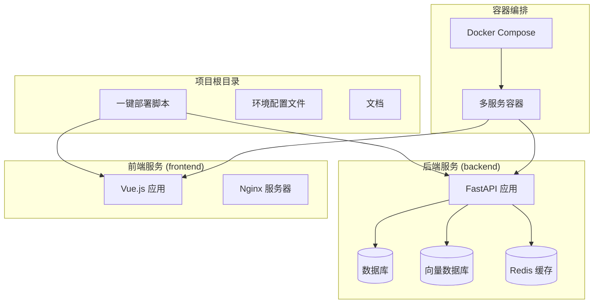

**图表来源**
- [setup.sh](file://setup.sh#L1-L318)
- [docker-compose.yml](file://docker-compose.yml#L1-L141)

**章节来源**
- [setup.sh](file://setup.sh#L1-L318)
- [docker-compose.yml](file://docker-compose.yml#L1-L141)

## 核心组件

### 一键部署脚本概述

一键部署脚本提供了两种部署模式，每种模式都有其特定的适用场景和优势：

#### 开发模式 (Dev Mode)
- **适用场景**：本地开发、调试、修改源代码
- **特点**：直接在本地系统安装和运行依赖
- **优势**：开发效率高，便于调试和修改
- **劣势**：需要手动管理依赖版本

#### Docker 模式 (Docker Mode)
- **适用场景**：生产环境部署、快速体验、避免依赖冲突
- **特点**：使用容器化隔离环境
- **优势**：环境一致性好，易于部署和维护
- **劣势**：开发调试相对复杂

**章节来源**
- [setup.sh](file://setup.sh#L297-L311)
- [setup.bat](file://setup.bat#L29-L43)

## 架构总览

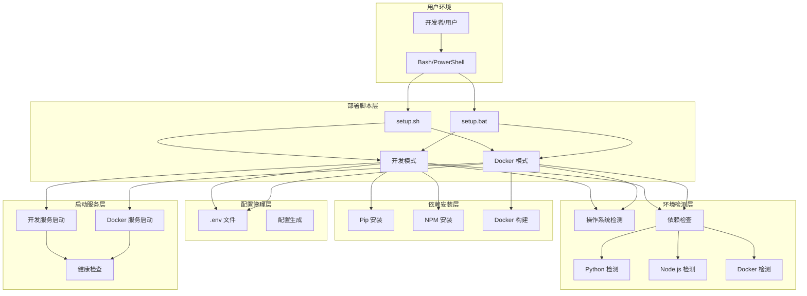

**图表来源**
- [setup.sh](file://setup.sh#L51-L69)
- [setup.bat](file://setup.bat#L52-L140)

## 详细组件分析

### Linux/macOS 部署脚本 (setup.sh)

#### 环境检测与操作系统识别

脚本首先检测操作系统类型，并根据不同的操作系统执行相应的安装策略：

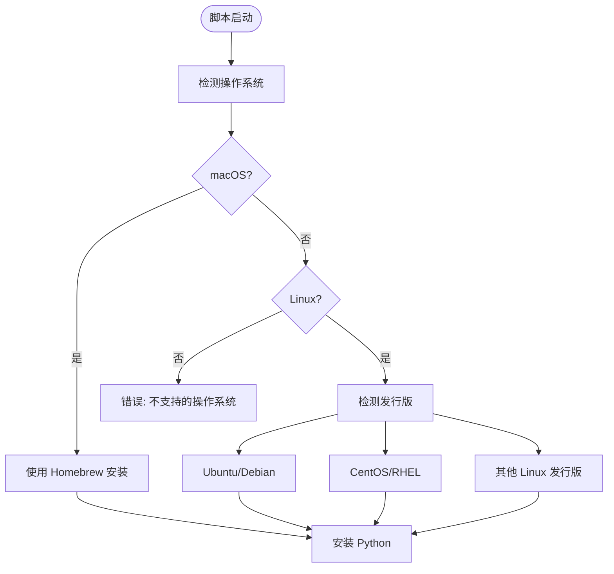

**图表来源**
- [setup.sh](file://setup.sh#L51-L69)
- [setup.sh](file://setup.sh#L82-L100)

#### 依赖安装流程

脚本支持三种主要依赖的自动安装：

1. **Python 3.10**：使用系统包管理器安装
2. **Node.js 18**：通过官方源安装
3. **Docker**：根据操作系统类型安装

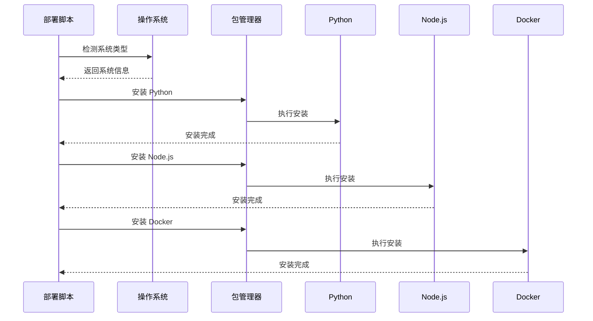

**图表来源**
- [setup.sh](file://setup.sh#L82-L146)

#### 开发模式部署流程

开发模式的核心流程包括环境配置、依赖安装和启动脚本生成：

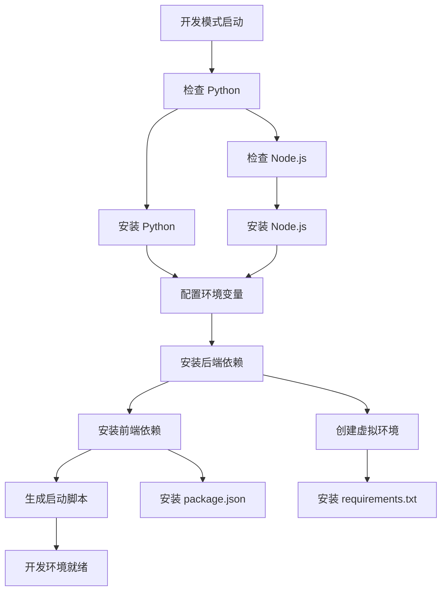

**图表来源**
- [setup.sh](file://setup.sh#L170-L239)

#### Docker 模式部署流程

Docker 模式的部署流程更加复杂，涉及容器编排和服务管理：

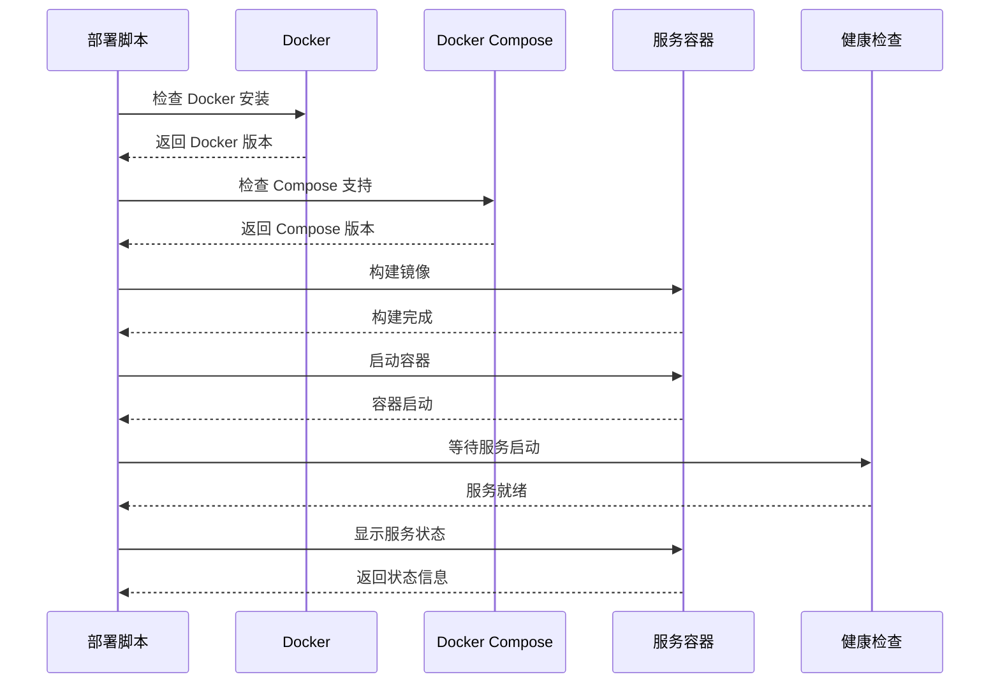

**图表来源**
- [setup.sh](file://setup.sh#L241-L287)

**章节来源**
- [setup.sh](file://setup.sh#L1-L318)

### Windows 部署脚本 (setup.bat)

#### Windows 特定的部署流程

Windows 部署脚本针对 Windows 环境进行了专门优化：

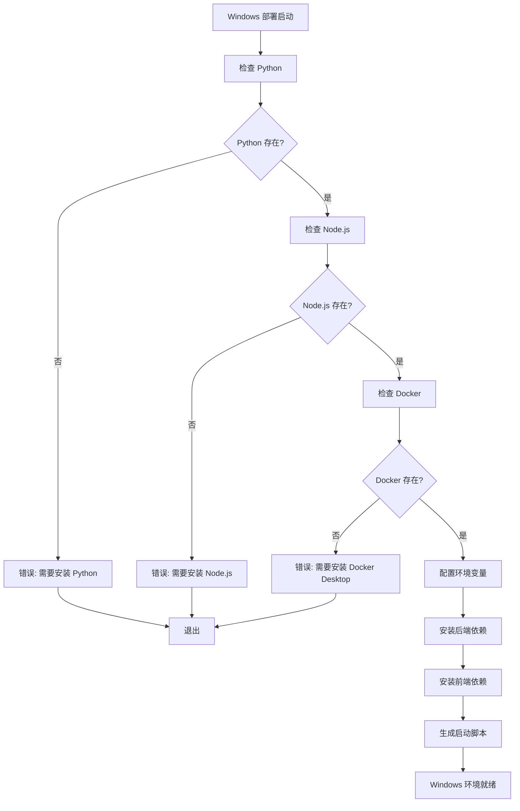

**图表来源**
- [setup.bat](file://setup.bat#L52-L139)

#### Windows 启动脚本生成

脚本会生成 `start_dev.bat` 批处理文件，用于启动开发服务：

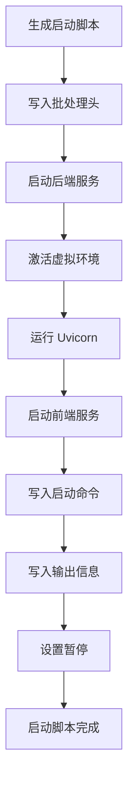

**图表来源**
- [setup.bat](file://setup.bat#L109-L128)

**章节来源**
- [setup.bat](file://setup.bat#L1-L213)

### 环境配置管理

#### .env 文件模板

项目提供了完整的环境配置模板，包含所有必需的配置项：

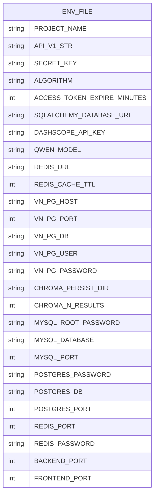

**图表来源**
- [.env.example](file://.env.example#L1-L72)

**章节来源**
- [.env.example](file://.env.example#L1-L72)

## 依赖关系分析

### 后端依赖分析

后端服务依赖于多种 Python 包，涵盖了 Web 框架、数据库连接、AI 集成等功能：

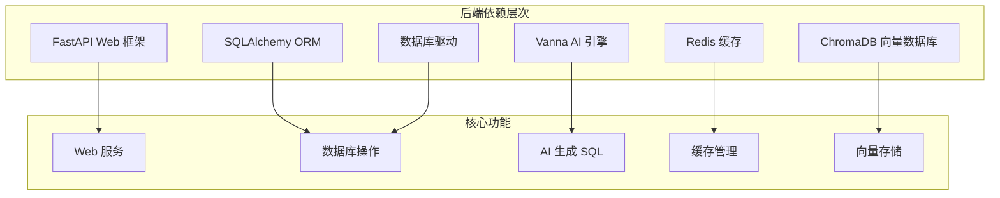

**图表来源**
- [backend/requirements.txt](file://backend/requirements.txt#L1-L19)

### 前端依赖分析

前端应用使用现代的 Vue.js 技术栈，包含丰富的 UI 组件和工具库：

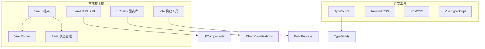

**图表来源**
- [frontend/package.json](file://frontend/package.json#L1-L40)

**章节来源**
- [backend/requirements.txt](file://backend/requirements.txt#L1-L19)
- [frontend/package.json](file://frontend/package.json#L1-L40)

## 性能考虑

### Docker 容器优化

Docker 模式提供了更好的性能和资源隔离：

1. **资源隔离**：每个服务运行在独立的容器中
2. **版本控制**：精确的依赖版本管理
3. **缓存优化**：Docker 层缓存加速构建
4. **健康检查**：自动监控服务状态

### 开发模式优化

开发模式注重开发效率和调试便利性：

1. **热重载**：支持代码变更自动重启
2. **本地调试**：便于断点调试和问题排查
3. **快速迭代**：修改代码后立即生效
4. **资源占用**：直接运行在主机上，无额外开销

## 故障排除指南

### 常见错误及解决方案

#### 权限问题

**问题**：Docker 组权限不足
**解决方案**：
```bash
# 重新登录系统以使组权限生效
sudo usermod -aG docker $USER
# 或者重新启动 Docker 服务
sudo systemctl restart docker
```

**章节来源**
- [setup.sh](file://setup.sh#L145-L146)

#### 网络超时问题

**问题**：依赖下载超时
**解决方案**：
```bash
# 使用国内镜像源
pip install -r requirements.txt -i https://mirrors.aliyun.com/pypi/simple/
npm install --registry=https://registry.npmmirror.com
```

**章节来源**
- [setup.sh](file://setup.sh#L188-L195)
- [setup.bat](file://setup.bat#L98-L105)

#### 端口冲突问题

**问题**：端口已被占用
**解决方案**：
```bash
# 检查端口占用情况
lsof -i :8000
lsof -i :3000

# 修改 .env 文件中的端口配置
BACKEND_PORT=8001
FRONTEND_PORT=3001
```

**章节来源**
- [.env.example](file://.env.example#L69-L72)

#### API Key 配置问题

**问题**：DASHSCOPE_API_KEY 未正确配置
**解决方案**：
```bash
# 获取 API Key
# 访问 https://dashscope.console.aliyun.com/apiKey
# 在 .env 文件中配置
DASHSCOPE_API_KEY=sk-xxxxxxxxxxxxxxxxxxxxxxxxxx
```

**章节来源**
- [.env.example](file://.env.example#L29-L33)

### 部署验证

#### Docker 模式验证

```bash
# 检查服务状态
docker-compose ps

# 查看服务日志
docker-compose logs -f

# 验证 API 可用性
curl http://localhost:8000/api/v1/health
```

#### 开发模式验证

```bash
# 检查后端服务
curl http://localhost:8000/api/v1/health

# 检查前端服务
curl http://localhost:3000

# 验证数据库连接
python -c "import sqlalchemy; engine = sqlalchemy.create_engine('mysql://...')"
```

**章节来源**
- [QUICKSTART.md](file://QUICKSTART.md#L147-L163)

## 结论

一键部署脚本为 Universal BI 提供了灵活而强大的部署解决方案。通过精心设计的自动化流程，用户可以根据自己的需求选择最适合的部署模式：

### 开发模式的优势
- 适合本地开发和调试
- 支持热重载和快速迭代
- 便于代码修改和问题排查
- 无需学习 Docker 概念

### Docker 模式的优点
- 环境一致性好
- 易于部署和维护
- 资源隔离和安全
- 生产环境友好

无论选择哪种模式，脚本都提供了完整的自动化部署体验，大大简化了 Universal BI 的部署过程。建议新用户优先尝试 Docker 模式以获得最佳的部署体验，有经验的开发者可以选择开发模式以获得更好的开发效率。