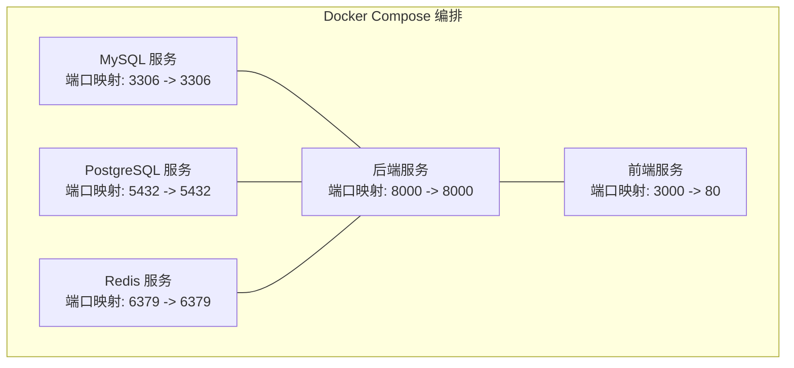
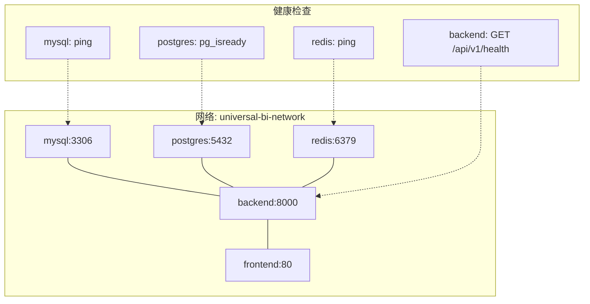
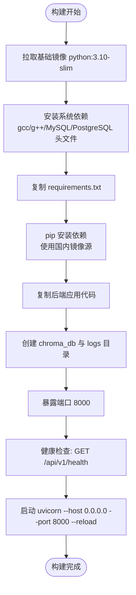
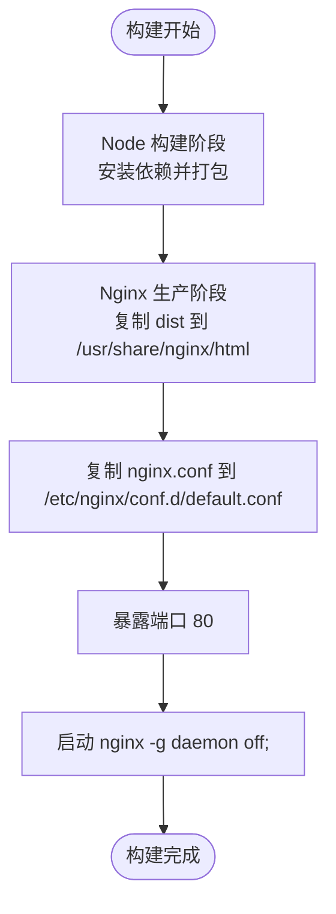
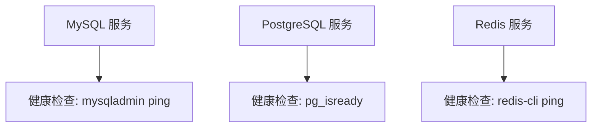
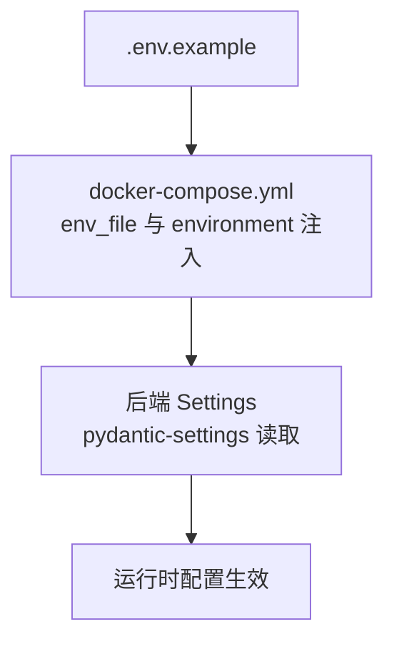
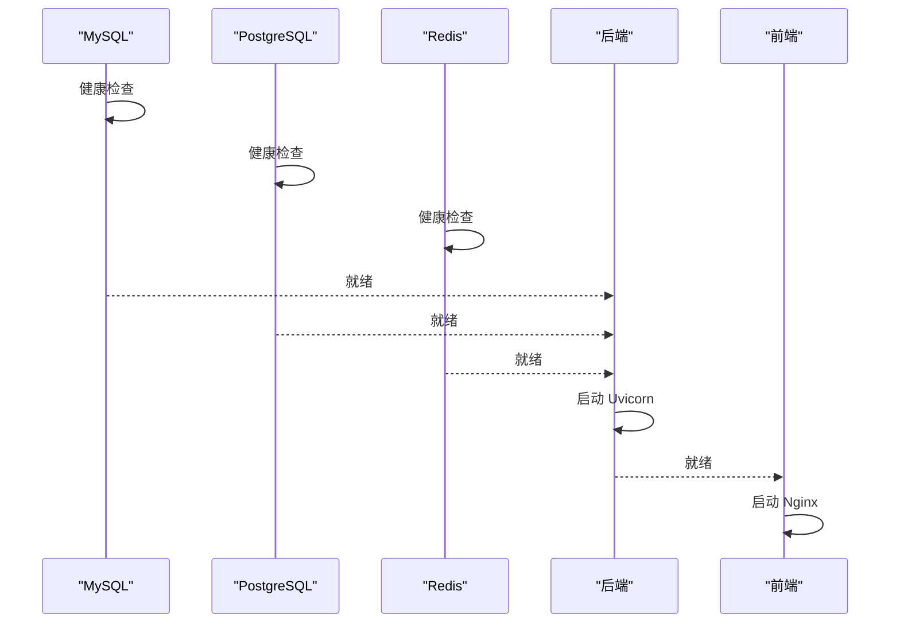
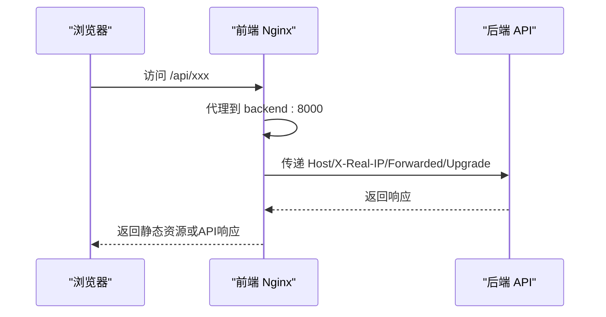
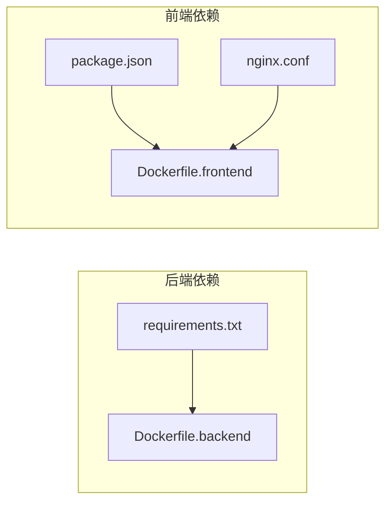

# Docker容器化部署

<cite>
**本文引用的文件**
- [docker-compose.yml](file://docker-compose.yml)
- [Dockerfile.backend](file://Dockerfile.backend)
- [Dockerfile.frontend](file://Dockerfile.frontend)
- [.env.example](file://.env.example)
- [backend/requirements.txt](file://backend/requirements.txt)
- [frontend/package.json](file://frontend/package.json)
- [backend/app/main.py](file://backend/app/main.py)
- [frontend/nginx.conf](file://frontend/nginx.conf)
- [backend/app/core/config.py](file://backend/app/core/config.py)
- [frontend/vite.config.ts](file://frontend/vite.config.ts)
- [QUICKSTART.md](file://QUICKSTART.md)
- [README.md](file://README.md)
</cite>

## 目录
1. [简介](#简介)
2. [项目结构](#项目结构)
3. [核心组件](#核心组件)
4. [架构总览](#架构总览)
5. [详细组件分析](#详细组件分析)
6. [依赖关系分析](#依赖关系分析)
7. [性能考虑](#性能考虑)
8. [故障排查指南](#故障排查指南)
9. [结论](#结论)
10. [附录](#附录)

## 简介
本操作手册面向希望使用Docker Compose进行容器化部署的用户，系统讲解docker-compose.yml的服务编排配置，包括后端、前端与数据库等容器的构建顺序、端口映射、环境变量注入与依赖关系；深入解析Dockerfile.backend如何基于Python镜像安装依赖并启动FastAPI应用，以及Dockerfile.frontend如何构建静态资源并通过Nginx提供服务；解释Nginx反向代理如何实现前后端同域访问，避免开发环境的跨域限制；最后提供容器日志查看、服务重启、数据卷持久化等运维操作命令，并对比其与开发模式在环境一致性、部署效率和资源隔离方面的优势。

## 项目结构
该项目采用前后端分离架构，后端使用FastAPI，前端使用Vue 3 + Vite，数据库包含MySQL、PostgreSQL（向量数据库）与Redis缓存。Docker Compose负责编排MySQL、PostgreSQL、Redis、后端、前端五个服务，形成统一的网络与数据卷，便于一键部署与运维。

**图表来源**
- [docker-compose.yml](file://docker-compose.yml#L7-L27)
- [docker-compose.yml](file://docker-compose.yml#L32-L50)
- [docker-compose.yml](file://docker-compose.yml#L55-L70)
- [docker-compose.yml](file://docker-compose.yml#L75-L104)
- [docker-compose.yml](file://docker-compose.yml#L109-L120)

**章节来源**
- [docker-compose.yml](file://docker-compose.yml#L1-L141)

## 核心组件
- MySQL：主数据库，提供数据持久化与迁移脚本初始化。
- PostgreSQL：向量数据库，用于Vanna向量存储与检索。
- Redis：缓存服务，提升查询与会话性能。
- 后端FastAPI：提供REST API，处理业务逻辑与数据交互。
- 前端Nginx：构建静态资源并通过反向代理转发/api请求至后端。

**章节来源**
- [docker-compose.yml](file://docker-compose.yml#L7-L27)
- [docker-compose.yml](file://docker-compose.yml#L32-L50)
- [docker-compose.yml](file://docker-compose.yml#L55-L70)
- [docker-compose.yml](file://docker-compose.yml#L75-L104)
- [docker-compose.yml](file://docker-compose.yml#L109-L120)

## 架构总览
下图展示了容器间的依赖关系与通信路径，包括健康检查、端口映射与网络互通。

**图表来源**
- [docker-compose.yml](file://docker-compose.yml#L23-L27)
- [docker-compose.yml](file://docker-compose.yml#L46-L50)
- [docker-compose.yml](file://docker-compose.yml#L66-L70)
- [docker-compose.yml](file://docker-compose.yml#L35-L36)
- [docker-compose.yml](file://docker-compose.yml#L86-L92)
- [Dockerfile.backend](file://Dockerfile.backend#L34-L36)

## 详细组件分析

### 后端服务（Dockerfile.backend）
- 基础镜像：基于python:3.10-slim，精简体积。
- 系统依赖：安装gcc/g++、MySQL客户端、PostgreSQL客户端与头文件，满足编译依赖。
- 依赖安装：复制requirements.txt并使用国内镜像源加速安装。
- 应用代码：复制backend目录，创建工作目录与日志目录。
- 端口暴露：8000。
- 健康检查：通过HTTP调用后端健康接口进行探测。
- 启动命令：使用uvicorn在0.0.0.0监听8000端口，支持热重载。

**图表来源**
- [Dockerfile.backend](file://Dockerfile.backend#L5-L39)
- [backend/requirements.txt](file://backend/requirements.txt#L1-L19)

**章节来源**
- [Dockerfile.backend](file://Dockerfile.backend#L1-L40)
- [backend/requirements.txt](file://backend/requirements.txt#L1-L19)

### 前端服务（Dockerfile.frontend）
- 多阶段构建：第一阶段使用node:18-alpine构建前端，第二阶段使用nginx:alpine提供静态服务。
- 构建流程：复制package.json与源码，安装依赖并执行构建，输出dist目录。
- 生产镜像：将dist目录复制到nginx默认站点目录，覆盖默认.conf为项目nginx.conf。
- 端口暴露：80。
- 启动命令：nginx前台运行。

**图表来源**
- [Dockerfile.frontend](file://Dockerfile.frontend#L5-L37)
- [frontend/nginx.conf](file://frontend/nginx.conf#L1-L49)

**章节来源**
- [Dockerfile.frontend](file://Dockerfile.frontend#L1-L38)
- [frontend/nginx.conf](file://frontend/nginx.conf#L1-L49)

### 数据库与缓存服务
- MySQL：设置根密码、数据库名、时区，映射3306端口，挂载数据卷与初始化脚本，健康检查使用mysqladmin ping。
- PostgreSQL：设置密码、数据库名、时区，映射5432端口，挂载数据卷，健康检查使用pg_isready。
- Redis：启用AOF持久化，可选密码，映射6379端口，挂载数据卷，健康检查使用redis-cli ping。

**图表来源**
- [docker-compose.yml](file://docker-compose.yml#L23-L27)
- [docker-compose.yml](file://docker-compose.yml#L46-L50)
- [docker-compose.yml](file://docker-compose.yml#L66-L70)

**章节来源**
- [docker-compose.yml](file://docker-compose.yml#L7-L27)
- [docker-compose.yml](file://docker-compose.yml#L32-L50)
- [docker-compose.yml](file://docker-compose.yml#L55-L70)

### 环境变量与配置注入
- .env.example提供完整的配置模板，包括JWT密钥、数据库连接、AI模型、Redis、向量数据库、ChromaDB、MySQL/PostgreSQL/Redis端口等。
- docker-compose.yml通过env_file与environment注入后端所需环境变量，包括数据库连接串、Redis URL、向量数据库主机与凭据等。
- 后端使用pydantic-settings从.env读取配置，统一管理应用参数。

**图表来源**
- [.env.example](file://.env.example#L1-L72)
- [docker-compose.yml](file://docker-compose.yml#L83-L92)
- [backend/app/core/config.py](file://backend/app/core/config.py#L5-L47)

**章节来源**
- [.env.example](file://.env.example#L1-L72)
- [docker-compose.yml](file://docker-compose.yml#L83-L92)
- [backend/app/core/config.py](file://backend/app/core/config.py#L5-L47)

### 依赖关系与启动顺序
- 后端依赖MySQL、PostgreSQL、Redis均处于健康状态才启动。
- 前端依赖后端服务可用。
- compose通过depends_on与健康检查保证服务启动顺序与稳定性。

**图表来源**
- [docker-compose.yml](file://docker-compose.yml#L93-L99)
- [docker-compose.yml](file://docker-compose.yml#L117-L118)
- [Dockerfile.backend](file://Dockerfile.backend#L34-L36)

**章节来源**
- [docker-compose.yml](file://docker-compose.yml#L93-L99)
- [docker-compose.yml](file://docker-compose.yml#L117-L118)

### Nginx反向代理与同域访问
- 前端Nginx监听80端口，根目录指向dist静态资源，支持SPA路由回退到index.html。
- /api前缀的请求转发至backend:8000，保留Host、X-Real-IP、X-Forwarded-*等头部，支持WebSocket升级。
- 通过同域代理避免开发环境跨域限制，生产环境可结合域名与HTTPS策略进一步加固。

**图表来源**
- [frontend/nginx.conf](file://frontend/nginx.conf#L19-L36)
- [docker-compose.yml](file://docker-compose.yml#L115-L116)

**章节来源**
- [frontend/nginx.conf](file://frontend/nginx.conf#L1-L49)
- [docker-compose.yml](file://docker-compose.yml#L115-L116)

### 开发模式与Docker模式对比
- 环境一致性：Docker模式通过镜像与数据卷确保各环境一致，避免“在我机器上能跑”的问题。
- 部署效率：一键compose启动，减少手工安装与配置成本。
- 资源隔离：容器间网络隔离，端口与卷独立，便于横向扩展与故障定位。

**章节来源**
- [README.md](file://README.md#L253-L282)
- [QUICKSTART.md](file://QUICKSTART.md#L23-L86)

## 依赖关系分析
- 后端依赖：FastAPI、SQLAlchemy、Pydantic、PyMySQL、Psycopg2、Redis、Vanna、OpenAI、ChromaDB、Passlib、Faker、Pandas等。
- 前端依赖：Vue 3、Element Plus、ECharts、Axios、Pinia、Vue Router等。
- 构建链路：后端Dockerfile依赖requirements.txt；前端Dockerfile依赖package.json与nginx.conf。

**图表来源**
- [backend/requirements.txt](file://backend/requirements.txt#L1-L19)
- [frontend/package.json](file://frontend/package.json#L1-L40)
- [Dockerfile.backend](file://Dockerfile.backend#L20-L23)
- [Dockerfile.frontend](file://Dockerfile.frontend#L10-L20)

**章节来源**
- [backend/requirements.txt](file://backend/requirements.txt#L1-L19)
- [frontend/package.json](file://frontend/package.json#L1-L40)
- [Dockerfile.backend](file://Dockerfile.backend#L20-L23)
- [Dockerfile.frontend](file://Dockerfile.frontend#L10-L20)

## 性能考虑
- 健康检查：数据库与缓存服务均配置健康检查，确保后端仅在依赖服务就绪时启动，降低冷启动失败概率。
- 端口映射：后端8000、前端80（映射到宿主机3000），便于本地联调与生产暴露。
- 静态资源缓存：Nginx对JS/CSS/字体等静态资源设置长缓存，提升加载速度。
- 数据持久化：MySQL、PostgreSQL、Redis、ChromaDB均挂载本地卷，避免容器重建丢失数据。
- 网络隔离：统一bridge网络，减少跨主机通信开销。

**章节来源**
- [docker-compose.yml](file://docker-compose.yml#L23-L27)
- [docker-compose.yml](file://docker-compose.yml#L46-L50)
- [docker-compose.yml](file://docker-compose.yml#L66-L70)
- [frontend/nginx.conf](file://frontend/nginx.conf#L38-L42)

## 故障排查指南
- 查看服务状态与日志
  - 查看所有服务状态：docker-compose ps
  - 查看实时日志：docker-compose logs -f
  - 查看特定服务日志：docker-compose logs -f backend
- 重启与重建
  - 重启所有服务：docker-compose restart
  - 重新构建并启动：docker-compose up -d --build
- 进入容器执行命令
  - 进入后端容器：docker exec -it universal-bi-backend bash
- 数据清理
  - 清理所有数据（慎用）：docker-compose down -v
- 常见问题
  - 数据库连接失败：检查MySQL/PostgreSQL容器状态与.env配置
  - DASHSCOPE_API_KEY错误：确认.env中API Key配置并重启服务
  - Redis连接失败：检查Redis容器状态与密码配置
  - 前端404：确认Vite开发代理与Nginx路由配置一致

**章节来源**
- [README.md](file://README.md#L253-L282)
- [QUICKSTART.md](file://QUICKSTART.md#L192-L250)

## 结论
通过Docker Compose编排，本项目实现了后端、前端与数据库/缓存服务的一键部署与稳定运行。Dockerfile.backend与Dockerfile.frontend分别针对Python与Node生态进行了优化，配合Nginx反向代理与健康检查机制，显著提升了部署效率与环境一致性。运维层面提供了完善的日志、重启与数据卷持久化能力，便于在生产环境中进行监控与维护。

## 附录
- 访问地址
  - 前端页面：http://localhost:3000
  - 后端API：http://localhost:8000
  - API文档：http://localhost:8000/docs
  - 默认管理员：用户名 admin，密码 admin123（首次登录后请立即修改）

**章节来源**
- [README.md](file://README.md#L163-L171)
- [QUICKSTART.md](file://QUICKSTART.md#L78-L84)