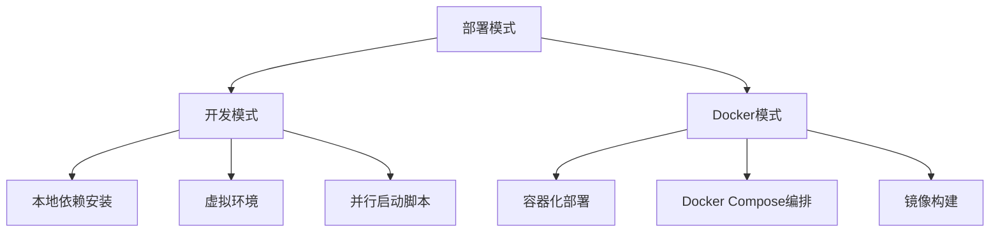
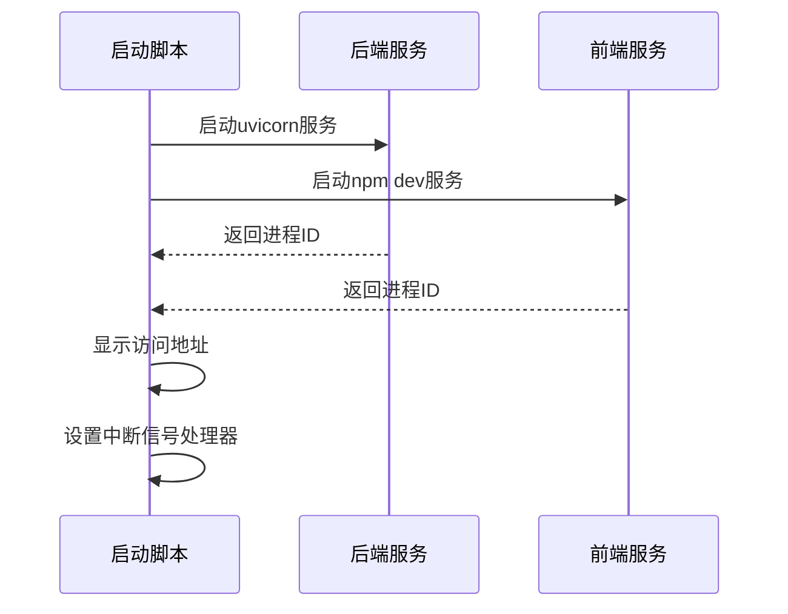
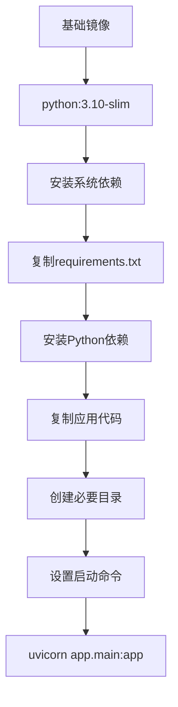
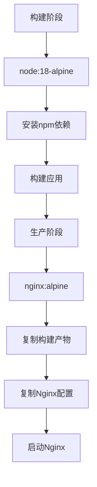
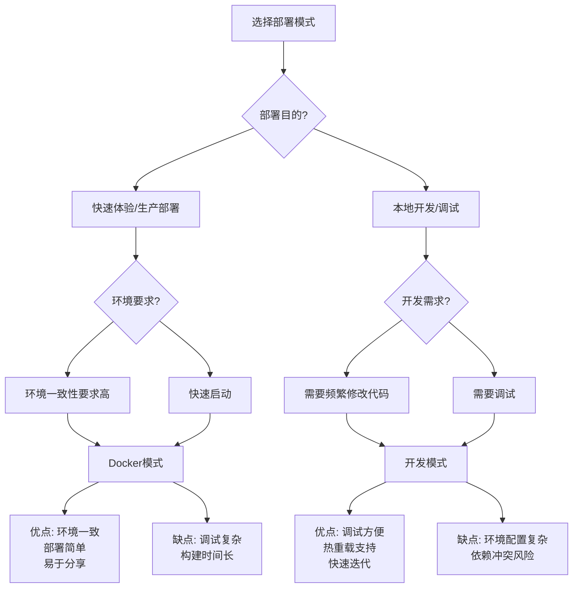

# 部署模式详解

<cite>
**本文档引用文件**  
- [docker-compose.yml](file://docker-compose.yml)
- [Dockerfile.backend](file://Dockerfile.backend)
- [Dockerfile.frontend](file://Dockerfile.frontend)
- [setup.sh](file://setup.sh)
- [setup.bat](file://setup.bat)
- [requirements.txt](file://requirements.txt)
- [backend/requirements.txt](file://backend/requirements.txt)
- [frontend/package.json](file://frontend/package.json)
- [backend/app/main.py](file://backend/app/main.py)
- [frontend/vite.config.ts](file://frontend/vite.config.ts)
- [.env.example](file://.env.example)
- [QUICKSTART.md](file://QUICKSTART.md)
</cite>

## 目录
1. [简介](#简介)
2. [部署模式概览](#部署模式概览)
3. [开发模式详解](#开发模式详解)
4. [Docker模式详解](#docker模式详解)
5. [模式对比分析](#模式对比分析)
6. [部署模式选择决策树](#部署模式选择决策树)
7. [资源占用与网络配置](#资源占用与网络配置)
8. [总结](#总结)

## 简介
Universal BI 是一个AI驱动的自然语言数据分析平台，支持两种主要部署模式：开发模式（dev）和Docker模式（docker）。本文档深入分析这两种部署方式的技术差异与适用场景，为开发者和运维人员提供全面的部署指南。

**本文档引用文件**  
- [QUICKSTART.md](file://QUICKSTART.md)

## 部署模式概览
Universal BI 提供了两种部署方式，每种方式都有其独特的优势和适用场景：

- **开发模式**：适用于本地开发、调试和二次开发，通过本地安装Python虚拟环境和Node.js依赖来运行应用
- **Docker模式**：适用于快速体验、生产部署和环境一致性要求高的场景，通过容器化技术实现一键部署

两种模式都能成功启动后端FastAPI服务和前端Vite应用，但实现方式和系统要求有所不同。



**本文档引用文件**  
- [setup.sh](file://setup.sh)
- [setup.bat](file://setup.bat)

## 开发模式详解

### 本地依赖管理
开发模式通过`setup.sh`（Linux/macOS）和`setup.bat`（Windows）脚本自动配置开发环境。该模式首先检查并安装必要的系统依赖，包括Python 3.10和Node.js 18。

Python依赖通过`pip`安装到虚拟环境中，确保项目依赖的隔离性：
- 后端依赖定义在`backend/requirements.txt`中
- 前端依赖定义在`frontend/package.json`中

```bash
# 创建Python虚拟环境
python3 -m venv venv

# 激活虚拟环境并安装依赖
source venv/bin/activate
pip install -r requirements.txt -i https://mirrors.aliyun.com/pypi/simple/
```

### 环境配置
系统通过`.env.example`文件创建配置文件`.env`，包含数据库连接、API密钥等关键配置。必须配置的环境变量包括：
- `DASHSCOPE_API_KEY`：通义千问API密钥（必填）
- 数据库连接信息：MySQL、PostgreSQL和Redis配置

### 启动机制
开发模式通过生成的`start_dev.sh`（Linux/macOS）或`start_dev.bat`（Windows）脚本并行启动前后端服务：



**启动流程：**
1. 启动后端FastAPI应用：`uvicorn app.main:app --reload --host 0.0.0.0 --port 8000`
2. 启动前端Vite开发服务器：`npm run dev`
3. 通过进程管理实现服务的统一启停

**开发模式特点：**
- 支持代码热重载（--reload参数）
- 便于调试和代码修改
- 依赖本地环境配置

**本文档引用文件**  
- [setup.sh](file://setup.sh#L171-L238)
- [setup.bat](file://setup.bat#L52-L139)
- [start_dev.sh](file://start_dev.sh)
- [start_dev.bat](file://start_dev.bat)
- [backend/app/main.py](file://backend/app/main.py)
- [frontend/vite.config.ts](file://frontend/vite.config.ts)

## Docker模式详解

### Docker Compose编排
Docker模式通过`docker-compose.yml`文件定义多容器应用的编排，包含五个核心服务：

```mermaid
graph TD
A[Docker Compose] --> B[MySQL]
A --> C[PostgreSQL]
A --> D[Redis]
A --> E[Backend]
A --> F[Frontend]
E --> B: 依赖MySQL
E --> C: 依赖PostgreSQL
E --> D: 依赖Redis
F --> E: 依赖Backend
```

### 服务配置
各服务的详细配置如下：

**数据库服务：**
- MySQL：版本8.0，用于主数据存储
- PostgreSQL：版本15，用于向量数据库
- Redis：版本7，用于缓存服务

**应用服务：**
- Backend：基于Python 3.10-slim镜像构建
- Frontend：基于Node 18和Nginx构建

### 镜像构建流程
后端和前端服务通过各自的Dockerfile进行构建：

#### 后端构建流程


#### 前端构建流程


### 依赖关系与健康检查
Docker Compose通过健康检查确保服务启动顺序：

```yaml
depends_on:
  mysql:
    condition: service_healthy
  postgres:
    condition: service_healthy  
  redis:
    condition: service_healthy
```

每个服务都配置了健康检查，确保在依赖服务完全就绪后再启动应用服务。

**本文档引用文件**  
- [docker-compose.yml](file://docker-compose.yml)
- [Dockerfile.backend](file://Dockerfile.backend)
- [Dockerfile.frontend](file://Dockerfile.frontend)

## 模式对比分析

### 环境隔离性对比
| 特性 | 开发模式 | Docker模式 |
|------|---------|-----------|
| 环境隔离 | 通过Python虚拟环境实现 | 通过容器完全隔离 |
| 依赖冲突风险 | 中等（系统级依赖可能冲突） | 低（完全隔离的运行环境） |
| 环境一致性 | 依赖开发者本地配置 | 高度一致（镜像保证） |

### 依赖管理对比
| 特性 | 开发模式 | Docker模式 |
|------|---------|-----------|
| 依赖安装 | 手动/脚本安装 | 镜像构建时自动安装 |
| 安装速度 | 较快（仅应用依赖） | 较慢（需构建完整镜像） |
| 依赖更新 | 简单（pip/npm更新） | 需重新构建镜像 |

### 性能开销对比
| 特性 | 开发模式 | Docker模式 |
|------|---------|-----------|
| 内存占用 | 较低 | 较高（容器运行时开销） |
| 启动速度 | 快（直接运行） | 较慢（需容器初始化） |
| 网络延迟 | 低 | 极低（容器网络优化） |

### 调试便利性对比
| 特性 | 开发模式 | Docker模式 |
|------|---------|-----------|
| 代码热重载 | 支持 | 需要特殊配置 |
| 日志查看 | 直接输出到终端 | 需要docker logs命令 |
| 断点调试 | 直接支持 | 需要调试器配置 |
| 环境变量修改 | 直接编辑文件 | 需要重启容器 |

### 网络配置对比
| 特性 | 开发模式 | Docker模式 |
|------|---------|-----------|
| 端口映射 | 直接绑定localhost | 通过Docker端口映射 |
| 服务发现 | 静态配置 | 通过Docker网络 |
| 前端代理 | Vite配置代理 | Nginx反向代理 |

**本文档引用文件**  
- [docker-compose.yml](file://docker-compose.yml#L81-L82)
- [frontend/vite.config.ts](file://frontend/vite.config.ts#L19-L23)
- [Dockerfile.frontend](file://Dockerfile.frontend#L31-L32)

## 部署模式选择决策树


**推荐场景：**
- **新开发者快速体验**：推荐Docker模式，避免复杂的环境配置
- **二次开发和调试**：推荐开发模式，便于代码修改和调试
- **生产环境部署**：推荐Docker模式，确保环境一致性
- **团队协作开发**：推荐Docker模式，避免"在我机器上能运行"问题

## 资源占用与网络配置

### 资源占用对比
| 服务 | 开发模式 | Docker模式 |
|------|---------|-----------|
| 后端API | ~200MB内存 | ~300MB内存 |
| 前端开发服务器 | ~150MB内存 | ~200MB内存（Nginx） |
| MySQL | ~500MB内存 | ~600MB内存 |
| PostgreSQL | ~400MB内存 | ~500MB内存 |
| Redis | ~100MB内存 | ~150MB内存 |
| **总计** | **~1.35GB** | **~1.75GB** |

Docker模式由于容器运行时开销，内存占用比开发模式高出约30%。

### 网络配置详情
**开发模式网络配置：**
- 后端服务：`http://localhost:8000`
- 前端服务：`http://localhost:3000`
- 前端通过Vite代理将`/api`请求转发到后端

**Docker模式网络配置：**
- 使用自定义bridge网络`universal-bi-network`
- 服务间通过服务名直接通信（如`mysql`、`redis`）
- 端口映射通过环境变量控制：
  - `${BACKEND_PORT:-8000}:8000`
  - `${FRONTEND_PORT:-3000}:80`

**环境变量优先级：**
1. `.env`文件中的值
2. 系统环境变量
3. Docker Compose中的默认值

## 总结
Universal BI的两种部署模式各有优势，选择合适的模式能显著提高开发和部署效率。

**Docker模式优势：**
- 环境一致性高，避免"在我机器上能运行"问题
- 部署简单，一键启动所有服务
- 适合生产环境和团队协作
- 服务隔离性好，依赖冲突风险低

**开发模式优势：**
- 调试方便，支持代码热重载
- 启动速度快，适合快速迭代
- 直接访问日志和进程
- 便于二次开发和代码修改

**最终建议：**
- **新用户**：从Docker模式开始，快速体验系统功能
- **开发者**：切换到开发模式进行代码修改和调试
- **生产环境**：使用Docker模式确保部署一致性
- **CI/CD流水线**：使用Docker模式实现自动化部署

无论选择哪种模式，都需确保正确配置`DASHSCOPE_API_KEY`等关键环境变量，并根据实际需求调整数据库和缓存配置。

**本文档引用文件**  
- [QUICKSTART.md](file://QUICKSTART.md)
- [setup.sh](file://setup.sh)
- [docker-compose.yml](file://docker-compose.yml)