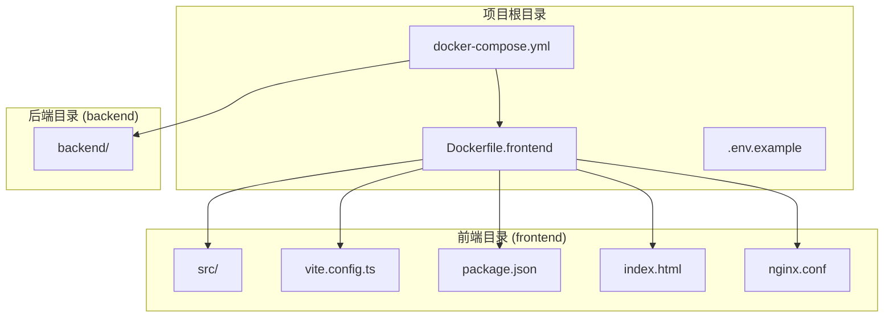
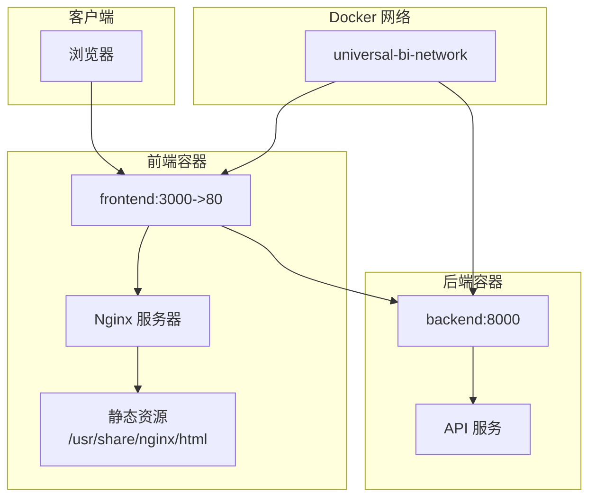
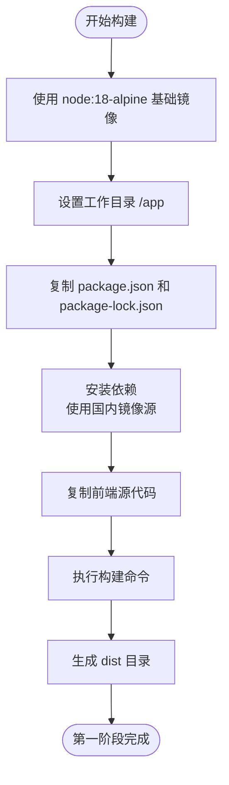
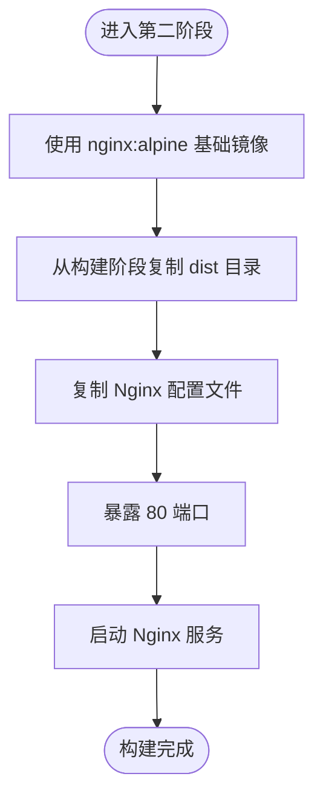
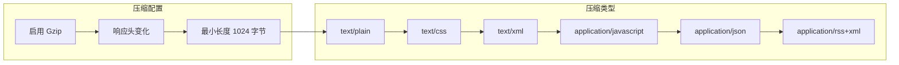
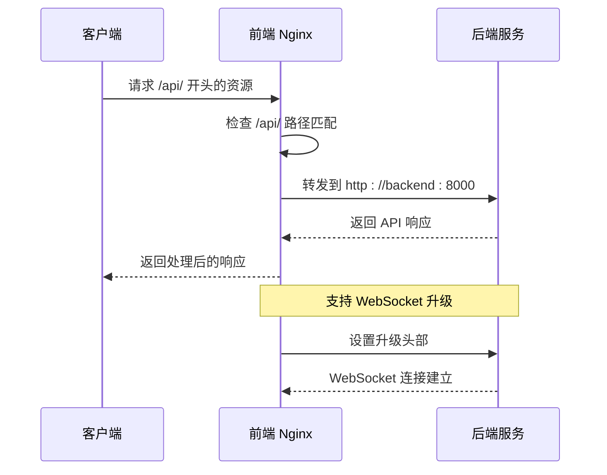
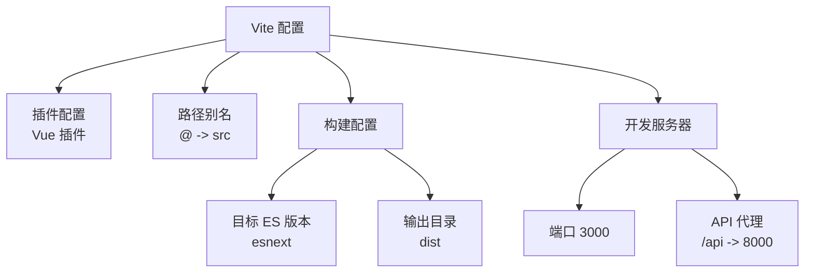
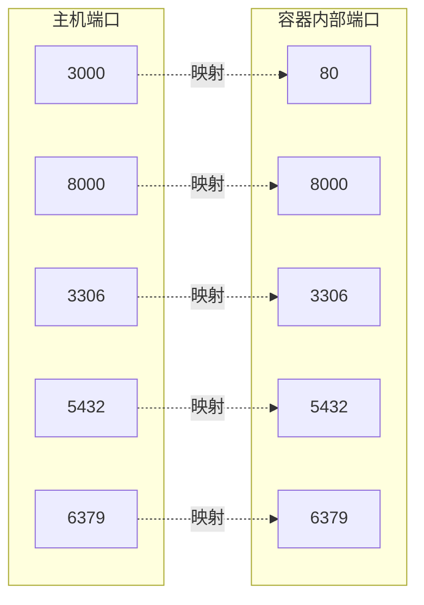
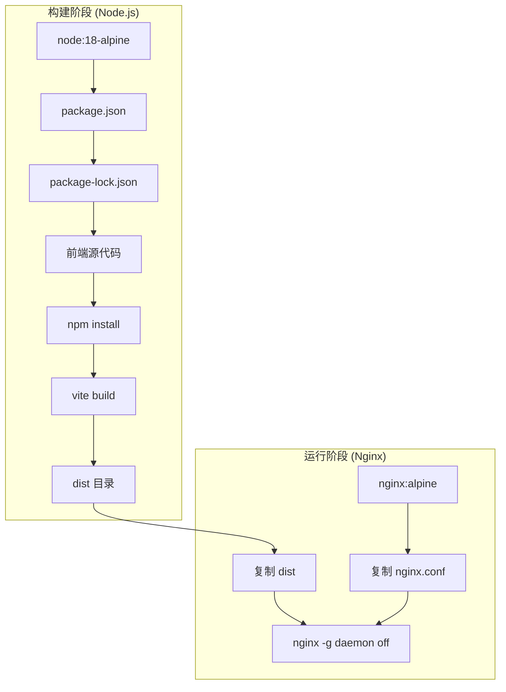
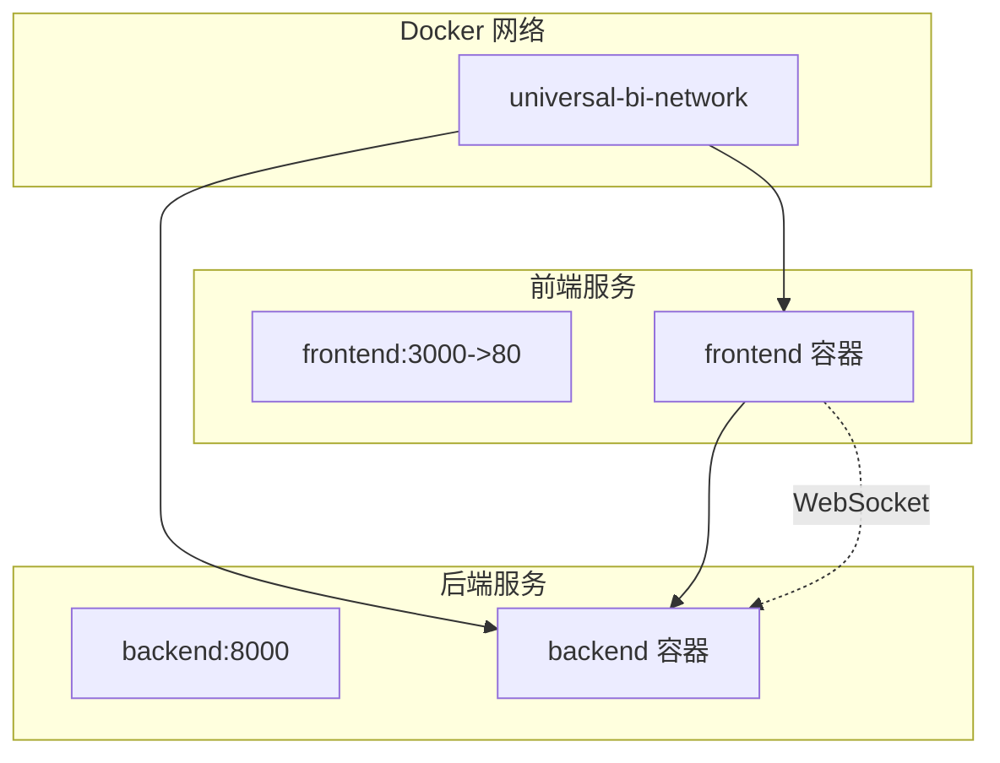

# 前端 Docker 镜像构建

<cite>
**本文档引用的文件**
- [Dockerfile.frontend](file://Dockerfile.frontend)
- [nginx.conf](file://frontend/nginx.conf)
- [package.json](file://frontend/package.json)
- [docker-compose.yml](file://docker-compose.yml)
- [vite.config.ts](file://frontend/vite.config.ts)
- [index.html](file://frontend/index.html)
- [.env.example](file://.env.example)
</cite>

## 目录
1. [简介](#简介)
2. [项目结构](#项目结构)
3. [核心组件](#核心组件)
4. [架构概览](#架构概览)
5. [详细组件分析](#详细组件分析)
6. [依赖关系分析](#依赖关系分析)
7. [性能考虑](#性能考虑)
8. [故障排除指南](#故障排除指南)
9. [结论](#结论)

## 简介

本文档详细分析了 Universal BI 项目的前端 Docker 镜像构建流程，重点解析 Dockerfile.frontend 的多阶段构建设计。该构建过程采用两阶段策略：第一阶段使用 node:18-alpine 进行依赖安装和应用构建，第二阶段使用 nginx:alpine 提供生产环境的静态资源服务。文档还涵盖了 npm 构建过程、国内镜像源配置、构建产物分发、Nginx 配置优化以及前端资源访问路径等关键内容。

## 项目结构

该项目采用前后端分离的微服务架构，前端构建通过 Docker 多阶段构建实现，确保最终镜像的轻量化和安全性。

**图表来源**
- [Dockerfile.frontend](file://Dockerfile.frontend#L1-L38)
- [docker-compose.yml](file://docker-compose.yml#L1-L141)

**章节来源**
- [Dockerfile.frontend](file://Dockerfile.frontend#L1-L38)
- [docker-compose.yml](file://docker-compose.yml#L1-L141)

## 核心组件

### 多阶段构建架构

前端镜像构建采用经典的多阶段构建模式，实现了开发环境与生产环境的有效分离：

**阶段一：构建阶段 (node:18-alpine)**
- 基础镜像：node:18-alpine（精简 Alpine Linux）
- 工作目录：/app
- 依赖管理：使用 npm 并配置国内镜像源
- 构建工具：Vite 进行生产环境构建
- 输出：dist 目录（构建产物）

**阶段二：运行阶段 (nginx:alpine)**
- 基础镜像：nginx:alpine（轻量级 Nginx）
- 静态资源：从构建阶段复制 dist 目录
- 配置文件：挂载自定义 Nginx 配置
- 服务端口：80
- 启动方式：直接运行 Nginx

**章节来源**
- [Dockerfile.frontend](file://Dockerfile.frontend#L5-L37)

### Nginx 配置优化

Nginx 配置文件实现了完整的生产环境优化策略：

**核心功能特性**
- Gzip 压缩：启用文本和 JavaScript 文件压缩
- 前端路由支持：使用 try_files 实现 SPA 路由
- 反向代理：将 /api/ 请求转发到后端服务
- 静态资源缓存：长期缓存策略提升加载速度
- 安全防护：禁止访问隐藏文件

**章节来源**
- [nginx.conf](file://frontend/nginx.conf#L1-L49)

## 架构概览

前端服务的整体架构展示了容器化部署的完整流程：

**图表来源**
- [docker-compose.yml](file://docker-compose.yml#L109-L120)
- [nginx.conf](file://frontend/nginx.conf#L19-L36)

**章节来源**
- [docker-compose.yml](file://docker-compose.yml#L109-L120)

## 详细组件分析

### Dockerfile.frontend 分析

#### 第一阶段：Node.js 构建环境

**图表来源**
- [Dockerfile.frontend](file://Dockerfile.frontend#L5-L20)

#### 第二阶段：Nginx 运行环境

**图表来源**
- [Dockerfile.frontend](file://Dockerfile.frontend#L25-L37)

**章节来源**
- [Dockerfile.frontend](file://Dockerfile.frontend#L1-L38)

### Nginx 配置详解

#### Gzip 压缩配置

Nginx 配置实现了多层次的压缩优化：

**图表来源**
- [nginx.conf](file://frontend/nginx.conf#L8-L12)

#### 反向代理配置

**图表来源**
- [nginx.conf](file://frontend/nginx.conf#L19-L36)

**章节来源**
- [nginx.conf](file://frontend/nginx.conf#L1-L49)

### Vite 构建配置

#### 构建输出配置

Vite 配置文件定义了生产环境的构建参数：

**图表来源**
- [vite.config.ts](file://frontend/vite.config.ts#L5-L26)

**章节来源**
- [vite.config.ts](file://frontend/vite.config.ts#L1-L27)

### 环境变量配置

#### Docker Compose 端口映射

**图表来源**
- [docker-compose.yml](file://docker-compose.yml#L115-L116)

**章节来源**
- [docker-compose.yml](file://docker-compose.yml#L115-L116)

## 依赖关系分析

### 构建阶段依赖链

**图表来源**
- [Dockerfile.frontend](file://Dockerfile.frontend#L5-L37)

### 服务间通信关系

**图表来源**
- [docker-compose.yml](file://docker-compose.yml#L109-L120)

**章节来源**
- [docker-compose.yml](file://docker-compose.yml#L1-L141)

## 性能考虑

### 构建优化建议

基于当前配置，以下是前端构建和部署的性能优化建议：

#### 1. 构建性能优化
- **依赖缓存策略**：保持 package-lock.json 的稳定性以利用 npm 缓存
- **并行构建**：Vite 已内置多线程构建能力
- **代码分割**：利用 Vite 的动态导入实现按需加载

#### 2. 静态资源优化
- **CDN 集成**：对于第三方库可考虑 CDN 加速
- **图片优化**：使用现代格式如 WebP 并提供降级方案
- **字体优化**：实施字体子集化和预加载策略

#### 3. 缓存策略增强
- **Service Worker**：实现离线缓存和智能更新
- **HTTP 缓存头**：根据文件类型设置不同的缓存策略
- **版本化资源**：使用内容哈希实现长效缓存

#### 4. 网络性能优化
- **HTTP/2**：启用 HTTP/2 以获得更好的连接复用
- **连接池**：合理配置后端 API 的连接池大小
- **超时设置**：根据业务需求调整代理超时参数

## 故障排除指南

### 常见构建问题

#### 1. 依赖安装失败
**症状**：构建阶段 npm install 失败
**解决方案**：
- 检查网络连接和国内镜像源可用性
- 清理 npm 缓存：`npm cache clean --force`
- 验证 package.json 格式正确性

#### 2. 构建产物缺失
**症状**：第二阶段复制 dist 目录失败
**解决方案**：
- 确认第一阶段构建命令执行成功
- 检查 Vite 配置中的 outDir 设置
- 验证构建输出权限

#### 3. Nginx 配置错误
**症状**：容器启动后无法访问静态资源
**解决方案**：
- 检查 nginx.conf 文件语法
- 验证静态资源路径配置
- 确认文件权限设置

### 容器启动问题

#### 1. 端口冲突
**症状**：前端容器启动失败，提示端口占用
**解决方案**：
- 修改 docker-compose.yml 中的 FRONTEND_PORT
- 检查主机端口占用情况
- 使用 `docker ps` 查看端口映射

#### 2. 服务依赖问题
**症状**：前端容器启动但无法访问后端 API
**解决方案**：
- 确认后端服务已完全启动
- 检查网络配置和容器间通信
- 验证反向代理配置正确性

**章节来源**
- [Dockerfile.frontend](file://Dockerfile.frontend#L14-L20)
- [nginx.conf](file://frontend/nginx.conf#L19-L36)

## 结论

Universal BI 项目的前端 Docker 镜像构建采用了现代化的多阶段构建策略，有效平衡了构建效率和运行时性能。通过使用 node:18-alpine 和 nginx:alpine 的精简基础镜像，实现了最小化的镜像体积和快速的启动时间。

该构建系统的主要优势包括：
- **模块化设计**：清晰的阶段分离便于维护和调试
- **性能优化**：内置 Gzip 压缩、静态资源缓存和反向代理
- **开发友好**：支持热重载和开发服务器代理
- **生产就绪**：完整的安全配置和错误处理

建议在实际部署中结合具体的业务需求，进一步优化缓存策略、监控指标和日志配置，以获得最佳的用户体验和运维效率。