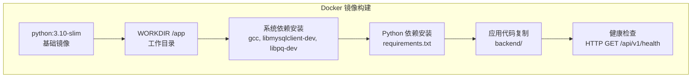
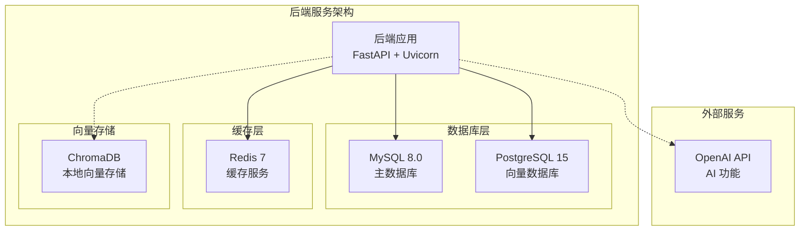
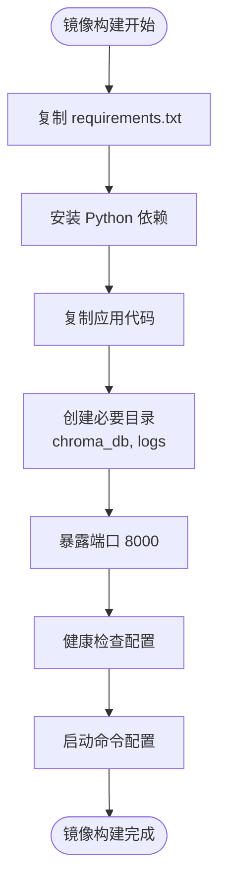
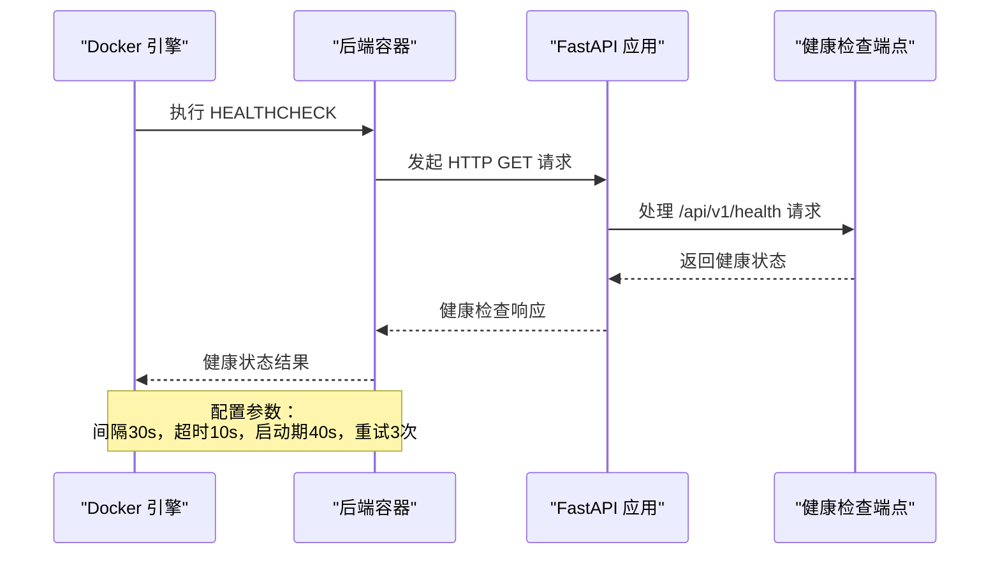
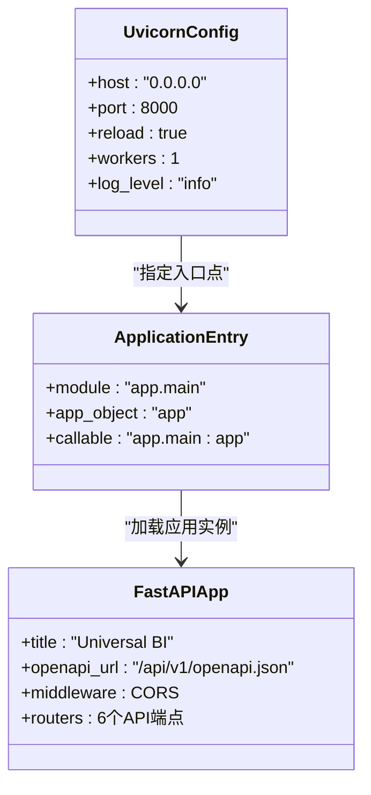
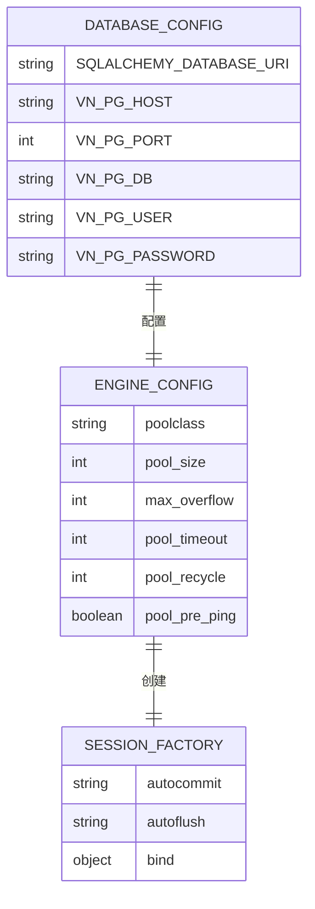

# 后端 Docker 镜像构建

<cite>
**本文档引用的文件**
- [Dockerfile.backend](file://Dockerfile.backend)
- [requirements.txt](file://requirements.txt)
- [backend/app/main.py](file://backend/app/main.py)
- [docker-compose.yml](file://docker-compose.yml)
- [backend/app/core/config.py](file://backend/app/core/config.py)
- [backend/app/db/session.py](file://backend/app/db/session.py)
- [.env.example](file://.env.example)
</cite>

## 目录
1. [简介](#简介)
2. [项目结构](#项目结构)
3. [核心组件](#核心组件)
4. [架构概览](#架构概览)
5. [详细组件分析](#详细组件分析)
6. [依赖关系分析](#依赖关系分析)
7. [性能考虑](#性能考虑)
8. [故障排除指南](#故障排除指南)
9. [结论](#结论)

## 简介

本文档深入解析了 Universal BI 项目的后端 Docker 镜像构建过程，重点关注 Dockerfile.backend 的每一层指令实现。该镜像基于 python:3.10-slim 基础镜像，为 FastAPI 应用提供了轻量级、高效的运行环境。文档详细说明了系统依赖安装的必要性、Python 依赖安装过程、应用代码复制策略、工作目录设置以及健康检查机制的实现。

## 项目结构

该项目采用前后端分离的微服务架构，后端使用 FastAPI 框架构建 RESTful API 服务。Docker 镜像构建遵循最佳实践，通过分层构建实现缓存优化和镜像体积控制。

**图表来源**
- [Dockerfile.backend](file://Dockerfile.backend#L5-L36)

**章节来源**
- [Dockerfile.backend](file://Dockerfile.backend#L1-L40)
- [docker-compose.yml](file://docker-compose.yml#L75-L104)

## 核心组件

### 基础镜像选择

项目选择了 `python:3.10-slim` 作为基础镜像，这一选择体现了以下考量：

- **版本稳定性**：Python 3.10 提供了最新的语言特性和性能改进
- **镜像体积**：slim 版本相比完整版减少了约 50% 的体积
- **安全性**：定期更新的基础镜像确保了安全补丁的及时应用
- **兼容性**：与项目中使用的依赖包完全兼容

### 系统依赖安装

镜像构建过程中安装了多个系统级依赖，这些依赖对于 Python 包的正确编译和运行至关重要：

- **编译工具链**：gcc 和 g++ 用于编译需要 C 扩展的 Python 包
- **数据库客户端**：libmysqlclient-dev 和 libpq-dev 提供 MySQL 和 PostgreSQL 的 C 接口支持
- **客户端工具**：postgresql-client 用于数据库连接测试

**章节来源**
- [Dockerfile.backend](file://Dockerfile.backend#L11-L17)

### Python 依赖管理

项目使用 requirements.txt 文件集中管理 Python 依赖，包含以下关键组件：

- **Web 框架**：FastAPI 和 Uvicorn 提供高性能的异步 Web 服务器
- **数据库访问**：SQLAlchemy ORM 框架，支持多种数据库后端
- **数据处理**：Pydantic 数据验证，Pandas 数据分析
- **AI 集成**：Vanna 向量数据库接口，OpenAI API 集成
- **缓存系统**：Redis 支持，ChromaDB 向量存储

**章节来源**
- [requirements.txt](file://requirements.txt#L1-L15)

## 架构概览

后端服务采用容器化部署，通过 Docker Compose 实现多服务协调。下图展示了后端服务与其依赖服务的交互关系：

**图表来源**
- [docker-compose.yml](file://docker-compose.yml#L7-L104)
- [backend/app/core/config.py](file://backend/app/core/config.py#L17-L42)

## 详细组件分析

### 工作目录和文件组织

镜像构建过程中的文件组织遵循最佳实践：

**图表来源**
- [Dockerfile.backend](file://Dockerfile.backend#L8-L39)

### 健康检查机制

健康检查是容器监控的重要组成部分，采用 HTTP 请求方式验证应用状态：

**图表来源**
- [Dockerfile.backend](file://Dockerfile.backend#L34-L36)

### 启动命令配置

启动命令使用 Uvicorn ASGI 服务器，配置了生产环境所需的参数：

**图表来源**
- [Dockerfile.backend](file://Dockerfile.backend#L39)
- [backend/app/main.py](file://backend/app/main.py#L11-L30)

**章节来源**
- [Dockerfile.backend](file://Dockerfile.backend#L38-L39)
- [backend/app/main.py](file://backend/app/main.py#L1-L35)

### 开发环境热重载

热重载功能在开发环境中提供了高效的迭代体验：

- **自动重启**：代码变更时自动重启应用进程
- **开发友好**：便于快速测试和调试
- **生产禁用**：生产环境通过环境变量控制禁用热重载

**章节来源**
- [Dockerfile.backend](file://Dockerfile.backend#L39)

## 依赖关系分析

### 数据库连接配置

后端应用支持多种数据库后端，通过 SQLAlchemy ORM 实现统一的数据访问：

**图表来源**
- [backend/app/core/config.py](file://backend/app/core/config.py#L17-L23)
- [backend/app/db/session.py](file://backend/app/db/session.py#L14-L24)

### 环境变量管理

项目使用 .env.example 文件提供完整的配置模板，支持多种部署场景：

- **开发环境**：本地数据库连接，简化部署流程
- **生产环境**：外部数据库服务，支持高可用部署
- **Docker 环境**：通过 docker-compose 自动注入配置

**章节来源**
- [.env.example](file://.env.example#L1-L72)
- [backend/app/core/config.py](file://backend/app/core/config.py#L44-L47)

## 性能考虑

### 镜像构建优化

当前的单阶段构建虽然简单易懂，但存在以下优化空间：

1. **多阶段构建**：分离构建阶段和运行阶段，减少最终镜像体积
2. **缓存优化**：合理安排 COPY 指令顺序，最大化利用 Docker 缓存
3. **依赖管理**：使用 pip-tools 或 Poetry 管理依赖版本锁定

### 运行时性能

- **连接池配置**：SQLAlchemy 连接池参数经过优化，支持高并发请求
- **内存管理**：Redis 缓存配置支持大规模数据缓存
- **向量存储**：ChromaDB 本地存储适合中小规模向量数据

## 故障排除指南

### 常见问题诊断

1. **端口冲突**：检查 BACKEND_PORT 环境变量配置
2. **数据库连接失败**：验证 SQLALCHEMY_DATABASE_URI 配置
3. **健康检查失败**：确认 API 服务正常启动和端口开放

### 调试技巧

- **日志查看**：使用 `docker logs <container_id>` 查看应用日志
- **网络诊断**：使用 `docker exec -it <container> ping <service>` 测试服务连通性
- **资源监控**：使用 `docker stats <container_id>` 监控容器资源使用情况

**章节来源**
- [docker-compose.yml](file://docker-compose.yml#L85-L99)

## 结论

Universal BI 项目的后端 Docker 镜像构建展现了现代容器化应用的最佳实践。通过精心设计的分层结构、合理的依赖管理和完善的健康检查机制，该镜像为生产环境提供了稳定可靠的运行基础。

主要优势包括：
- **简洁高效**：基于 slim 基础镜像，构建过程快速
- **功能完整**：支持多种数据库后端和 AI 功能集成
- **易于维护**：清晰的文件组织和配置管理
- **生产就绪**：包含健康检查和错误处理机制

未来可以考虑的改进方向：
- 实施多阶段构建以进一步优化镜像体积
- 添加更细粒度的日志记录和监控
- 实现更灵活的配置管理方案