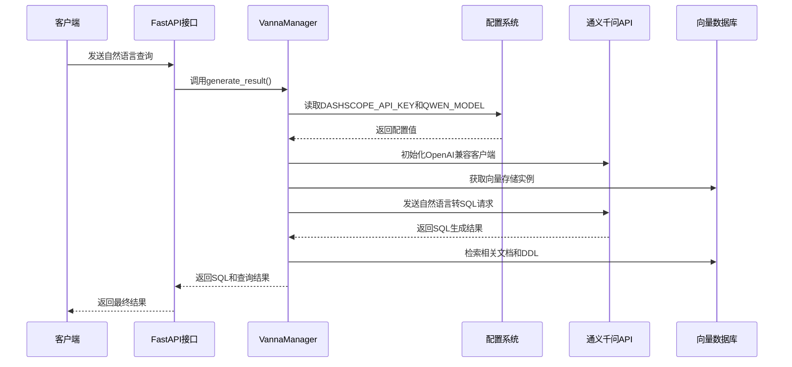
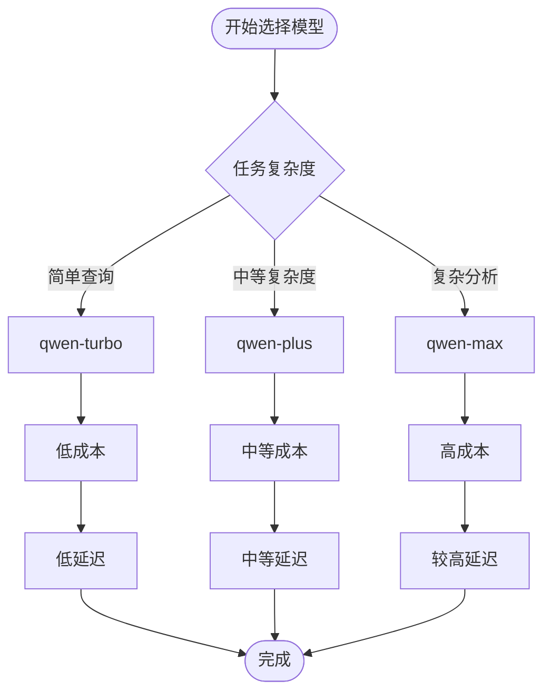
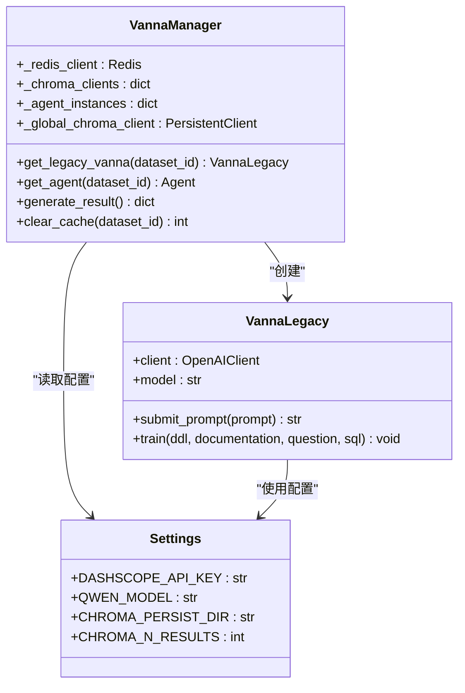
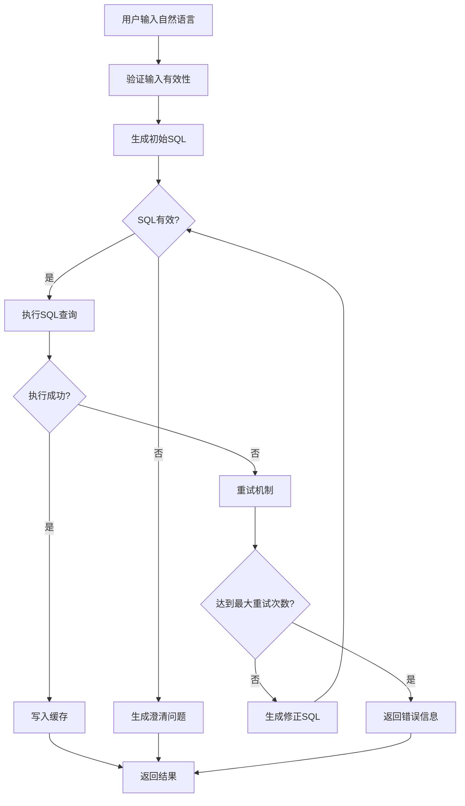
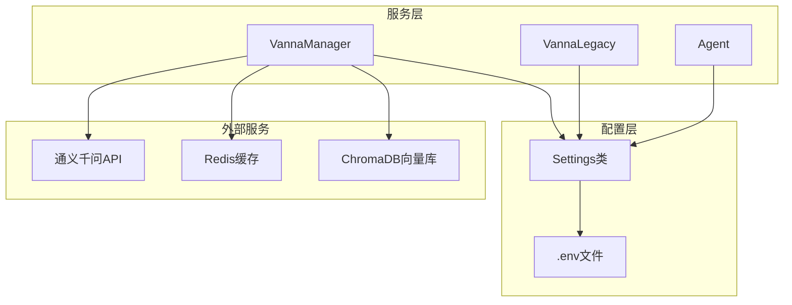

# AI模型与API密钥配置

<cite>
**本文引用的文件**
- [vanna_manager.py](file://backend/app/services/vanna_manager.py)
- [config.py](file://backend/app/core/config.py)
- [.env.example](file://.env.example)
- [chat.py](file://backend/app/api/v1/endpoints/chat.py)
- [README.md](file://README.md)
- [AI_FEEDBACK_TRAINING.md](file://docs/backend/AI_FEEDBACK_TRAINING.md)
</cite>

## 目录
1. [简介](#简介)
2. [项目结构](#项目结构)
3. [核心组件](#核心组件)
4. [架构概览](#架构概览)
5. [详细组件分析](#详细组件分析)
6. [依赖关系分析](#依赖关系分析)
7. [性能考虑](#性能考虑)
8. [故障排查指南](#故障排查指南)
9. [结论](#结论)

## 简介
本文档详细说明了项目中AI模型相关的配置项，重点解释DASHSCOPE_API_KEY（通义千问API密钥）和QWEN_MODEL（指定Qwen模型版本）的作用机制。文档阐述了这些配置如何被vanna_manager.py用于初始化Vanna AI模型并执行自然语言到SQL的转换，提供了不同Qwen模型版本的性能与成本对比建议，强调了API密钥的安全存储要求，并给出了配置错误导致AI服务不可用的故障排查步骤。

## 项目结构
该项目采用后端Python FastAPI + 前端Vue的架构，AI能力通过Vanna框架集成，使用阿里云通义千问API进行自然语言到SQL的转换。配置项集中在后端的配置模块中，通过环境变量文件进行管理。

```mermaid
graph TB
subgraph "后端"
API[FastAPI接口层]
SVC[服务层<br/>VannaManager]
CFG[配置层<br/>Settings]
ENV[环境变量文件<br/>.env]
end
subgraph "AI服务"
Vanna[Vanna框架]
DashScope[通义千问API]
end
subgraph "数据存储"
DB[(数据库)]
VectorDB[(向量数据库)]
end
API --> SVC
SVC --> CFG
CFG <- --> ENV
SVC --> Vanna
Vanna --> DashScope
SVC --> DB
SVC --> VectorDB
```

**图表来源**
- [vanna_manager.py](file://backend/app/services/vanna_manager.py#L131-L351)
- [config.py](file://backend/app/core/config.py#L5-L49)

**章节来源**
- [vanna_manager.py](file://backend/app/services/vanna_manager.py#L1-L100)
- [config.py](file://backend/app/core/config.py#L1-L51)

## 核心组件
本节详细分析AI模型配置的核心组件及其作用机制。

### 配置类Settings
配置类统一管理所有应用配置，包括AI模型配置项：

- **DASHSCOPE_API_KEY**: 通义千问API密钥，从.env文件或系统环境变量读取
- **QWEN_MODEL**: 指定使用的Qwen模型版本，默认为"qwen-max"
- **CHROMA_PERSIST_DIR**: 向量数据库持久化目录
- **CHROMA_N_RESULTS**: 向量检索返回结果数量

### VannaManager类
VannaManager是AI模型管理的核心类，负责：

- 初始化Vanna实例（支持传统API和Vanna 2.0）
- 管理Redis缓存和ChromaDB向量存储
- 执行自然语言到SQL的转换流程
- 处理训练数据和反馈优化

**章节来源**
- [config.py](file://backend/app/core/config.py#L21-L43)
- [vanna_manager.py](file://backend/app/services/vanna_manager.py#L131-L351)

## 架构概览
AI模型配置在整个系统中的作用机制如下：



**图表来源**
- [vanna_manager.py](file://backend/app/services/vanna_manager.py#L265-L351)
- [chat.py](file://backend/app/api/v1/endpoints/chat.py#L13-L42)

## 详细组件分析

### DASHSCOPE_API_KEY配置机制
DASHSCOPE_API_KEY是通义千问API的认证密钥，其配置和使用机制如下：

#### 配置读取流程
1. **环境变量加载**: 从.env文件或系统环境变量读取
2. **配置验证**: 在应用启动时验证API密钥的有效性
3. **动态传递**: 通过Settings对象传递给各个服务组件

#### API密钥注入位置
- **传统Vanna实例**: 在get_legacy_vanna()方法中注入
- **Vanna 2.0实例**: 在get_agent()方法中注入
- **直接API调用**: 在generate_summary()等方法中直接使用

#### 安全存储要求
- **禁止硬编码**: API密钥不应直接写在代码中
- **推荐存储方式**: 
  - 环境变量文件(.env)
  - 云平台密钥管理系统
  - 容器编排平台的密钥管理服务
- **访问控制**: 限制API密钥的访问权限和使用范围

**章节来源**
- [config.py](file://backend/app/core/config.py#L23-L24)
- [vanna_manager.py](file://backend/app/services/vanna_manager.py#L284-L288)
- [vanna_manager.py](file://backend/app/services/vanna_manager.py#L317-L319)

### QWEN_MODEL配置机制
QWEN_MODEL用于指定使用的通义千问模型版本，支持的版本包括：

#### 支持的模型版本
- **qwen-max**: 最大模型，适合复杂任务和高精度需求
- **qwen-plus**: 中等规模模型，平衡性能和成本
- **qwen-turbo**: 轻量级模型，适合简单任务和低延迟场景

#### 模型选择策略


**图表来源**
- [config.py](file://backend/app/core/config.py#L24-L24)

**章节来源**
- [config.py](file://backend/app/core/config.py#L24-L24)
- [vanna_manager.py](file://backend/app/services/vanna_manager.py#L285-L285)

### VannaManager初始化流程
VannaManager负责AI模型的完整生命周期管理：

#### 实例初始化


**图表来源**
- [vanna_manager.py](file://backend/app/services/vanna_manager.py#L131-L300)
- [config.py](file://backend/app/core/config.py#L5-L49)

**章节来源**
- [vanna_manager.py](file://backend/app/services/vanna_manager.py#L265-L351)

### 自然语言到SQL转换流程
VannaManager实现了完整的NLP到SQL转换流程：



**图表来源**
- [vanna_manager.py](file://backend/app/services/vanna_manager.py#L876-L1340)

**章节来源**
- [vanna_manager.py](file://backend/app/services/vanna_manager.py#L876-L1340)

## 依赖关系分析
AI模型配置的依赖关系如下：



**图表来源**
- [config.py](file://backend/app/core/config.py#L5-L49)
- [vanna_manager.py](file://backend/app/services/vanna_manager.py#L131-L351)

**章节来源**
- [config.py](file://backend/app/core/config.py#L1-L51)
- [vanna_manager.py](file://backend/app/services/vanna_manager.py#L1-L100)

## 性能考虑
基于项目中的实现，不同Qwen模型版本的性能与成本对比建议：

### 模型性能特征
- **qwen-turbo**: 
  - 延迟最低，适合简单查询
  - 成本最便宜，适合大量轻量查询
  - 适合实时性要求高的场景
  
- **qwen-plus**: 
  - 平衡的性能和成本
  - 适合大多数业务场景
  - 性价比最佳的选择
  
- **qwen-max**: 
  - 最高的准确性，适合复杂分析
  - 延迟最高，成本最贵
  - 适合深度分析和复杂查询

### 成本优化策略
1. **模型选择**: 根据查询复杂度选择合适的模型
2. **缓存策略**: 利用Redis缓存减少API调用
3. **批量处理**: 对相似查询进行批处理
4. **监控告警**: 设置API调用限额和费用监控

## 故障排查指南

### API密钥相关问题
**问题症状**: AI服务不可用，返回认证错误

**排查步骤**:
1. 验证.env文件中DASHSCOPE_API_KEY配置
2. 检查API密钥是否过期或被禁用
3. 确认API密钥具有足够的权限
4. 验证网络连接到通义千问API

**章节来源**
- [README.md](file://README.md#L300-L307)

### 模型配置问题
**问题症状**: 模型初始化失败或查询结果异常

**排查步骤**:
1. 检查QWEN_MODEL配置值是否正确
2. 验证所选模型版本是否可用
3. 确认模型版本与API兼容性
4. 查看相关日志获取详细错误信息

### 缓存相关问题
**问题症状**: 查询结果不更新或缓存异常

**排查步骤**:
1. 清理Redis缓存
2. 检查缓存配置参数
3. 验证缓存连接状态
4. 确认缓存键生成规则

### 向量数据库问题
**问题症状**: 训练数据丢失或查询结果不准确

**排查步骤**:
1. 检查ChromaDB持久化目录权限
2. 验证向量存储连接状态
3. 确认集合名称和配置
4. 查看向量检索结果

**章节来源**
- [AI_FEEDBACK_TRAINING.md](file://docs/backend/AI_FEEDBACK_TRAINING.md#L361-L390)

## 结论
本项目通过精心设计的配置体系和VannaManager服务层，实现了灵活且高效的AI模型管理。DASHSCOPE_API_KEY和QWEN_MODEL配置项为系统的AI能力提供了强大的基础设施支持。通过合理的模型选择策略、安全的密钥管理和完善的故障排查机制，系统能够在保证性能的同时满足生产环境的各种需求。

建议在实际部署中：
1. 严格遵守API密钥的安全存储规范
2. 根据业务场景选择合适的模型版本
3. 建立完善的监控和告警机制
4. 定期评估和优化模型配置策略