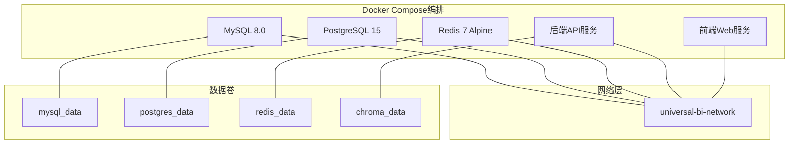
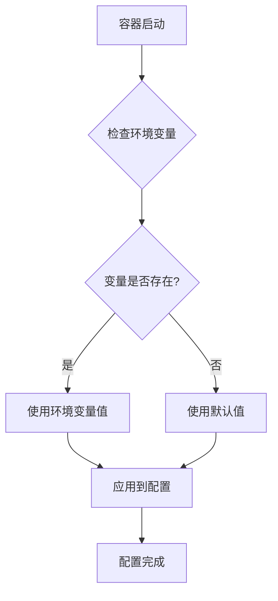
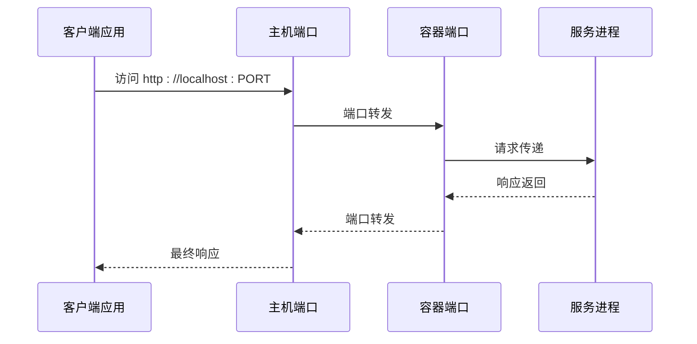
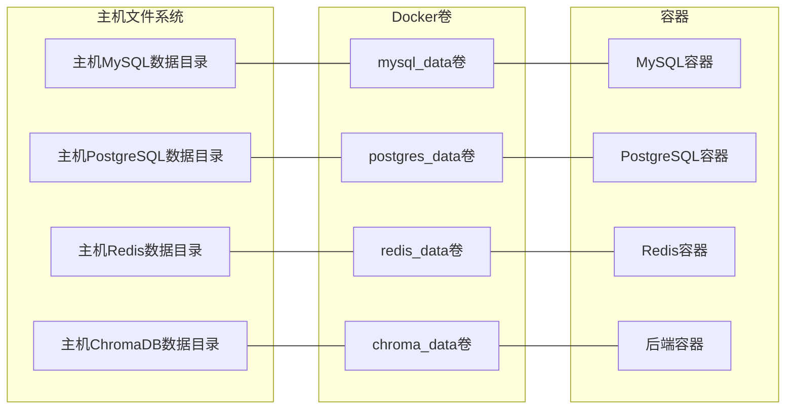
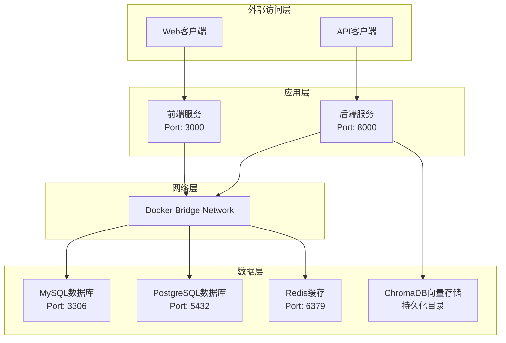
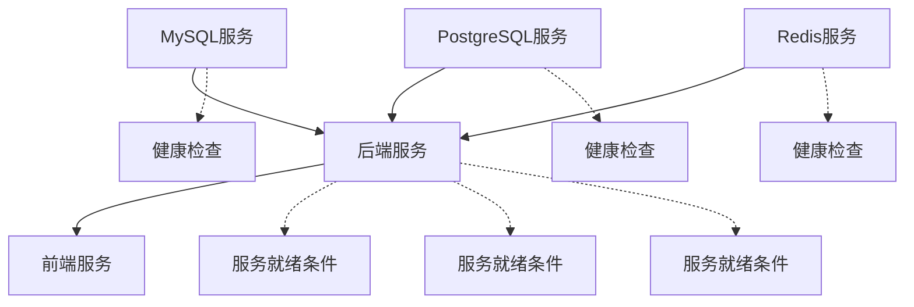
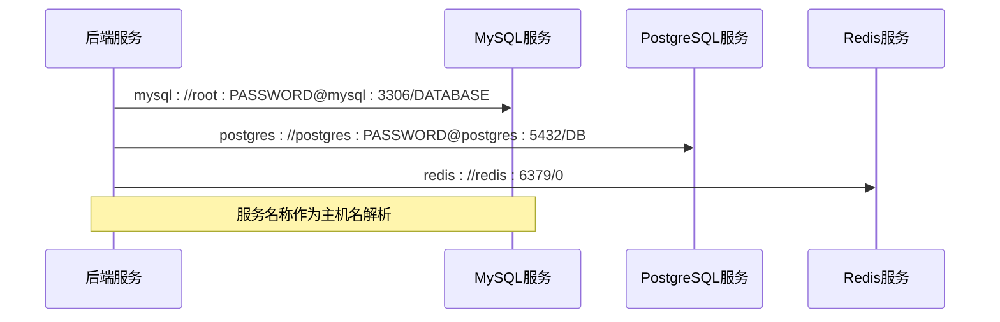

# Docker Compose配置继承

<cite>
**本文档引用的文件**
- [docker-compose.yml](file://docker-compose.yml)
- [.env.example](file://.env.example)
- [Dockerfile.backend](file://Dockerfile.backend)
- [backend/app/core/config.py](file://backend/app/core/config.py)
- [backend/requirements.txt](file://backend/requirements.txt)
- [QUICKSTART.md](file://QUICKSTART.md)
- [README.md](file://README.md)
</cite>

## 目录
1. [引言](#引言)
2. [项目结构概览](#项目结构概览)
3. [核心组件分析](#核心组件分析)
4. [架构总览](#架构总览)
5. [详细组件分析](#详细组件分析)
6. [依赖关系分析](#依赖关系分析)
7. [性能考虑](#性能考虑)
8. [故障排除指南](#故障排除指南)
9. [结论](#结论)

## 引言

本文档深入解析该Docker Compose项目的配置继承机制，重点说明服务（如backend、db、redis）如何从.env文件继承MYSQL_ROOT_PASSWORD、POSTGRES_PASSWORD、REDIS_PASSWORD等配置。详细描述端口映射如何实现容器内外通信，以及卷挂载对数据持久化的影响。同时提供多环境（开发、测试、生产）下docker-compose文件的覆盖与扩展策略，并演示如何通过自定义.env文件覆盖默认值以实现环境隔离。

## 项目结构概览

该项目采用Docker Compose进行容器编排，包含以下主要服务：



**图表来源**
- [docker-compose.yml](file://docker-compose.yml#L3-L141)

**章节来源**
- [docker-compose.yml](file://docker-compose.yml#L1-L141)

## 核心组件分析

### 环境变量继承机制

Docker Compose通过多种方式实现环境变量的继承和覆盖：

#### 1. 默认值继承
每个服务都定义了默认的环境变量值，格式为`${VARIABLE_NAME:-default_value}`：



**图表来源**
- [docker-compose.yml](file://docker-compose.yml#L11-L16)
- [docker-compose.yml](file://docker-compose.yml#L36-L40)
- [docker-compose.yml](file://docker-compose.yml#L59)

#### 2. 变量覆盖优先级
当同时存在系统环境变量和.env文件时，Docker Compose遵循以下优先级：
1. 系统环境变量（最高优先级）
2. docker-compose.yml中的直接定义
3. .env文件中的值
4. 默认值

**章节来源**
- [docker-compose.yml](file://docker-compose.yml#L11-L27)
- [docker-compose.yml](file://docker-compose.yml#L36-L50)
- [docker-compose.yml](file://docker-compose.yml#L59-L70)

### 端口映射机制

端口映射采用`HOST_PORT:CONTAINER_PORT`格式，实现容器内外通信：



**图表来源**
- [docker-compose.yml](file://docker-compose.yml#L15-L16)
- [docker-compose.yml](file://docker-compose.yml#L40-L41)
- [docker-compose.yml](file://docker-compose.yml#L60-L61)
- [docker-compose.yml](file://docker-compose.yml#L81-L82)
- [docker-compose.yml](file://docker-compose.yml#L115-L116)

**章节来源**
- [docker-compose.yml](file://docker-compose.yml#L15-L16)
- [docker-compose.yml](file://docker-compose.yml#L40-L41)
- [docker-compose.yml](file://docker-compose.yml#L60-L61)
- [docker-compose.yml](file://docker-compose.yml#L81-L82)
- [docker-compose.yml](file://docker-compose.yml#L115-L116)

### 卷挂载与数据持久化

卷挂载确保数据在容器重启后不会丢失：



**图表来源**
- [docker-compose.yml](file://docker-compose.yml#L17-L18)
- [docker-compose.yml](file://docker-compose.yml#L42-L43)
- [docker-compose.yml](file://docker-compose.yml#L62-L63)
- [docker-compose.yml](file://docker-compose.yml#L100-L102)

**章节来源**
- [docker-compose.yml](file://docker-compose.yml#L17-L18)
- [docker-compose.yml](file://docker-compose.yml#L42-L43)
- [docker-compose.yml](file://docker-compose.yml#L62-L63)
- [docker-compose.yml](file://docker-compose.yml#L100-L102)

## 架构总览

整个系统的架构采用微服务模式，各组件通过Docker网络进行通信：



**图表来源**
- [docker-compose.yml](file://docker-compose.yml#L3-L141)

## 详细组件分析

### MySQL服务配置

MySQL服务实现了完整的配置继承机制：

#### 环境变量配置
- **MYSQL_ROOT_PASSWORD**: 根密码继承机制
- **MYSQL_DATABASE**: 默认数据库名称
- **TZ**: 时区设置

#### 端口映射
- 主机端口: `${MYSQL_PORT:-3306}`
- 容器端口: 3306

#### 数据持久化
- 数据卷: `mysql_data:/var/lib/mysql`
- 初始化脚本: `./backend/migrations:/docker-entrypoint-initdb.d`

**章节来源**
- [docker-compose.yml](file://docker-compose.yml#L7-L27)

### PostgreSQL服务配置

PostgreSQL服务提供了向量数据库支持：

#### 环境变量配置
- **POSTGRES_PASSWORD**: PostgreSQL密码
- **POSTGRES_DB**: 默认数据库名称
- **TZ**: 时区设置

#### 端口映射
- 主机端口: `${POSTGRES_PORT:-5432}`
- 容器端口: 5432

#### 数据持久化
- 数据卷: `postgres_data:/var/lib/postgresql/data`

**章节来源**
- [docker-compose.yml](file://docker-compose.yml#L32-L50)

### Redis服务配置

Redis服务实现了密码认证和持久化：

#### 环境变量配置
- **REDIS_PASSWORD**: Redis密码（可选）
- **REDIS_PORT**: Redis端口

#### 条件命令执行
Redis启动命令根据密码存在性动态调整：
```bash
redis-server --appendonly yes ${REDIS_PASSWORD:+--requirepass $REDIS_PASSWORD}
```

#### 数据持久化
- 数据卷: `redis_data:/data`

**章节来源**
- [docker-compose.yml](file://docker-compose.yml#L55-L70)

### 后端服务配置

后端服务通过.env文件实现配置管理：

#### 配置文件继承
- **env_file**: `- .env`
- **环境变量**: 从.env文件读取所有配置

#### 数据库连接配置
- **SQLALCHEMY_DATABASE_URI**: MySQL连接字符串
- **REDIS_URL**: Redis连接字符串（支持密码认证）
- **向量数据库配置**: PGVector连接参数

#### 依赖关系
- 依赖MySQL健康检查
- 依赖PostgreSQL健康检查  
- 依赖Redis健康检查

**章节来源**
- [docker-compose.yml](file://docker-compose.yml#L75-L104)
- [backend/app/core/config.py](file://backend/app/core/config.py#L44-L47)

### 前端服务配置

前端服务作为静态资源提供者：

#### 端口映射
- 主机端口: `${FRONTEND_PORT:-3000}`
- 容器端口: 80

#### 依赖关系
- 依赖后端服务启动完成

**章节来源**
- [docker-compose.yml](file://docker-compose.yml#L109-L120)

## 依赖关系分析

### 服务间依赖关系



**图表来源**
- [docker-compose.yml](file://docker-compose.yml#L93-L99)

### 网络通信分析

所有服务都在同一个Docker网络中通信，使用服务名称作为主机名：



**图表来源**
- [docker-compose.yml](file://docker-compose.yml#L86-L92)

**章节来源**
- [docker-compose.yml](file://docker-compose.yml#L93-L99)

## 性能考虑

### 环境变量处理性能

Docker Compose在启动时会进行环境变量解析，建议：
- 避免在.env文件中使用复杂的shell表达式
- 合理设置默认值，减少运行时计算开销
- 使用简洁的变量命名，提高解析效率

### 端口映射性能

- 避免使用过多的端口映射
- 合理规划端口范围，避免冲突
- 在生产环境中固定端口映射，便于防火墙配置

### 数据持久化性能

- 使用独立的数据卷分离不同服务的数据
- 定期备份重要数据
- 监控磁盘空间使用情况

## 故障排除指南

### 常见配置问题

#### 环境变量未生效
1. 检查.env文件格式是否正确
2. 确认变量名大小写匹配
3. 验证Docker Compose版本兼容性

#### 端口冲突
```bash
# 检查端口占用
netstat -tulpn | grep :3306
netstat -tulpn | grep :5432
netstat -tulpn | grep :6379
netstat -tulpn | grep :8000
netstat -tulpn | grep :3000
```

#### 数据丢失问题
1. 检查数据卷是否正确挂载
2. 验证卷权限设置
3. 确认容器停止策略

**章节来源**
- [QUICKSTART.md](file://QUICKSTART.md#L192-L250)

### 环境隔离策略

#### 开发环境配置
```bash
# 创建开发环境配置
cp .env.example .env.dev
# 修改开发专用配置
vi .env.dev
```

#### 测试环境配置
```bash
# 创建测试环境配置
cp .env.example .env.test
# 修改测试专用配置
vi .env.test
```

#### 生产环境配置
```bash
# 创建生产环境配置
cp .env.example .env.prod
# 修改生产专用配置
vi .env.prod
```

**章节来源**
- [QUICKSTART.md](file://QUICKSTART.md#L44-L74)

## 结论

该Docker Compose配置展现了现代容器化应用的最佳实践：

1. **灵活的配置继承机制**：通过默认值、环境变量覆盖和.env文件继承，实现了多层次的配置管理
2. **清晰的服务依赖关系**：通过健康检查和依赖声明，确保服务按正确顺序启动
3. **可靠的数据持久化**：独立的数据卷设计保证了数据的安全性和可恢复性
4. **高效的网络通信**：统一的Docker网络简化了服务间的通信
5. **完善的环境隔离**：支持多环境配置，满足开发、测试、生产的不同需求

这种设计使得系统既易于维护，又具备良好的扩展性，为后续的功能扩展和运维管理奠定了坚实的基础。