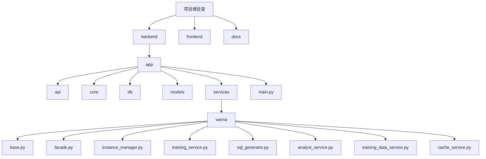
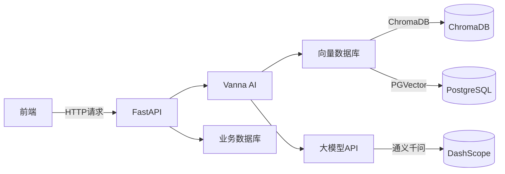
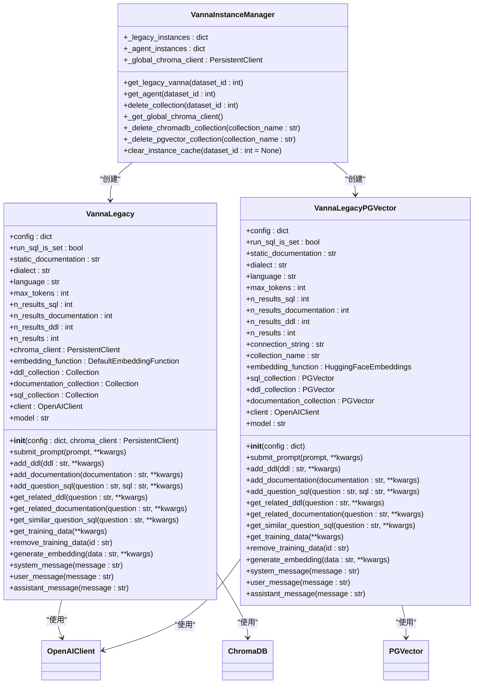
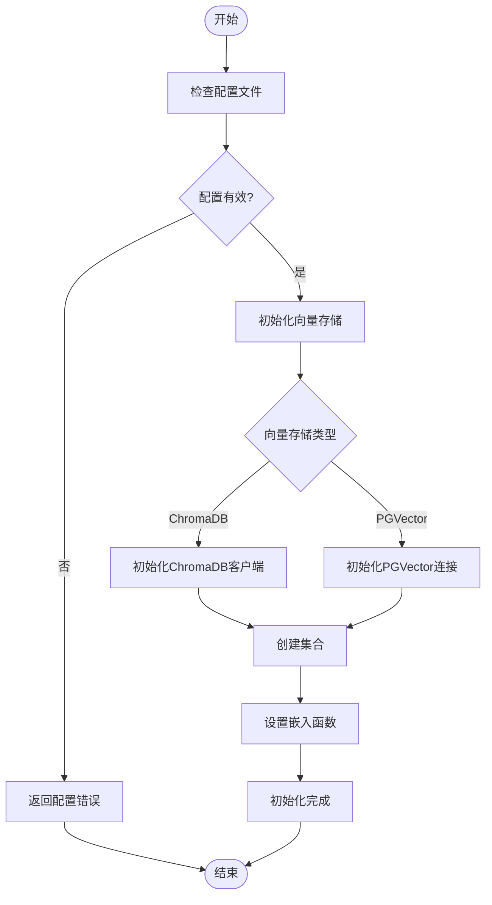
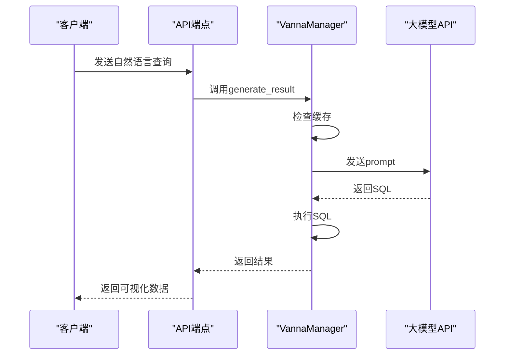
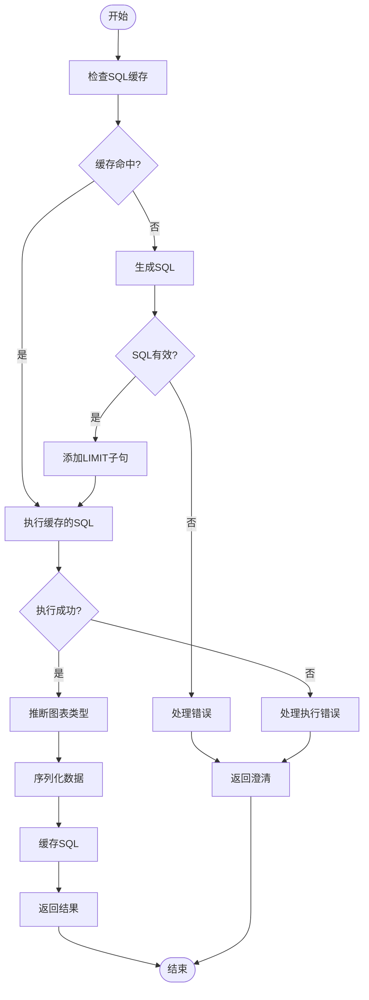
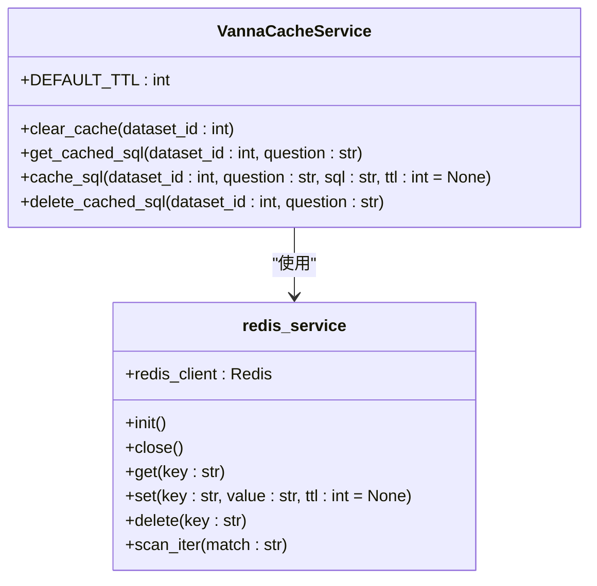
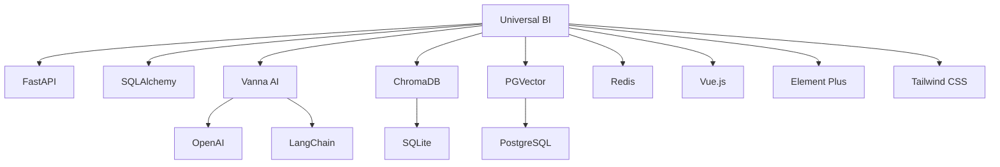

# 双意向量存储

<cite>
**本文档引用的文件**
- [main.py](file://backend/app/main.py)
- [config.py](file://backend/app/core/config.py)
- [base.py](file://backend/app/services/vanna/base.py)
- [facade.py](file://backend/app/services/vanna/facade.py)
- [instance_manager.py](file://backend/app/services/vanna/instance_manager.py)
- [training_service.py](file://backend/app/services/vanna/training_service.py)
- [sql_generator.py](file://backend/app/services/vanna/sql_generator.py)
- [analyst_service.py](file://backend/app/services/vanna/analyst_service.py)
- [training_data_service.py](file://backend/app/services/vanna/training_data_service.py)
- [cache_service.py](file://backend/app/services/vanna/cache_service.py)
- [metadata.py](file://backend/app/models/metadata.py)
- [chat.py](file://backend/app/api/v1/endpoints/chat.py)
- [dataset.py](file://backend/app/api/v1/endpoints/dataset.py)
- [utils.py](file://backend/app/services/vanna/utils.py)
</cite>

## 目录
1. [简介](#简介)
2. [项目结构](#项目结构)
3. [核心组件](#核心组件)
4. [架构概述](#架构概述)
5. [详细组件分析](#详细组件分析)
6. [依赖分析](#依赖分析)
7. [性能考虑](#性能考虑)
8. [故障排除指南](#故障排除指南)
9. [结论](#结论)

## 简介
双意向量存储是Universal BI平台的核心功能，它通过两种向量数据库技术（ChromaDB和PGVector）来实现AI驱动的自然语言数据分析。该系统允许用户通过自然语言提问，自动生成SQL查询并返回可视化结果。本项目采用Vanna AI框架，结合通义千问大模型，实现了高效的数据分析能力。

## 项目结构
项目采用分层架构设计，包含后端、前端和文档三个主要部分。后端基于FastAPI框架，实现了RESTful API接口；前端使用Vue 3和TypeScript构建现代化用户界面；文档部分包含了详细的开发和使用指南。

**图源**
- [main.py](file://backend/app/main.py#L1-L166)
- [config.py](file://backend/app/core/config.py#L1-L73)

**章节源**
- [main.py](file://backend/app/main.py#L1-L166)
- [config.py](file://backend/app/core/config.py#L1-L73)

## 核心组件
系统的核心组件包括向量数据库管理、AI模型集成、SQL生成引擎和缓存服务。这些组件协同工作，实现了从自然语言到SQL查询的转换过程。通过Vanna AI框架的封装，系统能够灵活地切换不同的向量数据库后端。

**章节源**
- [base.py](file://backend/app/services/vanna/base.py#L1-L364)
- [facade.py](file://backend/app/services/vanna/facade.py#L1-L152)

## 架构概述
系统采用微服务架构，通过FastAPI提供RESTful API接口。后端服务与前端通过API进行通信，实现了前后端分离。向量数据库作为核心存储，保存了训练数据和模型状态。

**图源**
- [main.py](file://backend/app/main.py#L1-L166)
- [config.py](file://backend/app/core/config.py#L1-L73)

## 详细组件分析

### 向量数据库管理
向量数据库管理组件负责处理ChromaDB和PGVector两种后端的初始化、数据存储和检索操作。通过配置文件可以灵活切换不同的向量数据库。

#### 向量数据库管理类图

**图源**
- [base.py](file://backend/app/services/vanna/base.py#L1-L364)
- [instance_manager.py](file://backend/app/services/vanna/instance_manager.py#L1-L289)

#### 向量数据库管理流程图

**图源**
- [config.py](file://backend/app/core/config.py#L1-L73)
- [instance_manager.py](file://backend/app/services/vanna/instance_manager.py#L1-L289)

**章节源**
- [base.py](file://backend/app/services/vanna/base.py#L1-L364)
- [instance_manager.py](file://backend/app/services/vanna/instance_manager.py#L1-L289)

### AI模型集成
AI模型集成组件负责与大语言模型API进行通信，将自然语言转换为SQL查询。系统使用通义千问的qwen-max模型，通过OpenAI兼容的API接口进行调用。

#### AI模型集成序列图

**图源**
- [sql_generator.py](file://backend/app/services/vanna/sql_generator.py#L1-L529)
- [chat.py](file://backend/app/api/v1/endpoints/chat.py#L1-L424)

**章节源**
- [sql_generator.py](file://backend/app/services/vanna/sql_generator.py#L1-L529)
- [chat.py](file://backend/app/api/v1/endpoints/chat.py#L1-L424)

### SQL生成引擎
SQL生成引擎是系统的核心，负责将自然语言转换为可执行的SQL查询。引擎采用多轮对话反思循环机制，能够处理复杂的查询需求。

#### SQL生成引擎流程图

**图源**
- [sql_generator.py](file://backend/app/services/vanna/sql_generator.py#L1-L529)
- [utils.py](file://backend/app/services/vanna/utils.py#L1-L285)

**章节源**
- [sql_generator.py](file://backend/app/services/vanna/sql_generator.py#L1-L529)
- [utils.py](file://backend/app/services/vanna/utils.py#L1-L285)

### 缓存服务
缓存服务组件负责管理Redis缓存，提高系统性能。服务提供了异步的缓存读写操作，避免了同步阻塞问题。

#### 缓存服务类图

**图源**
- [cache_service.py](file://backend/app/services/vanna/cache_service.py#L1-L126)
- [redis.py](file://backend/app/core/redis.py)

**章节源**
- [cache_service.py](file://backend/app/services/vanna/cache_service.py#L1-L126)

## 依赖分析
系统依赖于多个外部库和工具，包括FastAPI、SQLAlchemy、Vanna AI、ChromaDB、PGVector等。这些依赖通过requirements.txt文件进行管理。

**图源**
- [requirements.txt](file://backend/requirements.txt)
- [package.json](file://frontend/package.json)

**章节源**
- [requirements.txt](file://backend/requirements.txt)
- [package.json](file://frontend/package.json)

## 性能考虑
系统在设计时充分考虑了性能因素。通过Redis缓存机制，避免了重复的SQL生成和执行。向量数据库的选择也影响了查询性能，ChromaDB适合小规模数据，而PGVector适合大规模数据存储。

## 故障排除指南
常见问题包括数据库连接失败、API密钥未配置、向量数据库初始化失败等。解决方案包括检查配置文件、验证网络连接、确认API密钥有效性等。

**章节源**
- [README.md](file://README.md#L1-L507)
- [main.py](file://backend/app/main.py#L1-L166)

## 结论
双意向量存储系统通过集成多种先进技术，实现了高效的自然语言数据分析功能。系统架构灵活，可扩展性强，能够满足不同规模的数据分析需求。未来可以进一步优化向量数据库的性能，增加更多的AI模型支持。