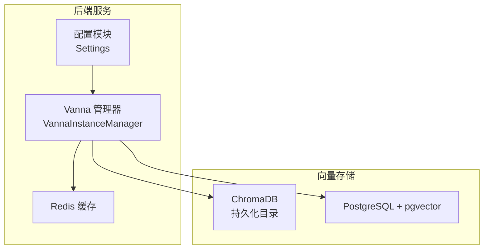
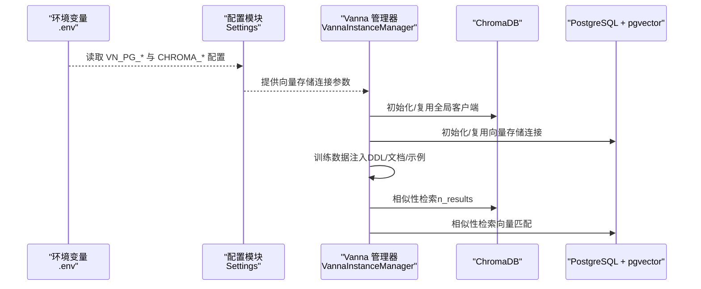
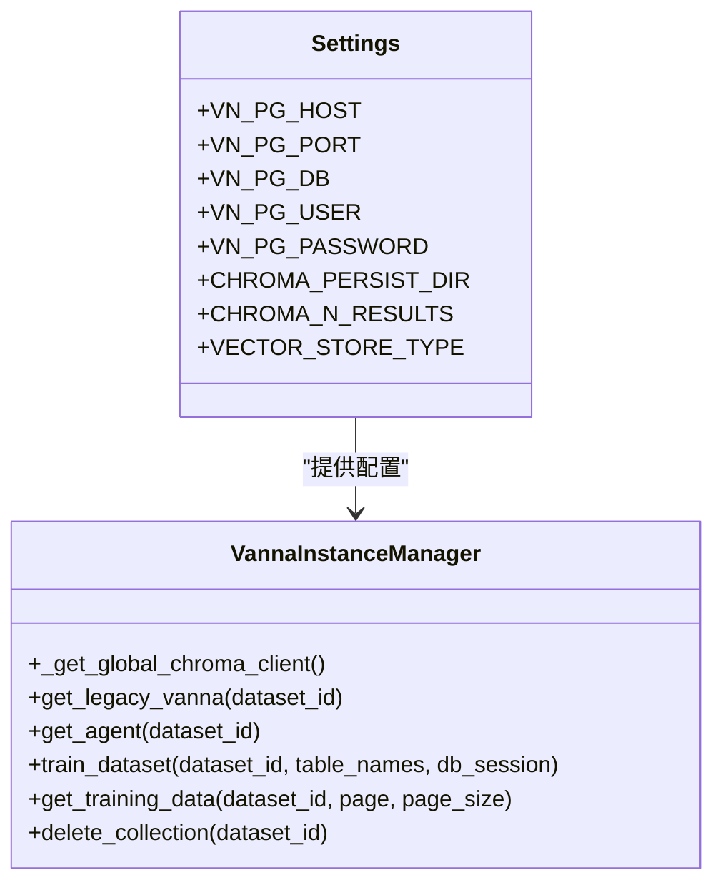
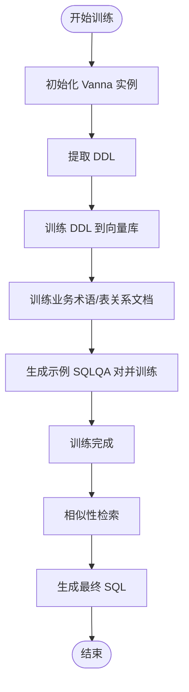
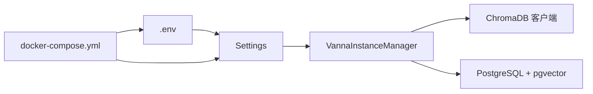

# 向量数据库配置

<cite>
**本文引用的文件**
- [backend/app/core/config.py](file://backend/app/core/config.py)
- [backend/app/services/vanna/base.py](file://backend/app/services/vanna/base.py)
- [backend/app/services/vanna/instance_manager.py](file://backend/app/services/vanna/instance_manager.py)
- [.env.example](file://.env.example)
- [docker-compose.yml](file://docker-compose.yml)
</cite>

## 更新摘要
**变更内容**
- 新增对 PostgreSQL pgvector 后端的支持，通过 `VannaLegacyPGVector` 实现
- 引入双后端配置选项，通过 `VECTOR_STORE_TYPE` 配置项在 ChromaDB 和 PGVector 之间切换
- 更新了向量数据库配置项的说明，包括 `VN_PG_HOST`、`VN_PG_PORT`、`VN_PG_USER`、`VN_PG_PASSWORD`、`VN_PG_DATABASE` 等
- 更新了配置示例，包括独立部署与共享数据库实例的配置方法

## 目录
1. [简介](#简介)
2. [项目结构](#项目结构)
3. [核心组件](#核心组件)
4. [架构总览](#架构总览)
5. [详细组件分析](#详细组件分析)
6. [依赖关系分析](#依赖关系分析)
7. [性能考量](#性能考量)
8. [故障排查指南](#故障排查指南)
9. [结论](#结论)
10. [附录](#附录)

## 简介
本章节专门解释 `VN_PG_HOST`、`VN_PG_PORT`、`VN_PG_USER`、`VN_PG_PASSWORD`、`VN_PG_DATABASE` 等向量数据库配置项，说明它们在 Vanna AI 的 ChromaDB 或 PostgreSQL 向量存储中的作用，以及如何支撑 AI 模型的训练数据存储与相似性检索。文档同时提供向量数据库独立部署与共享数据库实例的配置示例，强调向量数据库性能对 AI 响应速度的影响，并给出索引优化和资源分配建议。

## 项目结构
本项目采用前后端分离架构，后端使用 FastAPI + SQLAlchemy，向量数据库通过 Vanna 集成支持两种模式：
- ChromaDB（本地持久化目录）
- PostgreSQL + pgvector（生产级向量存储）

关键配置集中在后端配置模块与环境变量模板中，Docker Compose 提供一键部署方案。

图表来源
- [backend/app/core/config.py](file://backend/app/core/config.py#L31-L42)
- [backend/app/services/vanna/instance_manager.py](file://backend/app/services/vanna/instance_manager.py#L45-L88)
- [docker-compose.yml](file://docker-compose.yml#L29-L50)

章节来源
- [backend/app/core/config.py](file://backend/app/core/config.py#L31-L42)
- [docker-compose.yml](file://docker-compose.yml#L29-L50)

## 核心组件
- 配置模块 Settings：集中管理 `VN_PG_*` 与 `CHROMA_*` 相关配置项，统一从 `.env` 文件读取。
- `VannaInstanceManager`：封装 Vanna 2.0 Agent 与 Legacy API，负责向量存储初始化、训练数据注入、检索与缓存，支持双后端选择。
- `VannaLegacyPGVector`：实现对 PostgreSQL pgvector 的支持，提供与 `VannaLegacy` 兼容的接口。
- 环境变量模板 `.env.example`：提供 `VN_PG_*` 与 `CHROMA_*` 的默认值与注释说明。
- Docker Compose：提供 PostgreSQL + pgvector 的独立部署示例，便于与后端服务联动。

章节来源
- [backend/app/core/config.py](file://backend/app/core/config.py#L31-L42)
- [backend/app/services/vanna/instance_manager.py](file://backend/app/services/vanna/instance_manager.py#L45-L88)
- [backend/app/services/vanna/base.py](file://backend/app/services/vanna/base.py#L135-L356)
- [.env.example](file://.env.example#L41-L52)
- [docker-compose.yml](file://docker-compose.yml#L29-L50)

## 架构总览
下图展示了向量数据库配置在整体系统中的位置与交互关系，包括配置读取、向量存储选择、训练与检索流程。

图表来源
- [backend/app/core/config.py](file://backend/app/core/config.py#L31-L42)
- [backend/app/services/vanna/instance_manager.py](file://backend/app/services/vanna/instance_manager.py#L45-L88)
- [.env.example](file://.env.example#L41-L52)

## 详细组件分析

### 配置项详解：VN_PG_HOST、VN_PG_PORT、VN_PG_USER、VN_PG_PASSWORD、VN_PG_DB
- `VN_PG_HOST`：向量数据库主机地址（PostgreSQL）。默认本地回环，生产环境建议指向专用数据库实例。
- `VN_PG_PORT`：向量数据库端口，默认 5432。
- `VN_PG_DB`：向量数据库名称，默认 `universal_bi_vector`。
- `VN_PG_USER`：向量数据库用户名，默认 `postgres`。
- `VN_PG_PASSWORD`：向量数据库密码，默认 `postgres`。
- `VECTOR_STORE_TYPE`：向量存储类型，可选值为 `chromadb` 或 `pgvector`，用于在两种后端之间切换。

这些配置项由配置模块统一读取，供 `VannaInstanceManager` 在初始化向量存储时使用。在 Docker Compose 中，后端服务通过环境变量将这些值注入到容器内。

章节来源
- [backend/app/core/config.py](file://backend/app/core/config.py#L31-L37)
- [docker-compose.yml](file://docker-compose.yml#L88-L92)

### 向量存储初始化与使用
- **ChromaDB 模式**：通过全局持久化客户端初始化，使用集合（collections）分别存储 DDL、文档与 SQL 记忆，检索返回条目数量由 `CHROMA_N_RESULTS` 控制。
- **PostgreSQL + pgvector 模式**：通过 `Settings` 中的 `VN_PG_*` 参数建立连接，用于 Vanna 训练数据存储与相似性检索。`VannaLegacyPGVector` 类实现了对 pgvector 的支持，使用 `langchain-postgres` 库与 PostgreSQL 交互。

图表来源
- [backend/app/core/config.py](file://backend/app/core/config.py#L31-L42)
- [backend/app/services/vanna/instance_manager.py](file://backend/app/services/vanna/instance_manager.py#L45-L88)

章节来源
- [backend/app/services/vanna/instance_manager.py](file://backend/app/services/vanna/instance_manager.py#L45-L88)

### 训练流程与相似性检索
- 训练阶段：从数据库提取 DDL、业务术语、表关系文档，生成示例 SQLQA 对，注入向量存储。
- 检索阶段：基于用户问题进行向量相似性检索，返回相关 DDL/文档/示例 SQL，辅助 LLM 生成最终 SQL。

图表来源
- [backend/app/services/vanna/instance_manager.py](file://backend/app/services/vanna/instance_manager.py#L593-L770)

章节来源
- [backend/app/services/vanna/instance_manager.py](file://backend/app/services/vanna/instance_manager.py#L593-L770)

### 配置示例：独立部署与共享实例

- **独立部署（Docker Compose）**
  - PostgreSQL 服务：提供独立的向量数据库实例，端口映射与数据卷挂载确保持久化。
  - 后端服务：通过环境变量将 `VN_PG_*` 注入容器，连接到 `postgres` 服务。
  - 参考路径：[docker-compose.yml](file://docker-compose.yml#L29-L50), [docker-compose.yml](file://docker-compose.yml#L88-L92)

- **共享数据库实例**
  - 将 `VN_PG_HOST`、`VN_PG_PORT`、`VN_PG_DB`、`VN_PG_USER`、`VN_PG_PASSWORD` 指向现有 PostgreSQL 实例。
  - 确保网络可达与权限正确，必要时通过防火墙/安全组放行端口。
  - 参考路径：[backend/app/core/config.py](file://backend/app/core/config.py#L31-L37), [.env.example](file://.env.example#L41-L47)

章节来源
- [docker-compose.yml](file://docker-compose.yml#L29-L50)
- [docker-compose.yml](file://docker-compose.yml#L88-L92)
- [backend/app/core/config.py](file://backend/app/core/config.py#L31-L37)
- [.env.example](file://.env.example#L41-L47)

## 依赖关系分析
- 配置依赖：`VannaInstanceManager` 依赖 `Settings` 提供的 `VN_PG_*` 与 `CHROMA_*` 配置。
- 存储依赖：ChromaDB 依赖持久化目录；PostgreSQL + pgvector 依赖数据库连接。
- 运行时依赖：Docker Compose 通过环境变量将配置注入容器。

图表来源
- [backend/app/core/config.py](file://backend/app/core/config.py#L31-L42)
- [backend/app/services/vanna/instance_manager.py](file://backend/app/services/vanna/instance_manager.py#L45-L88)
- [docker-compose.yml](file://docker-compose.yml#L83-L92)

章节来源
- [backend/app/core/config.py](file://backend/app/core/config.py#L31-L42)
- [backend/app/services/vanna/instance_manager.py](file://backend/app/services/vanna/instance_manager.py#L45-L88)
- [docker-compose.yml](file://docker-compose.yml#L83-L92)

## 性能考量
- 向量数据库性能直接影响 AI 响应速度
  - ChromaDB：适合中小规模数据与开发测试，注意持久化目录的磁盘 IO 与内存占用。
  - PostgreSQL + pgvector：适合生产环境，具备更强的扩展性与稳定性。
- 相似性检索参数
  - `CHROMA_N_RESULTS`：控制返回的相似性结果数量，数值越大越可能提升召回但增加延迟。
- 缓存策略
  - Redis 缓存查询结果可显著降低重复查询的响应时间，建议开启并合理设置 TTL。
  - 参考路径：[docs/backend/REDIS_CACHE.md](file://docs/backend/REDIS_CACHE.md#L1-L76)
- 索引优化与资源分配建议
  - PostgreSQL + pgvector：确保启用 pgvector 扩展，合理设置向量维度与距离度量（cosine），为常用检索字段建立索引。
  - ChromaDB：使用 HNSW 空间（cosine）并控制 n_results，避免过度召回导致性能下降。
  - 资源分配：为向量数据库预留充足的 CPU、内存与磁盘空间，避免与主数据库争抢资源。

章节来源
- [docs/backend/REDIS_CACHE.md](file://docs/backend/REDIS_CACHE.md#L1-L76)
- [docs/general/2_tech_stack.md](file://docs/general/2_tech_stack.md#L26-L28)

## 故障排查指南
- 连接失败
  - 检查 `VN_PG_HOST`、`VN_PG_PORT`、`VN_PG_DB`、`VN_PG_USER`、`VN_PG_PASSWORD` 是否正确。
  - 确认网络连通性与防火墙规则。
- ChromaDB 目录权限
  - 确认 `CHROMA_PERSIST_DIR` 可写且有足够磁盘空间。
- 训练中断
  - 若训练被暂停，`VannaInstanceManager` 会抛出中断异常，需检查数据集状态与日志。
- 缓存不可用
  - Redis 不可用时系统会降级，不影响核心功能，但响应时间会增加。

章节来源
- [backend/app/services/vanna/instance_manager.py](file://backend/app/services/vanna/instance_manager.py#L377-L412)
- [backend/app/services/vanna/instance_manager.py](file://backend/app/services/vanna/instance_manager.py#L144-L170)

## 结论
`VN_PG_*` 与 `CHROMA_*` 配置项是 Vanna AI 向量存储的关键入口。通过合理的配置与部署策略（独立或共享实例），结合缓存与索引优化，可以在保证检索质量的同时显著提升 AI 响应速度。生产环境中建议优先采用 PostgreSQL + pgvector，并配套完善的监控与资源规划。

## 附录
- 环境变量模板参考：[.env.example](file://.env.example#L41-L52)
- 技术栈说明（含 PostgreSQL + pgvector）：[docs/general/2_tech_stack.md](file://docs/general/2_tech_stack.md#L26-L28)
- 依赖包清单（含 vanna、chromadb、redis）：[requirements.txt](file://requirements.txt#L1-L15)