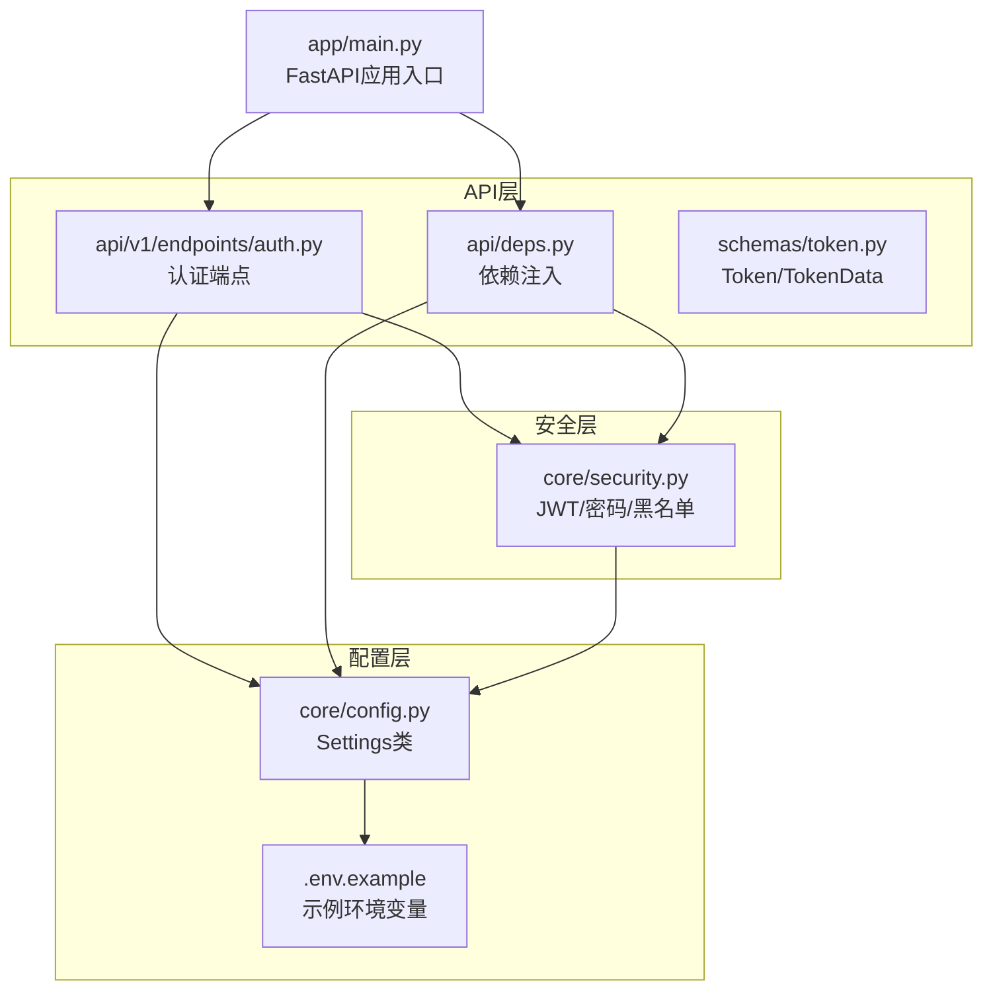
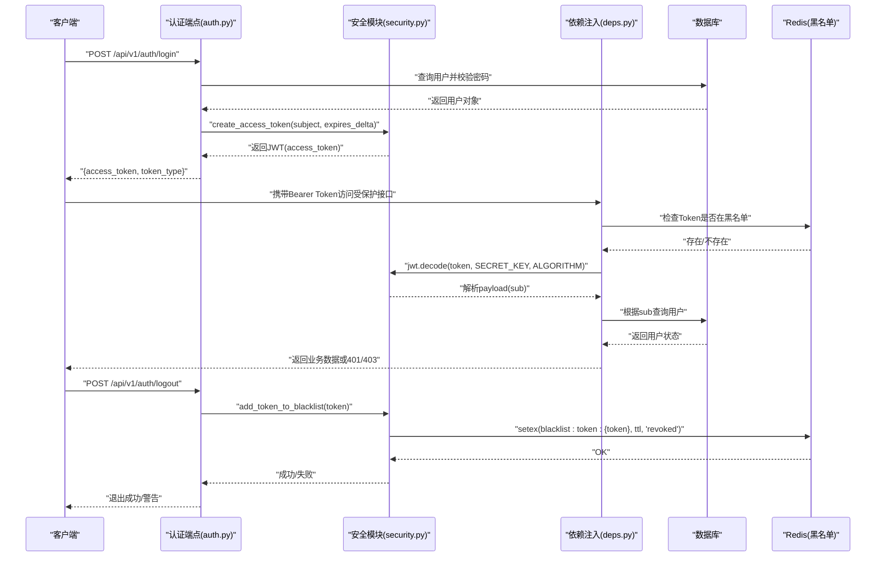
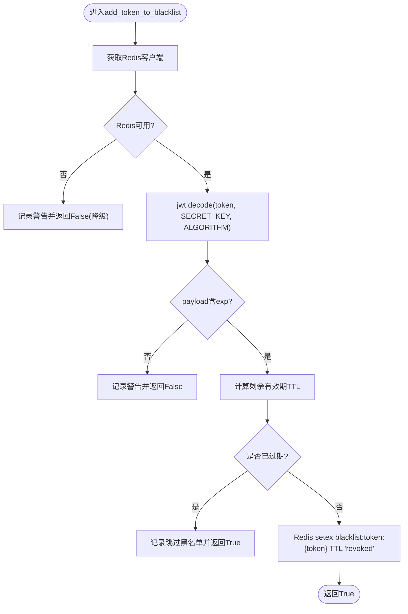
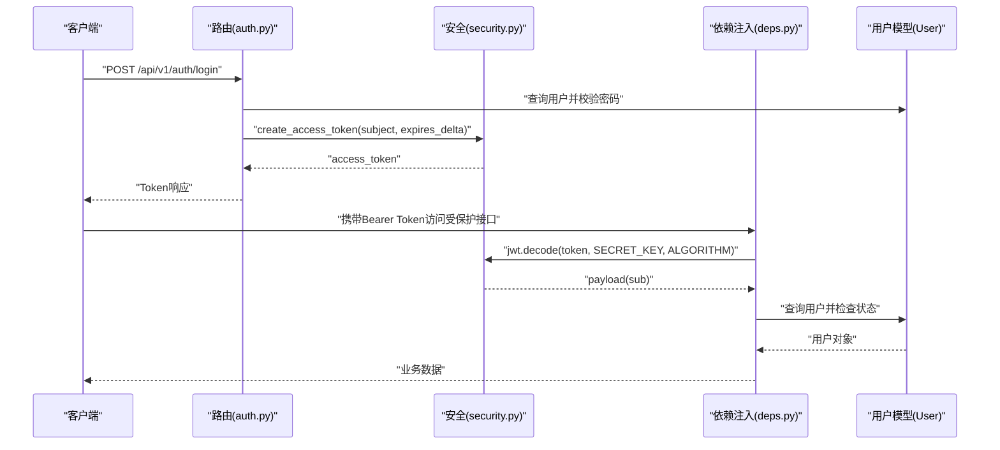
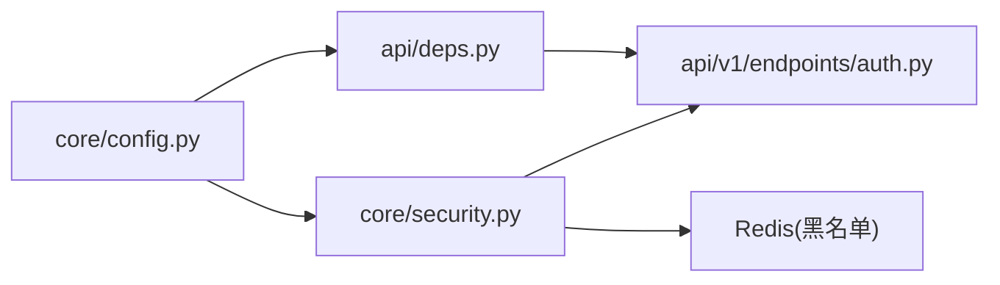

# 安全与认证配置

<cite>
**本文引用的文件列表**
- [backend/app/core/config.py](file://backend/app/core/config.py)
- [backend/app/core/security.py](file://backend/app/core/security.py)
- [backend/app/api/v1/endpoints/auth.py](file://backend/app/api/v1/endpoints/auth.py)
- [backend/app/api/deps.py](file://backend/app/api/deps.py)
- [backend/app/schemas/token.py](file://backend/app/schemas/token.py)
- [.env.example](file://.env.example)
- [backend/app/main.py](file://backend/app/main.py)
</cite>

## 目录
1. [简介](#简介)
2. [项目结构](#项目结构)
3. [核心组件](#核心组件)
4. [架构总览](#架构总览)
5. [详细组件分析](#详细组件分析)
6. [依赖关系分析](#依赖关系分析)
7. [性能考量](#性能考量)
8. [故障排查指南](#故障排查指南)
9. [结论](#结论)
10. [附录](#附录)

## 简介
本文件系统性梳理了项目的JWT安全配置体系，重点覆盖以下方面：
- SECRET_KEY生成方法与最佳实践（推荐使用secrets.token_urlsafe(32)）
- ACCESS_TOKEN_EXPIRE_MINUTES的时效策略设计
- REFRESH_TOKEN_EXPIRE_MINUTES在当前代码中的缺失与扩展建议
- 在auth.py端点与deps.py依赖注入中的具体应用（token编码、解码与验证流程）
- 如何通过配置调整安全策略以平衡用户体验与系统安全性
- 密钥轮换建议与生产环境密钥管理最佳实践（环境变量与密钥管理服务）

## 项目结构
项目采用分层架构，安全相关的关键模块集中在core与api两个子包中：
- 配置层：集中于core/config.py，统一从.env文件读取配置
- 安全层：集中于core/security.py，负责密码哈希、JWT签发与校验、Token黑名单管理
- API层：认证端点位于api/v1/endpoints/auth.py，依赖注入位于api/deps.py
- 数据模型与序列化：schemas/token.py定义Token与TokenData模型

图表来源
- [backend/app/main.py](file://backend/app/main.py#L1-L35)
- [backend/app/core/config.py](file://backend/app/core/config.py#L1-L51)
- [backend/app/core/security.py](file://backend/app/core/security.py#L1-L161)
- [backend/app/api/v1/endpoints/auth.py](file://backend/app/api/v1/endpoints/auth.py#L1-L147)
- [backend/app/api/deps.py](file://backend/app/api/deps.py#L1-L124)
- [backend/app/schemas/token.py](file://backend/app/schemas/token.py#L1-L10)

章节来源
- [backend/app/main.py](file://backend/app/main.py#L1-L35)
- [backend/app/core/config.py](file://backend/app/core/config.py#L1-L51)

## 核心组件
本节聚焦JWT安全配置的核心要素与实现位置。

- SECRET_KEY
  - 作用：JWT签名算法HS256的密钥，决定token的机密性与完整性
  - 生成建议：使用secrets.token_urlsafe(32)生成32字节URL安全随机字符串
  - 配置位置：core/config.py与.env.example均提供默认占位，需在生产环境替换
  - 使用位置：security.py中用于jwt.encode/jwt.decode；deps.py中用于JWT解码验证

- ALGORITHM
  - 作用：JWT签名算法，当前为HS256（对称密钥）
  - 配置位置：core/config.py
  - 使用位置：security.py与deps.py中均使用settings.ALGORITHM

- ACCESS_TOKEN_EXPIRE_MINUTES
  - 作用：访问令牌有效期（分钟），影响用户体验与安全强度
  - 配置位置：core/config.py
  - 使用位置：auth.py中用于计算access_token_expires；security.py中用于create_access_token默认过期时间

- REFRESH_TOKEN_EXPIRE_MINUTES
  - 现状：当前代码未实现刷新令牌机制，也未在配置中定义该参数
  - 建议：若引入刷新令牌，应新增配置项并在auth.py中提供刷新端点，同时在security.py中实现刷新逻辑

章节来源
- [backend/app/core/config.py](file://backend/app/core/config.py#L12-L16)
- [.env.example](file://.env.example#L14-L18)
- [backend/app/core/security.py](file://backend/app/core/security.py#L73-L80)
- [backend/app/api/v1/endpoints/auth.py](file://backend/app/api/v1/endpoints/auth.py#L48-L51)
- [backend/app/api/deps.py](file://backend/app/api/deps.py#L46-L47)

## 架构总览
下图展示了JWT认证在系统中的调用链路，包括登录签发、依赖注入验证与Token撤销流程。

图表来源
- [backend/app/api/v1/endpoints/auth.py](file://backend/app/api/v1/endpoints/auth.py#L17-L55)
- [backend/app/api/v1/endpoints/auth.py](file://backend/app/api/v1/endpoints/auth.py#L101-L133)
- [backend/app/core/security.py](file://backend/app/core/security.py#L73-L80)
- [backend/app/core/security.py](file://backend/app/core/security.py#L83-L133)
- [backend/app/api/deps.py](file://backend/app/api/deps.py#L17-L80)

## 详细组件分析

### 配置层：core/config.py
- 统一配置类Settings从.env文件加载所有配置项
- JWT相关配置：
  - SECRET_KEY：默认占位，需替换为强随机密钥
  - ALGORITHM：默认HS256
  - ACCESS_TOKEN_EXPIRE_MINUTES：默认30分钟
- 环境变量文件.env.example提供了生成密钥的命令示例与注释

章节来源
- [backend/app/core/config.py](file://backend/app/core/config.py#L5-L49)
- [.env.example](file://.env.example#L14-L18)

### 安全层：core/security.py
- 密码处理：bcrypt哈希与验证
- JWT处理：
  - create_access_token：基于settings.SECRET_KEY与ALGORITHM生成JWT，过期时间来自expires_delta或默认settings.ACCESS_TOKEN_EXPIRE_MINUTES
  - jwt.decode：在依赖注入与Token撤销时用于验证签名与提取载荷
- Token黑名单：
  - add_token_to_blacklist：解析Token获取exp，计算剩余TTL，将Token写入Redis黑名单
  - is_token_blacklisted：检查Token是否在黑名单
  - get_redis_client：带超时与异常处理的Redis连接封装，支持降级

图表来源
- [backend/app/core/security.py](file://backend/app/core/security.py#L83-L133)

章节来源
- [backend/app/core/security.py](file://backend/app/core/security.py#L19-L47)
- [backend/app/core/security.py](file://backend/app/core/security.py#L73-L80)
- [backend/app/core/security.py](file://backend/app/core/security.py#L83-L133)
- [backend/app/core/security.py](file://backend/app/core/security.py#L136-L161)

### API层：认证端点与依赖注入
- 认证端点auth.py：
  - /api/v1/auth/login：校验用户、密码与激活状态，生成access_token
  - /api/v1/auth/logout：将Token加入黑名单（Redis不可用时降级）
  - /api/v1/auth/me：返回当前用户信息（依赖注入校验）
- 依赖注入deps.py：
  - reusable_oauth2：OAuth2PasswordBearer，指向/auth/login
  - get_current_user：执行黑名单检查、JWT签名验证、用户状态检查
  - get_current_superuser：权限校验

图表来源
- [backend/app/api/v1/endpoints/auth.py](file://backend/app/api/v1/endpoints/auth.py#L17-L55)
- [backend/app/api/deps.py](file://backend/app/api/deps.py#L17-L80)
- [backend/app/core/security.py](file://backend/app/core/security.py#L73-L80)

章节来源
- [backend/app/api/v1/endpoints/auth.py](file://backend/app/api/v1/endpoints/auth.py#L17-L55)
- [backend/app/api/v1/endpoints/auth.py](file://backend/app/api/v1/endpoints/auth.py#L101-L133)
- [backend/app/api/deps.py](file://backend/app/api/deps.py#L13-L15)
- [backend/app/api/deps.py](file://backend/app/api/deps.py#L17-L80)

### 数据模型：schemas/token.py
- Token：包含access_token与token_type
- TokenData：包含username（可选），用于依赖注入中承载sub

章节来源
- [backend/app/schemas/token.py](file://backend/app/schemas/token.py#L4-L9)

## 依赖关系分析
- 配置依赖：security.py与deps.py均依赖settings（SECRET_KEY、ALGORITHM、ACCESS_TOKEN_EXPIRE_MINUTES）
- 端点依赖：auth.py依赖security.py生成token，依赖deps.py进行用户校验
- 外部依赖：jose（JWT）、passlib（密码哈希）、redis（黑名单）

图表来源
- [backend/app/core/config.py](file://backend/app/core/config.py#L12-L16)
- [backend/app/core/security.py](file://backend/app/core/security.py#L73-L80)
- [backend/app/api/deps.py](file://backend/app/api/deps.py#L46-L47)
- [backend/app/api/v1/endpoints/auth.py](file://backend/app/api/v1/endpoints/auth.py#L48-L51)

章节来源
- [backend/app/core/config.py](file://backend/app/core/config.py#L12-L16)
- [backend/app/core/security.py](file://backend/app/core/security.py#L73-L80)
- [backend/app/api/deps.py](file://backend/app/api/deps.py#L46-L47)
- [backend/app/api/v1/endpoints/auth.py](file://backend/app/api/v1/endpoints/auth.py#L48-L51)

## 性能考量
- Token过期时间与用户体验平衡
  - ACCESS_TOKEN_EXPIRE_MINUTES越短，安全性越高但频繁重新登录影响体验
  - 建议：移动端短周期（15-30分钟），桌面端可适当延长（30-60分钟）
- 黑名单查询降级策略
  - Redis不可用时，is_token_blacklisted返回False，避免阻塞请求
  - 建议：在高可用部署中确保Redis稳定，或采用本地缓存兜底
- 密钥长度与算法选择
  - HS256对称密钥，性能优于RS256非对称密钥
  - 建议：保持SECRET_KEY足够随机且长度≥32字节

[本节为通用指导，无需特定文件引用]

## 故障排查指南
- 登录失败
  - 检查用户是否存在、密码是否正确、账户是否激活
  - 确认settings.SECRET_KEY与ALGORITHM一致
- Token验证失败
  - 确认客户端携带的Bearer Token格式正确
  - 检查security.py中jwt.decode是否抛出异常
- 退出登录无效
  - 检查Redis连接与权限
  - 确认Token未过期（过期Token不会加入黑名单）
- 密钥泄露风险
  - 立即轮换SECRET_KEY并通知所有客户端重新登录
  - 生产环境禁止将密钥硬编码在代码中

章节来源
- [backend/app/api/v1/endpoints/auth.py](file://backend/app/api/v1/endpoints/auth.py#L25-L46)
- [backend/app/api/deps.py](file://backend/app/api/deps.py#L36-L54)
- [backend/app/core/security.py](file://backend/app/core/security.py#L83-L133)

## 结论
本项目采用对称密钥JWT（HS256）与黑名单机制实现认证与会话管理。通过合理设置ACCESS_TOKEN_EXPIRE_MINUTES可在安全与体验间取得平衡。当前代码未实现REFRESH_TOKEN_EXPIRE_MINUTES与刷新流程，建议后续扩展以提升用户体验。生产环境务必使用强随机密钥并通过环境变量或密钥管理服务进行管理，并定期轮换。

[本节为总结性内容，无需特定文件引用]

## 附录

### A. SECRET_KEY生成与轮换建议
- 生成方法
  - 推荐使用secrets.token_urlsafe(32)生成32字节URL安全随机字符串
  - 在.env中替换默认占位值
- 轮换流程
  - 生成新密钥并更新环境变量
  - 通知所有客户端重新登录
  - 旧密钥在轮换窗口内仍可解码历史Token，建议配合黑名单策略逐步回收

章节来源
- [.env.example](file://.env.example#L14-L16)
- [backend/app/core/config.py](file://backend/app/core/config.py#L12-L14)

### B. ACCESS_TOKEN_EXPIRE_MINUTES配置策略
- 短期令牌（15-30分钟）
  - 适合高敏感操作与移动端
- 中期令牌（30-60分钟）
  - 适合常规Web应用
- 长期令牌（60+分钟）
  - 需结合刷新令牌与严格审计

章节来源
- [backend/app/core/config.py](file://backend/app/core/config.py#L15-L16)
- [backend/app/core/security.py](file://backend/app/core/security.py#L76-L77)
- [backend/app/api/v1/endpoints/auth.py](file://backend/app/api/v1/endpoints/auth.py#L48-L51)

### C. REFRESH_TOKEN_EXPIRE_MINUTES扩展建议
- 当前缺失
  - 代码未定义REFRESH_TOKEN_EXPIRE_MINUTES，也未实现刷新端点
- 建议实现
  - 新增配置项与刷新端点
  - 在security.py中实现刷新逻辑，签发新的access_token
  - 在deps.py中增加刷新后的令牌校验

章节来源
- [backend/app/core/config.py](file://backend/app/core/config.py#L12-L16)
- [backend/app/api/v1/endpoints/auth.py](file://backend/app/api/v1/endpoints/auth.py#L17-L55)

### D. 生产环境密钥管理最佳实践
- 环境变量
  - 使用系统环境变量或容器编排平台的密钥管理
- 密钥管理服务
  - AWS Secrets Manager、Azure Key Vault、HashiCorp Vault等
- 最小权限与轮换
  - 限制密钥访问范围，定期轮换
  - 使用密钥版本控制与自动轮换

[本节为通用指导，无需特定文件引用]