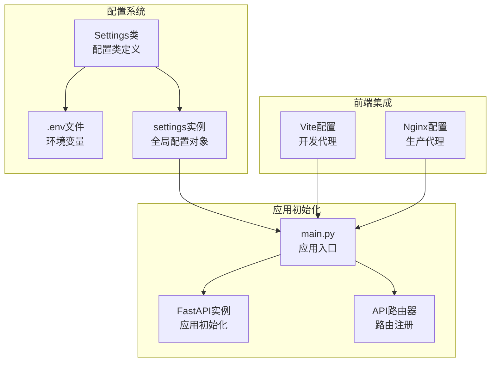
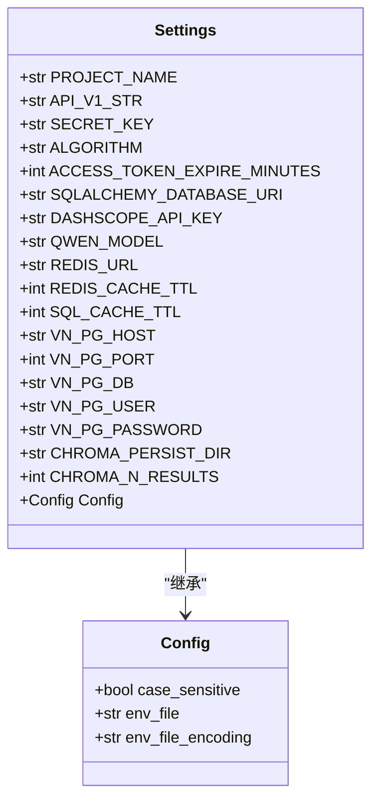
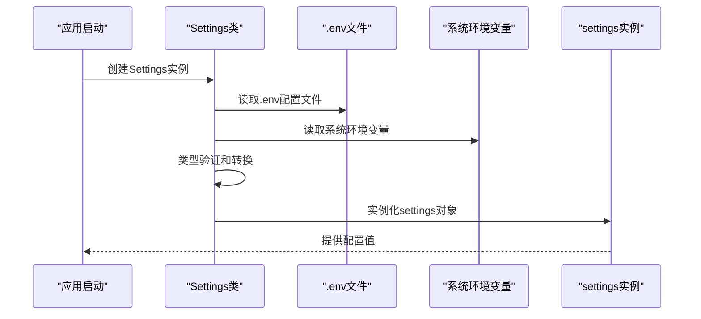
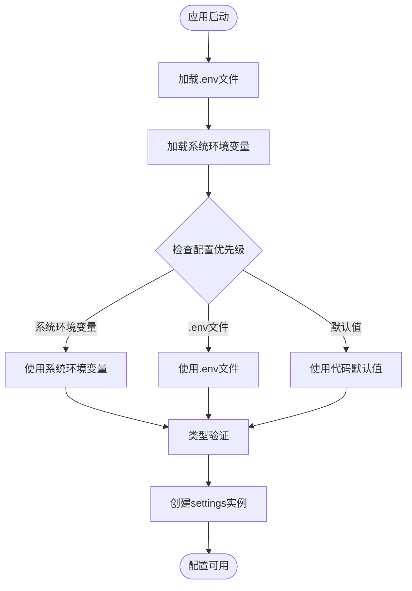
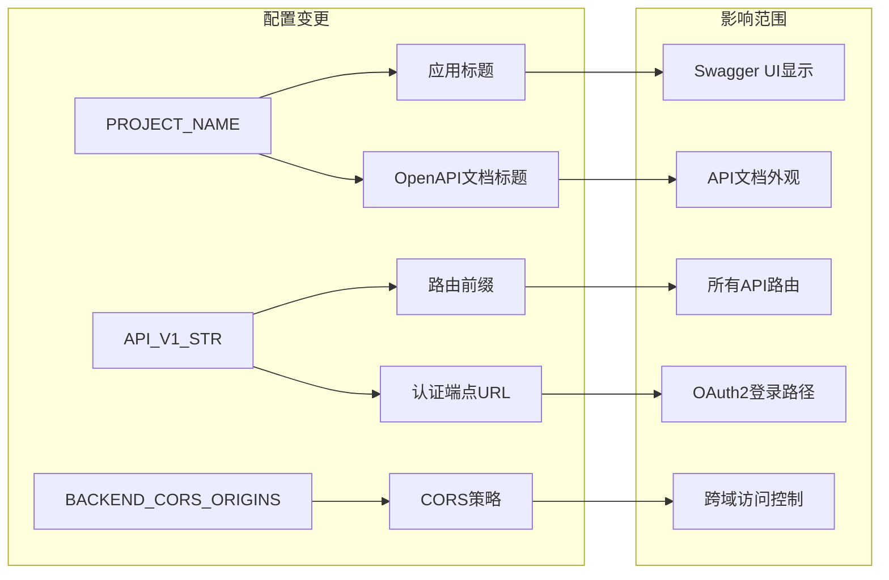

# 应用基础配置

<cite>
**本文档中引用的文件**
- [backend/app/core/config.py](file://backend/app/core/config.py)
- [backend/app/main.py](file://backend/app/main.py)
- [.env.example](file://.env.example)
- [docker-compose.yml](file://docker-compose.yml)
- [frontend/vite.config.ts](file://frontend/vite.config.ts)
- [frontend/nginx.conf](file://frontend/nginx.conf)
- [backend/app/api/deps.py](file://backend/app/api/deps.py)
- [backend/app/api/v1/endpoints/auth.py](file://backend/app/api/v1/endpoints/auth.py)
</cite>

## 目录
1. [简介](#简介)
2. [项目结构](#项目结构)
3. [核心配置项详解](#核心配置项详解)
4. [配置加载机制](#配置加载机制)
5. [API路由前缀影响](#api路由前缀影响)
6. [跨域策略配置](#跨域策略配置)
7. [环境变量覆盖机制](#环境变量覆盖机制)
8. [环境配置建议](#环境配置建议)
9. [配置变更影响分析](#配置变更影响分析)
10. [故障排除指南](#故障排除指南)
11. [结论](#结论)

## 简介

本文件详细解释了Universal BI项目中的应用基础配置系统，重点分析PROJECT_NAME、API_V1_STR、BACKEND_CORS_ORIGINS等核心配置项的作用、使用场景及其在整个FastAPI应用初始化过程中的影响。文档提供了实际代码示例展示配置项在main.py中的引用方式，并说明了环境变量默认值与覆盖机制，以及在开发、测试、生产环境中的不同配置建议。

## 项目结构

Universal BI采用标准的FastAPI项目结构，核心配置位于`backend/app/core/config.py`中，应用入口在`backend/app/main.py`中初始化。



**图表来源**
- [backend/app/core/config.py](file://backend/app/core/config.py#L5-L49)
- [backend/app/main.py](file://backend/app/main.py#L1-L35)

**章节来源**
- [backend/app/core/config.py](file://backend/app/core/config.py#L1-L51)
- [backend/app/main.py](file://backend/app/main.py#L1-L35)

## 核心配置项详解

### PROJECT_NAME配置项

PROJECT_NAME是应用的基础标识配置，用于设置FastAPI应用的标题和OpenAPI文档的显示名称。

**配置定义位置**: [backend/app/core/config.py](file://backend/app/core/config.py#L9)
**默认值**: "Universal BI"
**类型**: str

**作用场景**:
- 设置FastAPI应用的title参数
- 影响OpenAPI文档的显示标题
- 作为应用的统一标识符

**代码引用示例**:
```python
# 在main.py中引用
app = FastAPI(
    title=settings.PROJECT_NAME,
    openapi_url=f"{settings.API_V1_STR}/openapi.json"
)
```

### API_V1_STR配置项

API_V1_STR定义了API版本前缀，是整个API路由系统的统一前缀标识。

**配置定义位置**: [backend/app/core/config.py](file://backend/app/core/config.py#L10)
**默认值**: "/api/v1"
**类型**: str

**作用场景**:
- 作为所有API路由的统一前缀
- 影响路由注册时的prefix参数
- 支持API版本控制和演进

**代码引用示例**:
```python
# 在main.py中引用
app.include_router(datasource.router, prefix=f"{settings.API_V1_STR}/datasources")

# 在认证依赖中引用
reusable_oauth2 = OAuth2PasswordBearer(
    tokenUrl=f"{settings.API_V1_STR}/auth/login"
)
```

### BACKEND_CORS_ORIGINS配置项

BACKEND_CORS_ORIGINS用于配置CORS（跨域资源共享）策略，控制哪些前端域名可以访问后端API。

**注意**: 在当前代码中，CORS配置直接使用了通配符`["*"]`，并未使用BACKEND_CORS_ORIGINS配置项。

**当前CORS配置位置**: [backend/app/main.py](file://backend/app/main.py#L17-L23)
**配置特点**:
- 开发环境允许所有来源
- 生产环境应限制为特定来源
- 支持凭据传递、方法和头部配置

**章节来源**
- [backend/app/core/config.py](file://backend/app/core/config.py#L9-L10)
- [backend/app/main.py](file://backend/app/main.py#L11-L30)

## 配置加载机制

### Settings类架构

配置系统基于Pydantic的BaseSettings类构建，实现了类型安全的配置管理。



**图表来源**
- [backend/app/core/config.py](file://backend/app/core/config.py#L5-L49)

### 配置加载流程



**图表来源**
- [backend/app/core/config.py](file://backend/app/core/config.py#L44-L49)

**章节来源**
- [backend/app/core/config.py](file://backend/app/core/config.py#L1-L51)

## API路由前缀影响

### 路由前缀统一管理

API_V1_STR配置项直接影响所有API路由的前缀，确保了路由的一致性和可维护性。

**路由注册示例**:
```python
# 所有路由都使用相同的前缀
app.include_router(datasource.router, prefix=f"{settings.API_V1_STR}/datasources")
app.include_router(dataset.router, prefix=f"{settings.API_V1_STR}/datasets")
app.include_router(chat.router, prefix=f"{settings.API_V1_STR}/chat")
app.include_router(dashboard.router, prefix=f"{settings.API_V1_STR}/dashboards")
app.include_router(auth.router, prefix=f"{settings.API_V1_STR}/auth")
app.include_router(admin.router, prefix=f"{settings.API_V1_STR}/admin")
```

### OpenAPI文档路径

API_V1_STR还影响OpenAPI文档的访问路径，确保Swagger UI和ReDoc的正确访问。

**OpenAPI配置示例**:
```python
app = FastAPI(
    title=settings.PROJECT_NAME,
    openapi_url=f"{settings.API_V1_STR}/openapi.json"
)
```

**章节来源**
- [backend/app/main.py](file://backend/app/main.py#L11-L30)

## 跨域策略配置

### CORS中间件配置

当前应用使用FastAPI的CORSMiddleware中间件，但直接使用通配符配置而非BACKEND_CORS_ORIGINS。

**CORS配置详情**:
- 允许所有来源: `allow_origins=["*"]`
- 允许凭据: `allow_credentials=True`
- 允许所有HTTP方法: `allow_methods=["*"]`
- 允许所有请求头: `allow_headers=["*"]`

### 前端代理配置

#### 开发环境代理配置

前端Vite开发服务器配置了API代理，将/api开头的请求转发到后端。

**Vite代理配置**:
```typescript
proxy: {
  '/api': {
    target: 'http://127.0.0.1:8000',
    changeOrigin: true
  }
}
```

#### 生产环境代理配置

Nginx配置将/api开头的请求代理到后端服务。

**Nginx代理配置**:
```nginx
location /api/ {
    proxy_pass http://backend:8000;
    # 其他代理设置...
}
```

**章节来源**
- [backend/app/main.py](file://backend/app/main.py#L16-L23)
- [frontend/vite.config.ts](file://frontend/vite.config.ts#L19-L25)
- [frontend/nginx.conf](file://frontend/nginx.conf#L19-L36)

## 环境变量覆盖机制

### 配置优先级

配置系统遵循以下优先级顺序（从高到低）：
1. 系统环境变量
2. .env文件
3. 代码中的默认值

### 环境变量加载机制



**图表来源**
- [backend/app/core/config.py](file://backend/app/core/config.py#L44-L49)

### Docker环境变量覆盖

Docker Compose文件展示了如何在容器环境中覆盖配置：

**Docker环境变量示例**:
```yaml
environment:
  - SQLALCHEMY_DATABASE_URI=mysql+pymysql://root:${MYSQL_ROOT_PASSWORD:-root123456}@mysql:3306/${MYSQL_DATABASE:-universal_bi}?charset=utf8mb4
  - REDIS_URL=redis://${REDIS_PASSWORD:+:$REDIS_PASSWORD@}redis:6379/0
```

**章节来源**
- [.env.example](file://.env.example#L1-L72)
- [docker-compose.yml](file://docker-compose.yml#L83-L92)

## 环境配置建议

### 开发环境配置

**推荐配置**:
- PROJECT_NAME: "Universal BI Dev"
- API_V1_STR: "/api/v1"
- BACKEND_CORS_ORIGINS: ["*"] (开发阶段)
- 数据库: SQLite或本地MySQL
- 缓存: 本地Redis

**.env示例**:
```env
PROJECT_NAME="Universal BI Dev"
API_V1_STR="/api/v1"
BACKEND_CORS_ORIGINS=["*"]
SQLALCHEMY_DATABASE_URI="sqlite:///./sql_app.db"
```

### 测试环境配置

**推荐配置**:
- PROJECT_NAME: "Universal BI Test"
- API_V1_STR: "/api/v1"
- BACKEND_CORS_ORIGINS: ["https://test.yourdomain.com"]
- 数据库: 独立测试数据库
- 缓存: 测试Redis实例

### 生产环境配置

**推荐配置**:
- PROJECT_NAME: "Universal BI"
- API_V1_STR: "/api/v1"
- BACKEND_CORS_ORIGINS: ["https://yourdomain.com", "https://www.yourdomain.com"]
- 数据库: 生产数据库集群
- 缓存: 生产Redis集群

**安全注意事项**:
- 必须设置强随机的SECRET_KEY
- 启用HTTPS和安全的Cookie设置
- 限制CORS来源为可信域名
- 定期轮换API密钥

## 配置变更影响分析

### 前端请求路径影响

配置变更会直接影响前端请求的URL路径：

**变更前**: `/api/v1/datasources`
**变更后**: `/api/v2/datasources`

前端需要相应调整API调用路径。

### 后端服务行为影响

配置变更会影响多个后端组件：



**图表来源**
- [backend/app/main.py](file://backend/app/main.py#L11-L30)
- [backend/app/api/deps.py](file://backend/app/api/deps.py#L13-L14)

### 具体影响示例

1. **路由前缀变更**: 所有API端点URL都会相应变化
2. **认证路径变更**: OAuth2 tokenUrl会更新
3. **文档路径变更**: OpenAPI文档访问URL会改变
4. **CORS策略变更**: 前端跨域访问会受到限制或允许

**章节来源**
- [backend/app/api/deps.py](file://backend/app/api/deps.py#L13-L14)
- [backend/app/main.py](file://backend/app/main.py#L11-L14)

## 故障排除指南

### 常见配置问题

#### 配置项未生效

**可能原因**:
- .env文件路径错误
- 环境变量名大小写不匹配
- 配置类型转换失败

**解决方案**:
1. 检查.env文件是否存在且可读
2. 确认环境变量名与配置项完全一致
3. 验证配置值的类型是否正确

#### CORS访问被拒绝

**可能原因**:
- BACKEND_CORS_ORIGINS配置不正确
- 前端请求的Origin不在允许列表中
- 凭据设置与CORS配置冲突

**解决方案**:
1. 检查CORS配置中的允许来源
2. 确认前端请求的完整URL
3. 调整allow_origins设置

#### API路由404错误

**可能原因**:
- API_V1_STR配置与前端请求不匹配
- 路由注册时prefix参数错误
- 应用重启后配置未更新

**解决方案**:
1. 检查API_V1_STR配置值
2. 验证路由注册时的prefix参数
3. 重启应用服务

**章节来源**
- [backend/app/core/config.py](file://backend/app/core/config.py#L44-L49)
- [backend/app/main.py](file://backend/app/main.py#L16-L30)

## 结论

Universal BI项目的配置系统通过Settings类实现了集中化的配置管理，确保了应用的一致性和可维护性。PROJECT_NAME、API_V1_STR等核心配置项在应用初始化过程中发挥着关键作用，不仅影响应用的外观和行为，还决定了API路由的组织结构和跨域策略。

通过合理的环境变量覆盖机制，项目能够在不同的部署环境中灵活配置，满足开发、测试和生产环境的不同需求。建议在生产环境中严格管理配置项，特别是安全相关的配置，如SECRET_KEY和CORS设置，以确保应用的安全性和稳定性。