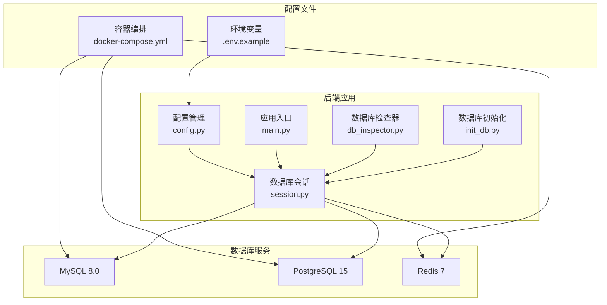
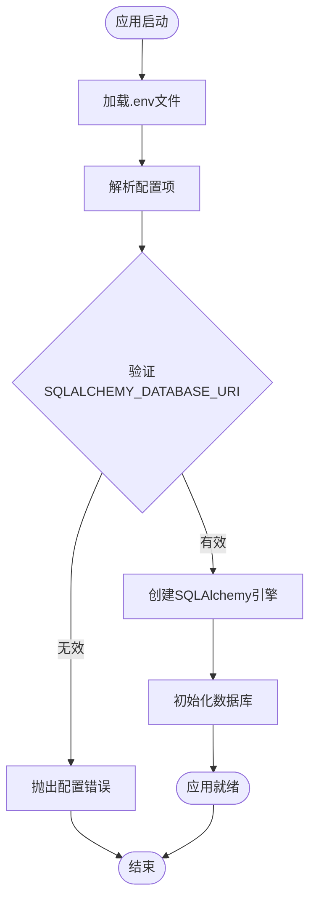
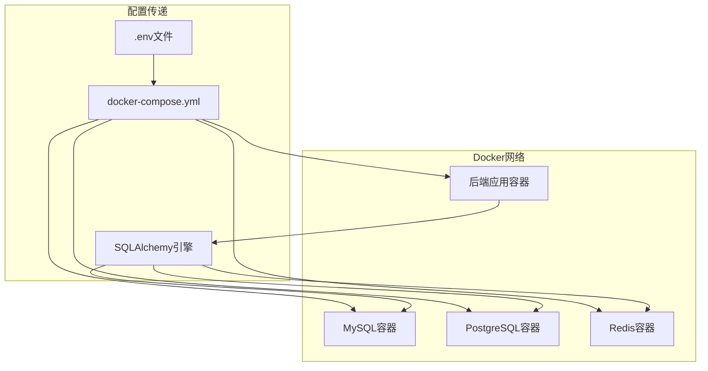
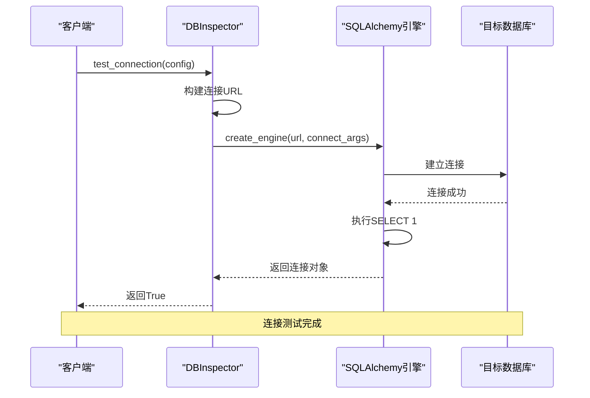
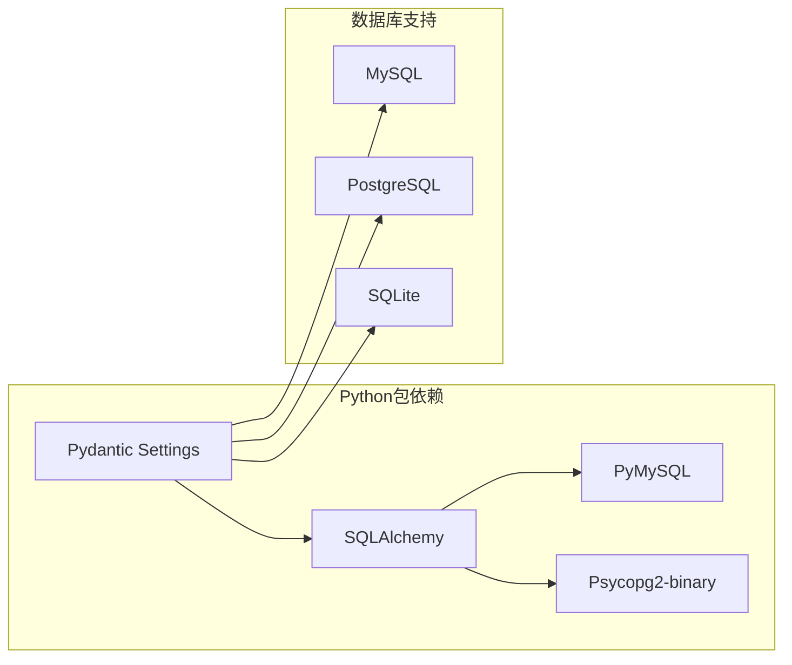
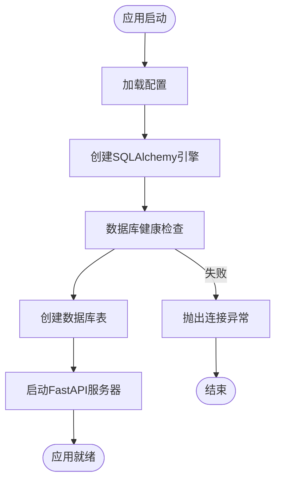

# 数据库连接配置

<cite>
**本文引用的文件**
- [backend/app/core/config.py](file://backend/app/core/config.py)
- [docker-compose.yml](file://docker-compose.yml)
- [.env.example](file://.env.example)
- [backend/app/db/session.py](file://backend/app/db/session.py)
- [backend/init_db.py](file://backend/init_db.py)
- [backend/app/main.py](file://backend/app/main.py)
- [backend/app/services/db_inspector.py](file://backend/app/services/db_inspector.py)
- [backend/requirements.txt](file://backend/requirements.txt)
</cite>

## 目录
1. [简介](#简介)
2. [项目结构](#项目结构)
3. [核心组件](#核心组件)
4. [架构概览](#架构概览)
5. [详细组件分析](#详细组件分析)
6. [依赖关系分析](#依赖关系分析)
7. [性能考虑](#性能考虑)
8. [故障排除指南](#故障排除指南)
9. [结论](#结论)

## 简介

本文档系统性阐述了Universal BI项目中主数据库配置SQLALCHEMY_DATABASE_URI的格式规范与连接参数，涵盖PostgreSQL、MySQL和SQLite三种数据库支持。详细说明了该配置在SQLAlchemy引擎创建过程中的作用，以及与Docker Compose中数据库服务（如db）的关联机制。同时提供了MYSQL_PORT、POSTGRES_PORT等端口配置对本地开发环境连接调试的影响分析，并给出数据库连接池配置建议和常见连接失败问题的排查指南。

## 项目结构

该项目采用前后端分离架构，数据库配置主要集中在后端应用中：



**图表来源**
- [backend/app/core/config.py](file://backend/app/core/config.py#L1-L51)
- [docker-compose.yml](file://docker-compose.yml#L1-L141)
- [backend/app/db/session.py](file://backend/app/db/session.py#L1-L34)

**章节来源**
- [backend/app/core/config.py](file://backend/app/core/config.py#L1-L51)
- [docker-compose.yml](file://docker-compose.yml#L1-L141)

## 核心组件

### SQLALCHEMY_DATABASE_URI配置规范

SQLALCHEMY_DATABASE_URI是项目的核心数据库连接配置，支持多种数据库类型：

#### MySQL连接格式
```
mysql+pymysql://用户名:密码@主机:端口/数据库名?charset=utf8mb4
```

#### PostgreSQL连接格式
```
postgresql://用户名:密码@主机:端口/数据库名
```

#### SQLite连接格式
```
sqlite:///./数据库文件路径
```

**章节来源**
- [backend/app/core/config.py](file://backend/app/core/config.py#L17-L20)
- [.env.example](file://.env.example#L20-L28)

### 配置加载机制

应用通过Pydantic的BaseSettings类从.env文件加载配置，支持运行时环境变量覆盖：



**图表来源**
- [backend/app/core/config.py](file://backend/app/core/config.py#L44-L49)
- [backend/app/db/session.py](file://backend/app/db/session.py#L6-L24)

**章节来源**
- [backend/app/core/config.py](file://backend/app/core/config.py#L1-L51)

## 架构概览

系统采用Docker Compose进行多服务编排，数据库连接通过容器网络实现：



**图表来源**
- [docker-compose.yml](file://docker-compose.yml#L72-L104)
- [backend/app/db/session.py](file://backend/app/db/session.py#L1-L34)

**章节来源**
- [docker-compose.yml](file://docker-compose.yml#L1-L141)

## 详细组件分析

### 数据库引擎配置

SQLAlchemy引擎根据数据库类型采用不同的配置策略：

#### SQLite专用配置
- 线程安全：`check_same_thread=False`允许多线程访问
- 文件路径：相对路径支持开发环境快速部署

#### MySQL/PostgreSQL通用配置
- 连接池：QueuePool提供高效的连接复用
- 连接池参数：
  - `pool_size=10`：基础连接数
  - `max_overflow=20`：超出基础连接数的额外连接
  - `pool_timeout=30`：获取连接超时时间
  - `pool_recycle=3600`：连接回收时间，防止长时间空闲连接失效
  - `pool_pre_ping=True`：连接前自动检查可用性

**章节来源**
- [backend/app/db/session.py](file://backend/app/db/session.py#L6-L24)

### Docker Compose集成

Docker Compose定义了完整的数据库服务栈：

#### MySQL服务配置
- 基础镜像：mysql:8.0
- 端口映射：`${MYSQL_PORT:-3306}:3306`
- 环境变量：ROOT密码、数据库名、时区
- 健康检查：mysqladmin ping验证

#### PostgreSQL服务配置
- 基础镜像：postgres:15
- 端口映射：`${POSTGRES_PORT:-5432}:5432`
- 环境变量：密码、数据库名、时区
- 健康检查：pg_isready验证

#### 后端服务配置
- 环境变量传递：SQLALCHEMY_DATABASE_URI通过环境变量注入
- 依赖关系：等待数据库服务健康检查通过
- 网络通信：通过服务名进行容器间通信

**章节来源**
- [docker-compose.yml](file://docker-compose.yml#L7-L51)
- [docker-compose.yml](file://docker-compose.yml#L75-L104)

### 数据库连接测试

项目提供了灵活的数据库连接测试功能：



**图表来源**
- [backend/app/services/db_inspector.py](file://backend/app/services/db_inspector.py#L33-L51)

**章节来源**
- [backend/app/services/db_inspector.py](file://backend/app/services/db_inspector.py#L1-L99)

### 端口配置对开发环境的影响

端口配置直接影响本地开发体验：

#### 端口映射机制
- 环境变量优先级：`$MYSQL_PORT`覆盖默认值3306
- 容器内部固定端口：MySQL始终使用3306端口
- 开发灵活性：可自定义宿主机端口避免冲突

#### 端口配置示例
- MySQL：`MYSQL_PORT=3306`（默认）
- PostgreSQL：`POSTGRES_PORT=5432`（默认）
- Redis：`REDIS_PORT=6379`（默认）

**章节来源**
- [docker-compose.yml](file://docker-compose.yml#L15-L41)
- [.env.example](file://.env.example#L54-L67)

## 依赖关系分析

### 数据库驱动依赖

项目使用多种数据库驱动以支持不同数据库类型：



**图表来源**
- [backend/requirements.txt](file://backend/requirements.txt#L1-L19)

**章节来源**
- [backend/requirements.txt](file://backend/requirements.txt#L1-L19)

### 应用启动流程

数据库连接在应用启动时建立：



**图表来源**
- [backend/app/main.py](file://backend/app/main.py#L8-L9)
- [backend/init_db.py](file://backend/init_db.py#L21-L31)

**章节来源**
- [backend/app/main.py](file://backend/app/main.py#L1-L35)
- [backend/init_db.py](file://backend/init_db.py#L1-L79)

## 性能考虑

### 连接池优化建议

基于项目现有配置，建议的连接池参数：

| 参数 | 建议值 | 说明 |
|------|--------|------|
| pool_size | 10 | 基础连接数，适合一般并发需求 |
| max_overflow | 20 | 超出基础连接数的额外连接 |
| pool_timeout | 30 | 获取连接超时时间（秒） |
| pool_recycle | 3600 | 连接回收时间（秒），防止连接超时 |
| pool_pre_ping | True | 连接前检查可用性 |

### 数据库类型特定优化

#### MySQL优化
- `connect_timeout=10`：连接超时设置
- `read_timeout=30`：读操作超时
- `write_timeout=30`：写操作超时

#### PostgreSQL优化
- `connect_timeout=10`：连接超时设置
- `client_encoding='utf8'`：字符编码设置

**章节来源**
- [backend/app/db/session.py](file://backend/app/db/session.py#L14-L24)
- [backend/app/services/db_inspector.py](file://backend/app/services/db_inspector.py#L73-L96)

## 故障排除指南

### 常见连接问题及解决方案

#### 主机名解析问题
**症状**：连接超时或无法找到主机
**原因**：Docker容器内无法解析服务名
**解决方案**：
- 使用服务名而非localhost：`mysql`、`postgres`、`redis`
- 确保容器在同一Docker网络中
- 检查Docker网络配置

#### 网络隔离问题
**症状**：容器间无法通信
**原因**：网络配置错误或防火墙阻拦
**解决方案**：
- 验证`universal-bi-network`网络配置
- 检查端口映射是否正确
- 确认防火墙规则

#### 凭据错误
**症状**：认证失败
**原因**：用户名或密码不正确
**解决方案**：
- 验证`.env`文件中的数据库凭据
- 检查Docker Compose中的环境变量
- 确认数据库用户权限

#### 端口冲突
**症状**：端口被占用
**原因**：宿主机端口已被其他服务使用
**解决方案**：
- 修改`.env`文件中的端口号
- 使用`docker-compose down`清理后重新启动
- 检查宿主机端口占用情况

#### 连接池耗尽
**症状**：请求超时或连接获取失败
**原因**：连接池配置不足
**解决方案**：
- 增加`pool_size`和`max_overflow`
- 优化应用逻辑减少长连接持有
- 检查连接泄漏问题

### 调试步骤

1. **验证配置文件**：确认`.env`文件中的连接字符串格式正确
2. **检查容器状态**：使用`docker-compose ps`查看服务状态
3. **测试数据库连接**：使用`docker exec`进入容器测试连接
4. **查看日志**：使用`docker-compose logs`查看详细错误信息
5. **验证网络**：使用`docker network ls`检查网络配置

**章节来源**
- [docker-compose.yml](file://docker-compose.yml#L23-L27)
- [docker-compose.yml](file://docker-compose.yml#L46-L50)

## 结论

Universal BI项目的数据库连接配置展现了现代Python Web应用的最佳实践。通过统一的配置管理、灵活的Docker Compose编排和完善的连接池机制，实现了跨数据库类型的无缝支持。

关键优势包括：
- **统一配置管理**：通过.env文件集中管理所有数据库配置
- **容器化部署**：Docker Compose确保开发和生产环境一致性
- **连接池优化**：合理的连接池参数提升应用性能
- **多数据库支持**：同时支持MySQL、PostgreSQL和SQLite
- **完善的故障排除**：详细的错误处理和调试机制

建议在生产环境中进一步增强：
- 使用更严格的连接池配置
- 实施数据库监控和告警
- 配置SSL/TLS加密传输
- 建立备份和恢复策略