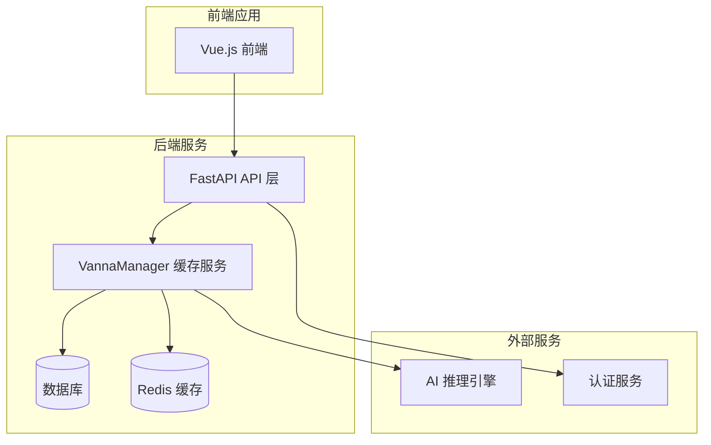
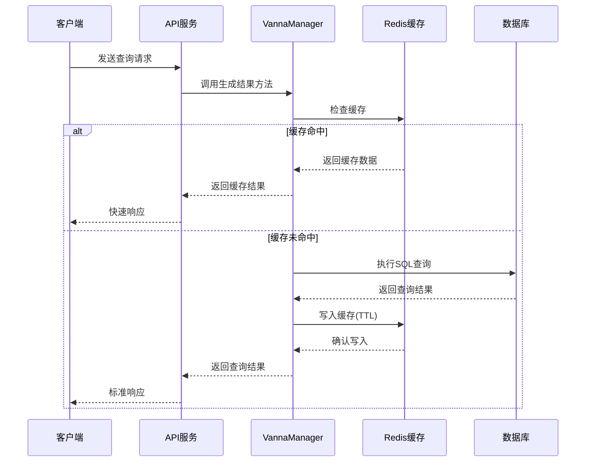
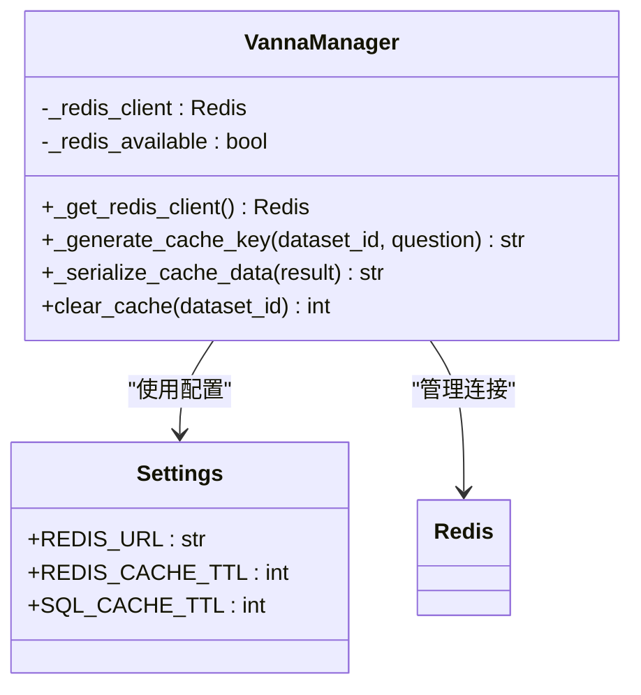
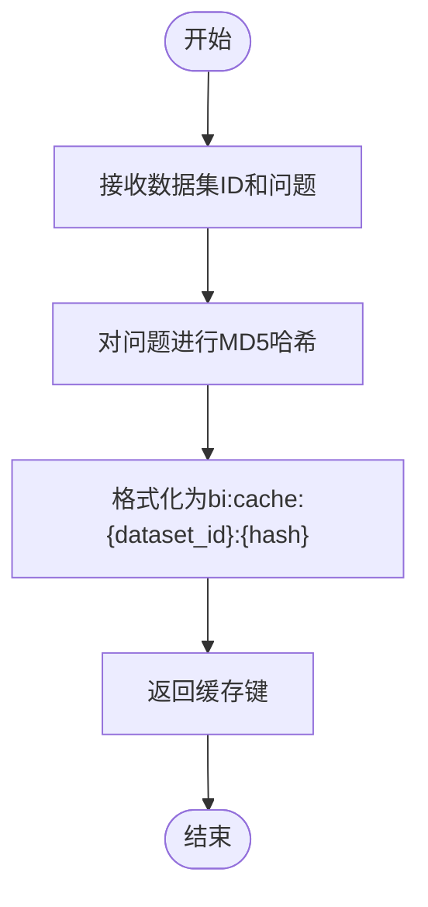
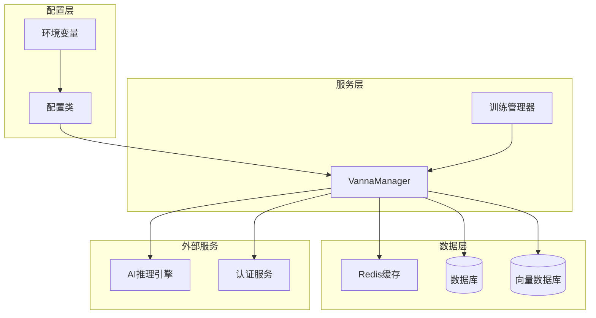

# 缓存系统配置

<cite>
**本文档引用的文件**
- [backend/app/core/config.py](file://backend/app/core/config.py)
- [.env.example](file://.env.example)
- [backend/app/services/vanna_manager.py](file://backend/app/services/vanna_manager.py)
- [backend/example_redis_cache.py](file://backend/example_redis_cache.py)
- [backend/clear_cache.py](file://backend/clear_cache.py)
- [backend/monitor_redis.py](file://backend/monitor_redis.py)
- [docs/backend/REDIS_CACHE.md](file://docs/backend/REDIS_CACHE.md)
- [backend/tests/manual_scripts/test_redis_cache.py](file://backend/tests/manual_scripts/test_redis_cache.py)
</cite>

## 目录
1. [简介](#简介)
2. [项目结构](#项目结构)
3. [核心组件](#核心组件)
4. [架构概览](#架构概览)
5. [详细组件分析](#详细组件分析)
6. [依赖关系分析](#依赖关系分析)
7. [性能考虑](#性能考虑)
8. [故障排除指南](#故障排除指南)
9. [结论](#结论)
10. [附录](#附录)

## 简介

本文档全面阐述了REDIS_URL配置项在查询结果缓存和会话管理中的关键作用。Redis作为高性能的键值存储系统，在Universal BI项目中承担着双重重要职责：一方面通过查询结果缓存显著提升系统响应速度；另一方面通过会话管理支持用户认证和状态维护。

Redis连接字符串采用标准的redis://协议格式，支持主机名、端口、数据库索引等参数配置。本文将详细解释Redis连接字符串的格式规范，演示开发和生产环境的不同配置策略，并结合具体的代码实现展示缓存键生成策略、过期机制以及运维监控方案。

## 项目结构

该项目采用前后端分离的架构设计，后端使用Python FastAPI框架构建RESTful API服务，前端使用Vue.js构建用户界面。Redis缓存系统作为后端服务的重要组成部分，与数据库层、AI推理引擎和用户认证模块紧密集成。



**图表来源**
- [backend/app/services/vanna_manager.py](file://backend/app/services/vanna_manager.py#L131-L170)
- [backend/app/core/config.py](file://backend/app/core/config.py#L26-L29)

**章节来源**
- [backend/app/core/config.py](file://backend/app/core/config.py#L1-L51)
- [.env.example](file://.env.example#L35-L40)

## 核心组件

### Redis配置管理

REDIS_URL配置项位于应用配置类中，采用统一的环境变量管理模式。该配置项支持完整的Redis连接字符串格式，包括主机名、端口、数据库索引等参数。

### 缓存键生成策略

系统实现了两级缓存机制：
- **结果缓存**：缓存完整的查询结果，TTL默认5分钟
- **SQL缓存**：缓存SQL语句并重新执行，TTL默认7天

缓存键采用MD5哈希算法确保唯一性，格式为"bi:cache:{dataset_id}:{hash(question)}"。

### 异常降级机制

当Redis不可用时，系统自动降级为无缓存模式，确保核心功能不受影响。这种优雅的降级策略保证了系统的高可用性。

**章节来源**
- [backend/app/core/config.py](file://backend/app/core/config.py#L26-L29)
- [backend/app/services/vanna_manager.py](file://backend/app/services/vanna_manager.py#L172-L189)
- [backend/app/services/vanna_manager.py](file://backend/app/services/vanna_manager.py#L204-L250)

## 架构概览

Redis缓存系统在整个应用架构中扮演着关键的中间件角色，通过连接池管理和异常处理机制确保服务的稳定性和性能。



**图表来源**
- [backend/app/services/vanna_manager.py](file://backend/app/services/vanna_manager.py#L144-L170)
- [backend/app/services/vanna_manager.py](file://backend/app/services/vanna_manager.py#L204-L250)

## 详细组件分析

### Redis连接管理

VannaManager类实现了Redis客户端的单例模式管理，通过类级别的静态变量实现连接复用和生命周期控制。



**图表来源**
- [backend/app/services/vanna_manager.py](file://backend/app/services/vanna_manager.py#L131-L170)
- [backend/app/core/config.py](file://backend/app/core/config.py#L26-L29)

### 缓存键生成算法

缓存键生成采用MD5哈希算法确保唯一性，同时通过数据集ID和问题哈希的组合实现精确的缓存隔离。



**图表来源**
- [backend/app/services/vanna_manager.py](file://backend/app/services/vanna_manager.py#L172-L189)

### 缓存清除机制

系统提供了两种缓存清除方式：按数据集清除和全量清除，支持批量操作和精确控制。

**章节来源**
- [backend/app/services/vanna_manager.py](file://backend/app/services/vanna_manager.py#L204-L250)
- [backend/clear_cache.py](file://backend/clear_cache.py#L16-L46)

### Redis连接字符串格式

REDIS_URL遵循标准的Redis连接字符串格式，支持多种配置选项：

| 组件 | 格式 | 示例 | 说明 |
|------|------|------|------|
| 协议 | redis:// | redis://localhost:6379/0 | Redis协议标识 |
| 主机名 | hostname | localhost | 服务器地址 |
| 端口 | port | 6379 | 端口号 |
| 数据库 | db_index | /0 | 数据库索引 |
| 密码 | :password@ | :password@ | 可选密码 |

**章节来源**
- [.env.example](file://.env.example#L35-L40)
- [backend/app/core/config.py](file://backend/app/core/config.py#L27-L28)

## 依赖关系分析

Redis缓存系统与项目的其他组件存在密切的依赖关系，形成了完整的数据流架构。



**图表来源**
- [backend/app/core/config.py](file://backend/app/core/config.py#L1-L51)
- [backend/app/services/vanna_manager.py](file://backend/app/services/vanna_manager.py#L1-L50)

**章节来源**
- [backend/app/core/config.py](file://backend/app/core/config.py#L1-L51)
- [backend/app/services/vanna_manager.py](file://backend/app/services/vanna_manager.py#L1-L50)

## 性能考虑

### 缓存性能提升

通过Redis缓存，系统能够实现显著的性能提升。根据测试数据显示，缓存命中场景下的响应时间可以达到秒级，相比未缓存场景提升数倍性能。

### 内存使用优化

系统采用LRU淘汰策略和合理的TTL配置，确保Redis内存使用的高效性和可控性。建议为每个数据集预留10-100MB的缓存空间。

### 连接池管理

通过连接池管理机制，系统能够有效复用Redis连接，减少连接建立开销，提高并发处理能力。

**章节来源**
- [docs/backend/REDIS_CACHE.md](file://docs/backend/REDIS_CACHE.md#L161-L192)
- [backend/tests/manual_scripts/test_redis_cache.py](file://backend/tests/manual_scripts/test_redis_cache.py#L351-L358)

## 故障排除指南

### Redis连接问题

当遇到Redis连接失败时，系统会自动降级为无缓存模式。常见原因包括网络连接问题、Redis服务未启动、认证失败等。

### 缓存异常处理

系统实现了完善的异常处理机制，包括连接超时、序列化失败、网络中断等情况的优雅处理。

### 监控和诊断

通过监控脚本可以实时查看Redis的运行状态、内存使用情况和缓存命中率等关键指标。

**章节来源**
- [backend/monitor_redis.py](file://backend/monitor_redis.py#L32-L72)
- [docs/backend/REDIS_CACHE.md](file://docs/backend/REDIS_CACHE.md#L138-L159)

## 结论

REDIS_URL配置项在Universal BI项目中发挥着至关重要的作用，它不仅支撑着查询结果缓存这一核心功能，还为系统的整体性能和用户体验提供了重要保障。通过合理的配置策略、完善的异常处理机制和有效的运维监控，Redis缓存系统能够为用户提供快速、稳定的服务体验。

建议在生产环境中采用独立的Redis实例部署，配置适当的连接池和超时参数，并建立完善的监控告警机制，确保缓存系统的稳定运行。

## 附录

### 开发环境配置示例

开发环境推荐使用本地Redis实例，便于调试和测试。配置示例如下：

```bash
# 开发环境Redis配置
REDIS_URL=redis://localhost:6379/0
REDIS_CACHE_TTL=300
```

### 生产环境配置建议

生产环境建议采用高可用的Redis集群部署，配置连接池和适当的TTL策略：

```bash
# 生产环境Redis配置
REDIS_URL=redis://redis-prod:6379/0
REDIS_CACHE_TTL=300
SQL_CACHE_TTL=604800
```

### 缓存运维最佳实践

1. **定期监控**：通过监控脚本定期检查Redis状态
2. **容量规划**：根据业务规模合理规划Redis内存
3. **TTL调优**：根据数据更新频率调整缓存过期时间
4. **备份策略**：建立Redis数据备份和恢复机制

**章节来源**
- [docs/backend/REDIS_CACHE.md](file://docs/backend/REDIS_CACHE.md#L211-L228)
- [backend/monitor_redis.py](file://backend/monitor_redis.py#L167-L177)