# 配置最佳实践与安全建议

<cite>
**本文档引用的文件**
- [backend/app/core/config.py](file://backend/app/core/config.py)
- [.env.example](file://.env.example)
- [backend/app/main.py](file://backend/app/main.py)
- [backend/requirements.txt](file://backend/requirements.txt)
- [backend/app/core/security.py](file://backend/app/core/security.py)
- [.gitignore](file://.gitignore)
- [docker-compose.yml](file://docker-compose.yml)
- [QUICKSTART.md](file://QUICKSTART.md)
- [setup.sh](file://setup.sh)
- [setup.bat](file://setup.bat)
</cite>

## 目录
1. [简介](#简介)
2. [项目结构](#项目结构)
3. [核心组件](#核心组件)
4. [架构概览](#架构概览)
5. [详细组件分析](#详细组件分析)
6. [依赖分析](#依赖分析)
7. [性能考虑](#性能考虑)
8. [故障排除指南](#故障排除指南)
9. [结论](#结论)

## 简介

本指南专注于Universal BI项目的配置最佳实践与安全建议。该项目采用现代化的配置管理模式，通过.env文件集中管理所有敏感信息和配置参数，确保开发环境与生产环境的分离，以及完整的安全防护措施。

## 项目结构

项目采用前后端分离的架构设计，配置管理贯穿整个应用栈：

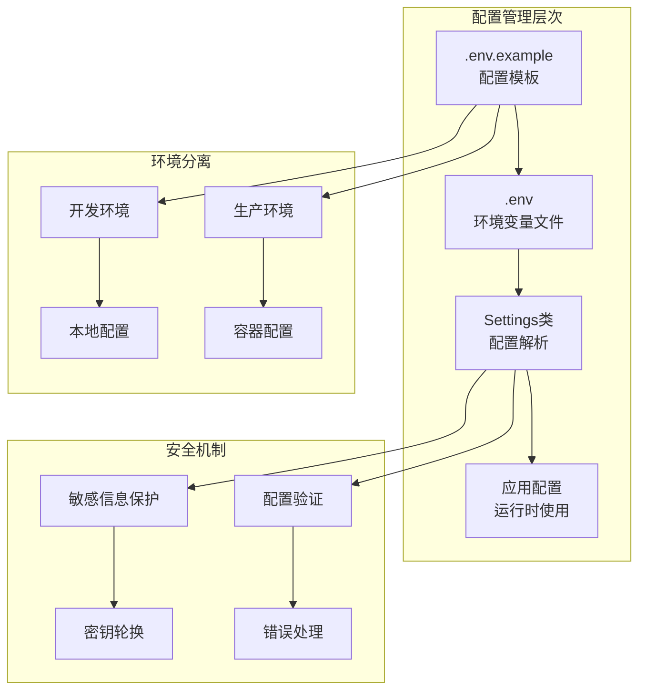

**图表来源**
- [backend/app/core/config.py](file://backend/app/core/config.py#L1-L51)
- [.env.example](file://.env.example#L1-L72)

**章节来源**
- [backend/app/core/config.py](file://backend/app/core/config.py#L1-L51)
- [.env.example](file://.env.example#L1-L72)

## 核心组件

### 配置类设计

项目使用Pydantic的BaseSettings实现类型安全的配置管理：

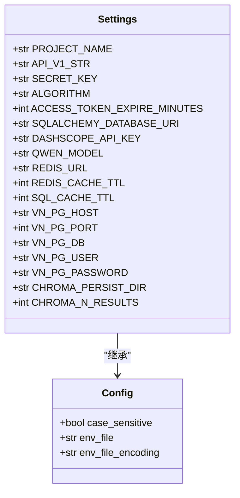

**图表来源**
- [backend/app/core/config.py](file://backend/app/core/config.py#L5-L49)

### 环境变量模板

.env.example提供了完整的配置模板，包含所有必要配置项：

| 配置类别 | 关键配置项 | 用途 |
|---------|-----------|------|
| 应用基础 | PROJECT_NAME, API_V1_STR | 应用名称和API版本 |
| 安全配置 | SECRET_KEY, ALGORITHM | JWT令牌加密 |
| 数据库配置 | SQLALCHEMY_DATABASE_URI | 主数据库连接 |
| AI配置 | DASHSCOPE_API_KEY, QWEN_MODEL | 通义千问API集成 |
| 缓存配置 | REDIS_URL, REDIS_CACHE_TTL | Redis缓存设置 |
| 向量数据库 | VN_PG_HOST, VN_PG_PORT | PGVector配置 |

**章节来源**
- [.env.example](file://.env.example#L1-L72)
- [backend/app/core/config.py](file://backend/app/core/config.py#L8-L43)

## 架构概览

项目采用分层配置架构，确保配置的安全性和可维护性：

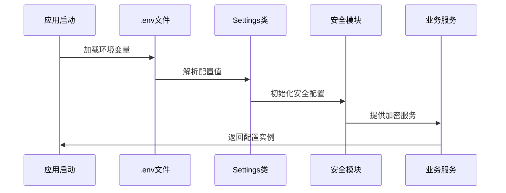

**图表来源**
- [backend/app/core/config.py](file://backend/app/core/config.py#L44-L49)
- [backend/app/core/security.py](file://backend/app/core/security.py#L73-L80)

## 详细组件分析

### 敏感信息保护机制

项目实现了多层次的敏感信息保护：

#### 1. 环境变量隔离

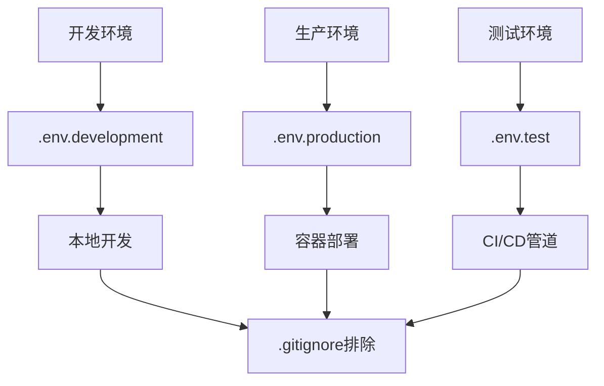

**图表来源**
- [.gitignore](file://.gitignore#L57-L61)

#### 2. 密钥生成与管理

项目推荐使用Python secrets模块生成高强度密钥：

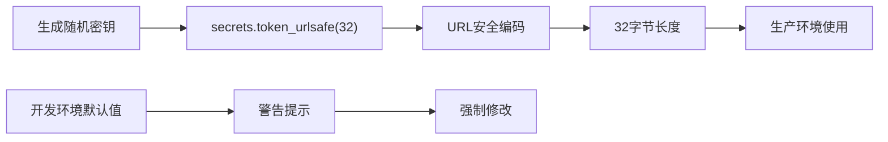

**图表来源**
- [.env.example](file://.env.example#L15-L16)

#### 3. 配置验证流程

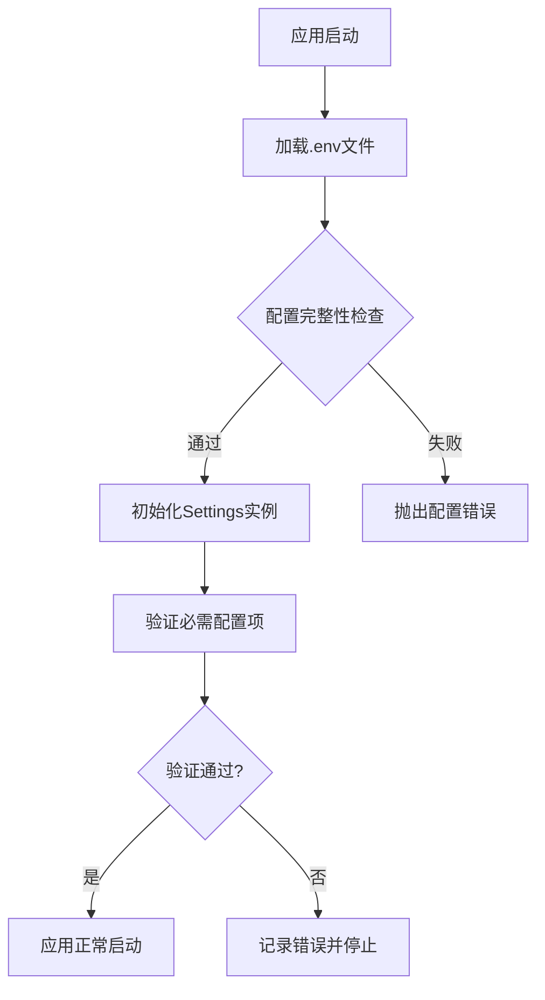

**图表来源**
- [backend/app/core/config.py](file://backend/app/core/config.py#L44-L49)

### 配置分离策略

#### 开发环境配置

开发环境使用本地配置文件，便于调试和测试：

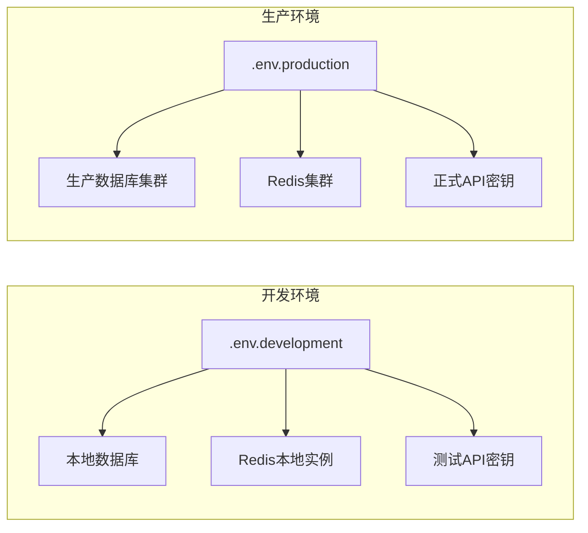

#### 容器化配置管理

Docker Compose实现了环境变量的动态注入：

**章节来源**
- [docker-compose.yml](file://docker-compose.yml#L83-L92)

### 安全配置最佳实践

#### JWT密钥管理

项目实现了安全的JWT配置管理：

| 配置项 | 默认值 | 安全建议 |
|--------|--------|----------|
| SECRET_KEY | change_this_to_a_secure_random_key_in_production | 必须使用secrets模块生成 |
| ALGORITHM | HS256 | 使用标准算法 |
| ACCESS_TOKEN_EXPIRE_MINUTES | 30 | 合理设置过期时间 |

#### 数据库连接安全

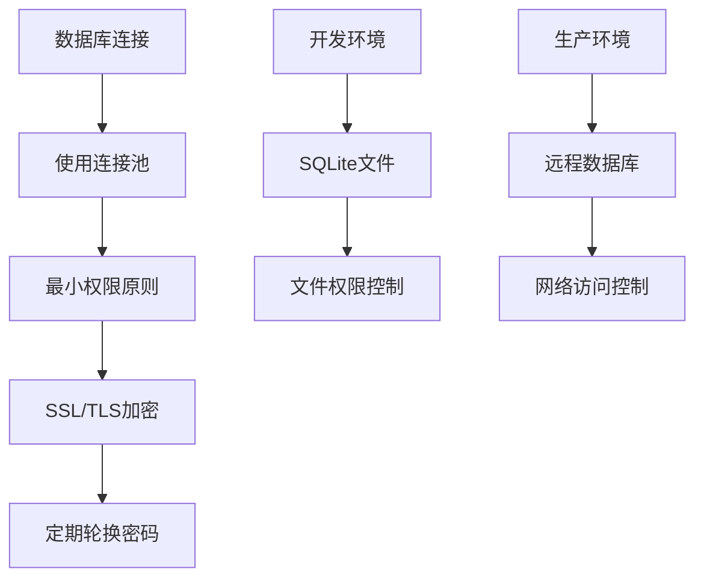

**图表来源**
- [backend/app/core/config.py](file://backend/app/core/config.py#L17-L19)

**章节来源**
- [backend/app/core/security.py](file://backend/app/core/security.py#L73-L80)

## 依赖分析

项目配置管理涉及多个关键依赖：

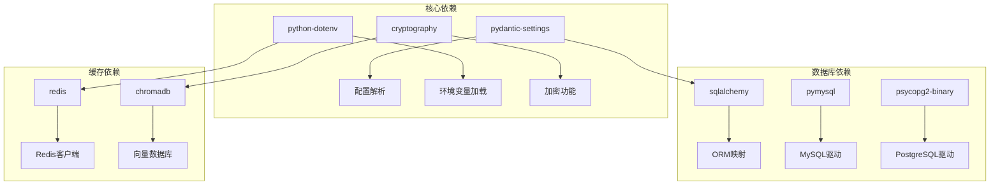

**图表来源**
- [backend/requirements.txt](file://backend/requirements.txt#L1-L19)

**章节来源**
- [backend/requirements.txt](file://backend/requirements.txt#L1-L19)

## 性能考虑

### 配置加载优化

1. **延迟初始化**：配置在首次使用时才加载，避免启动时的性能开销
2. **缓存机制**：配置对象被全局缓存，减少重复解析
3. **类型转换**：自动进行类型转换，避免运行时类型错误

### 环境变量优化

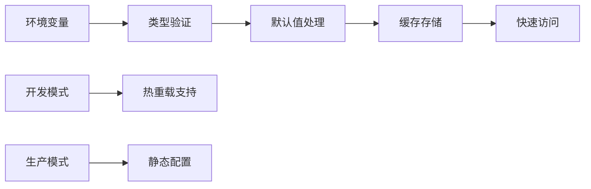

## 故障排除指南

### 常见配置错误及解决方案

#### 1. 环境变量未加载

**问题症状**：
- 应用启动时报配置缺失错误
- 数据库连接失败
- API密钥认证失败

**解决方案**：
```bash
# 检查.env文件是否存在
ls -la .env

# 验证配置文件格式
cat .env | grep "="

# 重新加载配置
source .env
```

#### 2. 敏感信息泄露

**预防措施**：
- 确保.env文件被.gitignore排除
- 定期检查Git提交历史
- 使用不同环境的独立配置文件

#### 3. 配置验证失败

**诊断步骤**：
```bash
# 检查必需配置项
grep -E "(DASHSCOPE_API_KEY|SQLALCHEMY_DATABASE_URI)" .env

# 验证配置格式
python -c "from app.core.config import settings; print(settings)"

# 检查环境变量覆盖
env | grep -E "(SECRET_KEY|DATABASE_URL)"
```

#### 4. 开发与生产环境差异

**配置分离检查**：
```bash
# 开发环境
cp .env.example .env.development
# 生产环境  
cp .env.example .env.production
```

**章节来源**
- [QUICKSTART.md](file://QUICKSTART.md#L192-L250)

### 配置验证流程

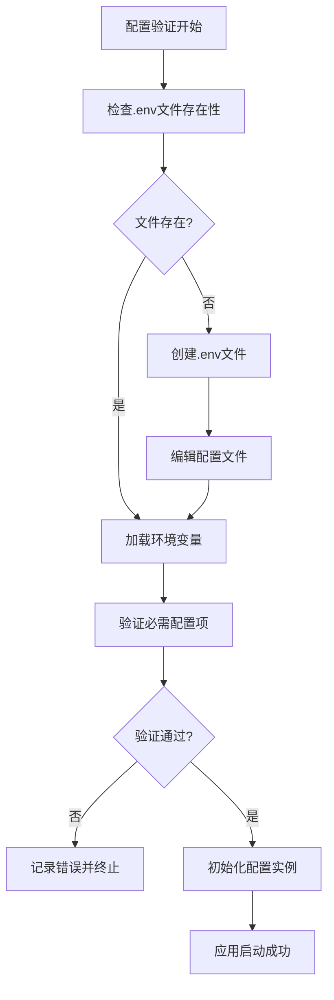

**图表来源**
- [backend/app/core/config.py](file://backend/app/core/config.py#L44-L49)

## 结论

Universal BI项目的配置管理体现了现代应用的最佳实践：

### 核心优势

1. **安全性**：完整的敏感信息保护机制，支持密钥轮换
2. **可维护性**：清晰的配置分离策略，支持多环境管理
3. **可靠性**：完善的配置验证和错误处理机制
4. **可扩展性**：灵活的配置加载和管理架构

### 实施建议

1. **立即行动**：
   - 使用secrets模块生成高强度密钥
   - 建立配置变更审查流程
   - 实施定期安全审计

2. **长期规划**：
   - 集成专业的密钥管理系统
   - 建立配置版本控制和回滚机制
   - 实施配置监控和告警

3. **团队培训**：
   - 制定配置管理规范
   - 建立配置变更流程
   - 定期进行安全意识培训

通过遵循这些最佳实践，可以确保项目的配置管理既安全又高效，为应用的稳定运行提供坚实基础。