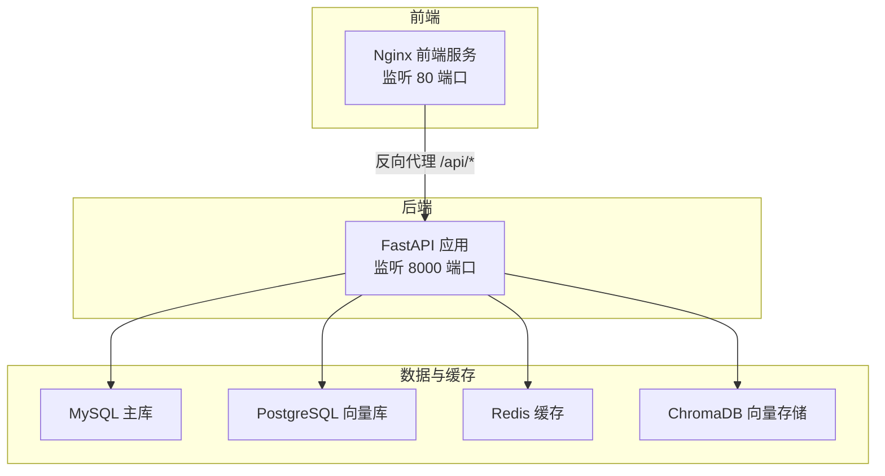
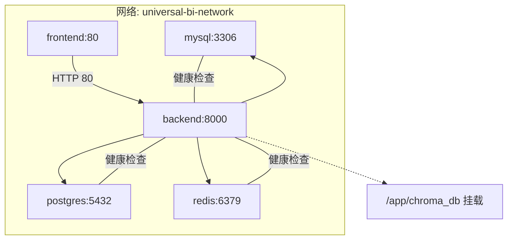
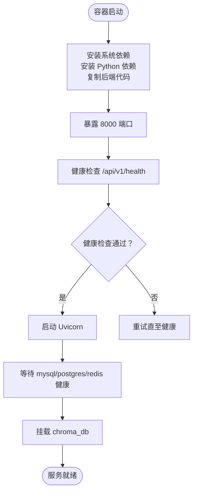
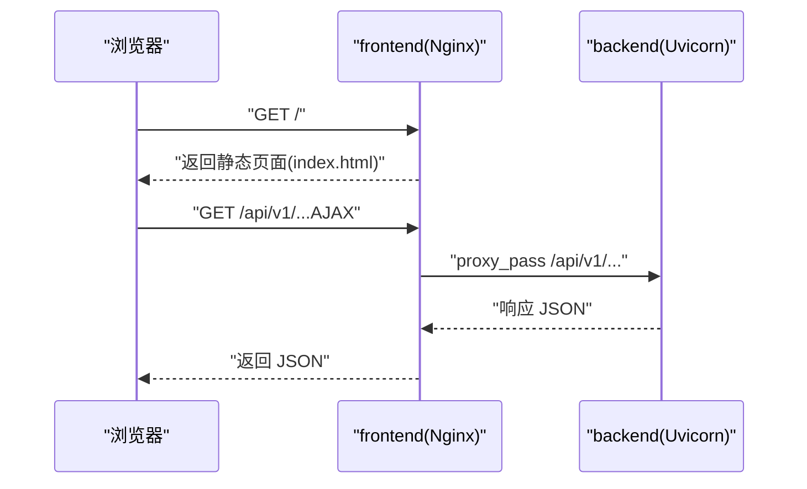
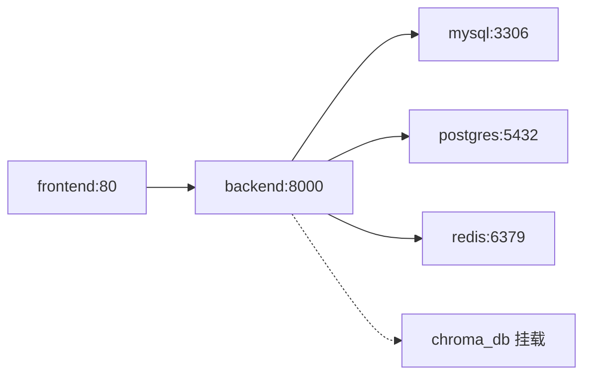

# 部署与运维

<cite>
**本文引用的文件**
- [docker-compose.yml](file://docker-compose.yml)
- [.env.example](file://.env.example)
- [Dockerfile.backend](file://Dockerfile.backend)
- [Dockerfile.frontend](file://Dockerfile.frontend)
- [setup.sh](file://setup.sh)
- [setup.bat](file://setup.bat)
- [backend/monitor_redis.py](file://backend/monitor_redis.py)
- [backend/requirements.txt](file://backend/requirements.txt)
- [frontend/nginx.conf](file://frontend/nginx.conf)
- [backend/app/core/config.py](file://backend/app/core/config.py)
- [backend/app/main.py](file://backend/app/main.py)
- [README.md](file://README.md)
</cite>

## 目录
1. [简介](#简介)
2. [项目结构](#项目结构)
3. [核心组件](#核心组件)
4. [架构总览](#架构总览)
5. [详细组件分析](#详细组件分析)
6. [依赖关系分析](#依赖关系分析)
7. [性能考虑](#性能考虑)
8. [故障排查指南](#故障排查指南)
9. [结论](#结论)
10. [附录](#附录)

## 简介
本指南面向生产环境部署 universal-bi 系统，围绕 docker-compose.yml 展开各服务（web、api、db、redis）的配置与网络连接；解析 Dockerfile.backend 与 Dockerfile.frontend 的构建步骤（依赖安装、代码复制、启动命令）；详解 .env.example 中的关键配置项（数据库连接、AI 模型 API 密钥、JWT 密钥等）；给出 setup.sh/.bat 的执行流程与适用场景；提供监控建议（Redis 状态检查 monitor_redis.py）、日志收集、备份策略与扩展方案（水平扩展 API 服务），并强调 HTTPS、敏感信息加密等安全要点。

## 项目结构
该仓库采用前后端分离与多服务编排的结构：
- 后端：FastAPI 应用，提供 API 服务，使用 SQLAlchemy 连接 MySQL/PostgreSQL，使用 Redis 缓存，使用 ChromaDB 存储向量数据。
- 前端：Vue 3 + Vite 构建，Nginx 提供静态资源与反向代理。
- 数据层：MySQL（主库）、PostgreSQL（向量库）、Redis（缓存）、ChromaDB（向量存储）。
- 编排：docker-compose 将上述服务组合为统一的部署单元，并通过自定义网络互通。

图表来源
- [docker-compose.yml](file://docker-compose.yml#L1-L141)
- [frontend/nginx.conf](file://frontend/nginx.conf#L1-L49)
- [backend/app/main.py](file://backend/app/main.py#L1-L35)

章节来源
- [docker-compose.yml](file://docker-compose.yml#L1-L141)
- [README.md](file://README.md#L47-L98)

## 核心组件
- 后端 API 服务（backend）
  - 基于 Uvicorn 运行 FastAPI 应用，暴露 /api/v1 路由。
  - 依赖 MySQL、PostgreSQL、Redis、ChromaDB。
  - 通过 .env 与环境变量注入配置。
- 前端 Web 服务（frontend）
  - Nginx 提供静态资源与 SPA 路由支持，反向代理 /api/* 到后端。
  - 默认对外暴露 80 端口。
- 数据库服务（mysql、postgres）
  - MySQL 作为主业务库，PostgreSQL 用于向量检索。
- 缓存服务（redis）
  - 提供令牌黑名单、查询缓存等能力。
- 向量存储（chroma_db）
  - 用于 Vanna 训练与检索的数据持久化目录。

章节来源
- [backend/app/main.py](file://backend/app/main.py#L1-L35)
- [frontend/nginx.conf](file://frontend/nginx.conf#L1-L49)
- [docker-compose.yml](file://docker-compose.yml#L7-L121)

## 架构总览
下图展示了容器间的网络拓扑、端口映射与服务依赖关系。

图表来源
- [docker-compose.yml](file://docker-compose.yml#L1-L141)

章节来源
- [docker-compose.yml](file://docker-compose.yml#L1-L141)

## 详细组件分析

### 后端 API 服务（backend）
- 构建与运行
  - 基于 Dockerfile.backend 构建镜像，安装系统依赖（MySQL/PostgreSQL 客户端、编译工具），安装 Python 依赖，复制后端代码，创建必要目录，暴露 8000 端口，健康检查通过调用 /api/v1/health，启动命令使用 Uvicorn。
- 环境变量注入
  - 通过 env_file 加载 .env；同时显式注入数据库、Redis、向量库连接参数，确保容器内服务发现与连接可用。
- 依赖与端口
  - 依赖 mysql、postgres、redis 健康后再启动；挂载 chroma_db 目录持久化向量数据。
- 健康检查
  - 通过 Uvicorn 内部健康端点进行探测，失败将被重启。

图表来源
- [Dockerfile.backend](file://Dockerfile.backend#L1-L40)
- [docker-compose.yml](file://docker-compose.yml#L75-L104)

章节来源
- [Dockerfile.backend](file://Dockerfile.backend#L1-L40)
- [docker-compose.yml](file://docker-compose.yml#L75-L104)

### 前端 Web 服务（frontend）
- 构建流程
  - 多阶段构建：第一阶段使用 Node Alpine 安装依赖并打包；第二阶段使用 Nginx Alpine，复制构建产物与 Nginx 配置，暴露 80 端口。
- 反向代理
  - Nginx 将 /api/* 代理至 backend:8000；对静态资源启用 gzip 与长缓存；SPA 路由通过 try_files $uri $uri/ /index.html 支持。
- 端口映射
  - 默认映射宿主机 3000:80（若需 HTTPS，建议在反向代理层做 TLS 终止）。

图表来源
- [frontend/nginx.conf](file://frontend/nginx.conf#L1-L49)
- [docker-compose.yml](file://docker-compose.yml#L109-L121)

章节来源
- [Dockerfile.frontend](file://Dockerfile.frontend#L1-L38)
- [frontend/nginx.conf](file://frontend/nginx.conf#L1-L49)
- [docker-compose.yml](file://docker-compose.yml#L109-L121)

### 数据库与向量库（mysql、postgres）
- MySQL
  - 初始化脚本挂载到 /docker-entrypoint-initdb.d，随容器启动自动执行迁移脚本。
  - 健康检查通过 mysqladmin ping。
- PostgreSQL
  - 通过 pg_isready 健康检查；用于 Vanna 向量数据存储。

章节来源
- [docker-compose.yml](file://docker-compose.yml#L7-L50)

### 缓存与向量存储（redis、chroma_db）
- Redis
  - 启用 AOF；可选密码；健康检查通过 redis-cli ping。
- ChromaDB
  - 挂载目录 /app/chroma_db，持久化向量数据。

章节来源
- [docker-compose.yml](file://docker-compose.yml#L55-L104)

### 环境变量与配置（.env.example）
- 应用基础配置
  - PROJECT_NAME、API_V1_STR。
- JWT 安全配置
  - SECRET_KEY、ALGORITHM、ACCESS_TOKEN_EXPIRE_MINUTES。
- 数据库连接（开发/本地）
  - SQLALCHEMY_DATABASE_URI 支持 MySQL/PostgreSQL/SQLite。
- AI 大模型配置（必填）
  - DASHSCOPE_API_KEY、QWEN_MODEL。
- Redis 缓存配置
  - REDIS_URL、REDIS_CACHE_TTL。
- 向量数据库（PGVector）配置
  - VN_PG_HOST、VN_PG_PORT、VN_PG_DB、VN_PG_USER、VN_PG_PASSWORD。
- ChromaDB 配置
  - CHROMA_PERSIST_DIR、CHROMA_N_RESULTS。
- Docker Compose 使用的默认值
  - MYSQL_ROOT_PASSWORD、MYSQL_DATABASE、MYSQL_PORT、POSTGRES_PASSWORD、POSTGRES_DB、POSTGRES_PORT、REDIS_PORT、REDIS_PASSWORD、BACKEND_PORT、FRONTEND_PORT。

章节来源
- [.env.example](file://.env.example#L1-L72)
- [backend/app/core/config.py](file://backend/app/core/config.py#L1-L51)

### Dockerfile.backend 构建细节
- 基础镜像与工作目录
  - 使用 python:3.10-slim，设置 /app。
- 系统依赖
  - 安装 gcc/g++、MySQL 客户端、PostgreSQL 客户端、libpq-dev。
- Python 依赖
  - 使用阿里云镜像源安装 requirements.txt。
- 代码与目录
  - 复制 backend/，创建 chroma_db 与 logs 目录。
- 健康检查与启动
  - 健康检查通过访问 /api/v1/health；启动命令 uvicorn 绑定 0.0.0.0:8000。

章节来源
- [Dockerfile.backend](file://Dockerfile.backend#L1-L40)
- [backend/requirements.txt](file://backend/requirements.txt#L1-L19)

### Dockerfile.frontend 构建细节
- 多阶段构建
  - 第一阶段：Node Alpine 安装依赖并构建；第二阶段：Nginx Alpine 复制构建产物与 Nginx 配置。
- Nginx 配置
  - gzip、SPA 路由、/api/* 代理、静态资源缓存、隐藏文件禁止访问。

章节来源
- [Dockerfile.frontend](file://Dockerfile.frontend#L1-L38)
- [frontend/nginx.conf](file://frontend/nginx.conf#L1-L49)

### setup.sh/.bat 执行流程与适用场景
- 适用场景
  - setup.sh 适用于 macOS/Linux；setup.bat 适用于 Windows。
- 功能概览
  - 检测系统与命令；安装 Python/Node/Docker；复制并提示编辑 .env；开发模式（本地依赖）与 Docker 模式（容器化）两种部署路径。
- 开发模式
  - 安装 Python/Node，创建虚拟环境，安装依赖，生成 start_dev.sh 启动后端与前端。
- Docker 模式
  - 安装 Docker，检查 docker-compose 或 docker compose，构建镜像并后台启动，等待并检查服务状态，输出常用命令。

章节来源
- [setup.sh](file://setup.sh#L1-L318)
- [setup.bat](file://setup.bat#L1-L213)

### Redis 监控与运维（monitor_redis.py）
- 功能
  - 连接 Redis，周期性打印服务器信息、黑名单 Key 数量、缓存分布等；支持自定义刷新间隔。
- 使用建议
  - 在生产环境中定期运行，观察黑名单与缓存增长趋势，及时清理过期 Key 与异常缓存。

章节来源
- [backend/monitor_redis.py](file://backend/monitor_redis.py#L1-L177)

## 依赖关系分析
- 服务耦合
  - frontend 依赖 backend；backend 依赖 mysql、postgres、redis；chroma_db 为后端持久化目录。
- 网络与端口
  - frontend:80 -> backend:8000；backend:8000 -> mysql:3306、postgres:5432、redis:6379。
- 健康检查
  - mysql、postgres、redis 健康检查通过；backend 健康检查通过内部 /api/v1/health。

图表来源
- [docker-compose.yml](file://docker-compose.yml#L1-L141)

章节来源
- [docker-compose.yml](file://docker-compose.yml#L1-L141)

## 性能考虑
- 前端静态资源与路由
  - Nginx 启用 gzip 与静态资源缓存，减少带宽与请求延迟。
- 后端并发与健康检查
  - Uvicorn 默认并发模型，健康检查失败自动重启，保障可用性。
- 数据库与缓存
  - Redis 作为缓存层，合理设置 TTL；MySQL/PostgreSQL 连接池与索引优化可进一步提升吞吐。
- 向量检索
  - ChromaDB 持久化目录需定期清理与压缩，避免磁盘膨胀。

章节来源
- [frontend/nginx.conf](file://frontend/nginx.conf#L1-L49)
- [Dockerfile.backend](file://Dockerfile.backend#L34-L36)

## 故障排查指南
- 后端启动失败（数据库连接）
  - 检查 mysql/postgres 是否健康；核对 .env 中 SQLALCHEMY_DATABASE_URI；在容器内执行数据库连接验证。
- DASHSCOPE_API_KEY 未配置
  - 确认 .env 中 DASHSCOPE_API_KEY 已设置；获取地址见 .env 注释。
- Docker 容器启动失败
  - 使用 docker-compose ps 查看状态；docker-compose logs -f 查看后端/数据库/Redis 日志；必要时 docker-compose up -d --build 重建。
- Redis 连接问题
  - 使用 redis-cli ping 或 docker-compose exec redis redis-cli ping；核对 REDIS_URL 与密码。
- 前端 404（刷新路由）
  - 确认 Nginx 配置中 try_files $uri $uri/ /index.html；确认后端允许跨域。
- 性能问题
  - 使用 docker stats 观察资源占用；清理 Docker 缓存；谨慎清理 chroma_db 目录。

章节来源
- [README.md](file://README.md#L284-L356)
- [docker-compose.yml](file://docker-compose.yml#L1-L141)

## 结论
通过 docker-compose.yml 的统一编排，universal-bi 实现了前后端与数据层的一体化部署。结合 .env.example 的配置项与 Dockerfile.backend/ frontend 的构建细节，可在生产环境快速落地。配合 monitor_redis.py 的监控与 README.md 的运维建议，可有效保障系统稳定性与可维护性。后续可按需引入 HTTPS、密钥管理与水平扩展 API 服务。

## 附录

### 环境变量清单与含义
- 应用基础
  - PROJECT_NAME、API_V1_STR
- JWT 安全
  - SECRET_KEY、ALGORITHM、ACCESS_TOKEN_EXPIRE_MINUTES
- 数据库连接（开发/本地）
  - SQLALCHEMY_DATABASE_URI（支持 MySQL/PostgreSQL/SQLite）
- AI 大模型
  - DASHSCOPE_API_KEY（必填）、QWEN_MODEL
- Redis 缓存
  - REDIS_URL、REDIS_CACHE_TTL
- 向量数据库（PGVector）
  - VN_PG_HOST、VN_PG_PORT、VN_PG_DB、VN_PG_USER、VN_PG_PASSWORD
- ChromaDB
  - CHROMA_PERSIST_DIR、CHROMA_N_RESULTS
- Docker Compose 默认值
  - MYSQL_ROOT_PASSWORD、MYSQL_DATABASE、MYSQL_PORT、POSTGRES_PASSWORD、POSTGRES_DB、POSTGRES_PORT、REDIS_PORT、REDIS_PASSWORD、BACKEND_PORT、FRONTEND_PORT

章节来源
- [.env.example](file://.env.example#L1-L72)
- [backend/app/core/config.py](file://backend/app/core/config.py#L1-L51)

### 安全加固建议
- HTTPS
  - 在反向代理层（如 Nginx/Traefik/Caddy）启用 TLS 终止，配置证书与强密码套件。
- 敏感信息加密
  - 使用密钥管理服务（KMS）或环境变量加密工具，避免明文存储在 .env。
- 网络隔离
  - 将数据库与缓存置于受保护子网，仅允许 API 服务访问。
- 访问控制
  - 限制 API 端口暴露范围，启用 WAF 与速率限制。
- 日志与审计
  - 集中采集容器日志，保留访问与错误日志，定期轮转与归档。

### 监控与日志
- Redis 监控
  - 使用 monitor_redis.py 定期巡检黑名单与缓存分布。
- 日志收集
  - docker-compose 日志：docker-compose logs -f；按服务过滤：docker-compose logs -f backend。
- 备份策略
  - 数据库：mysqldump/pg_dump + 定时归档；Redis：AOF/RDB + 定期快照；ChromaDB：备份持久化目录。
- 扩展方案
  - 水平扩展 API 服务：使用反向代理（Nginx/Traefik）+ 多实例 Uvicorn；Redis 使用集群或哨兵；数据库读写分离与分库分表。

章节来源
- [backend/monitor_redis.py](file://backend/monitor_redis.py#L1-L177)
- [README.md](file://README.md#L253-L282)