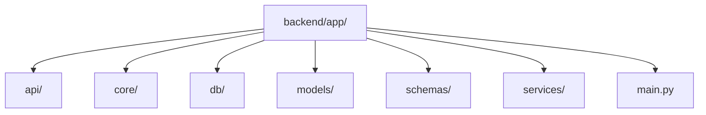
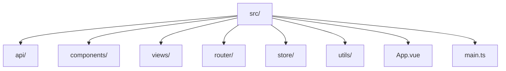
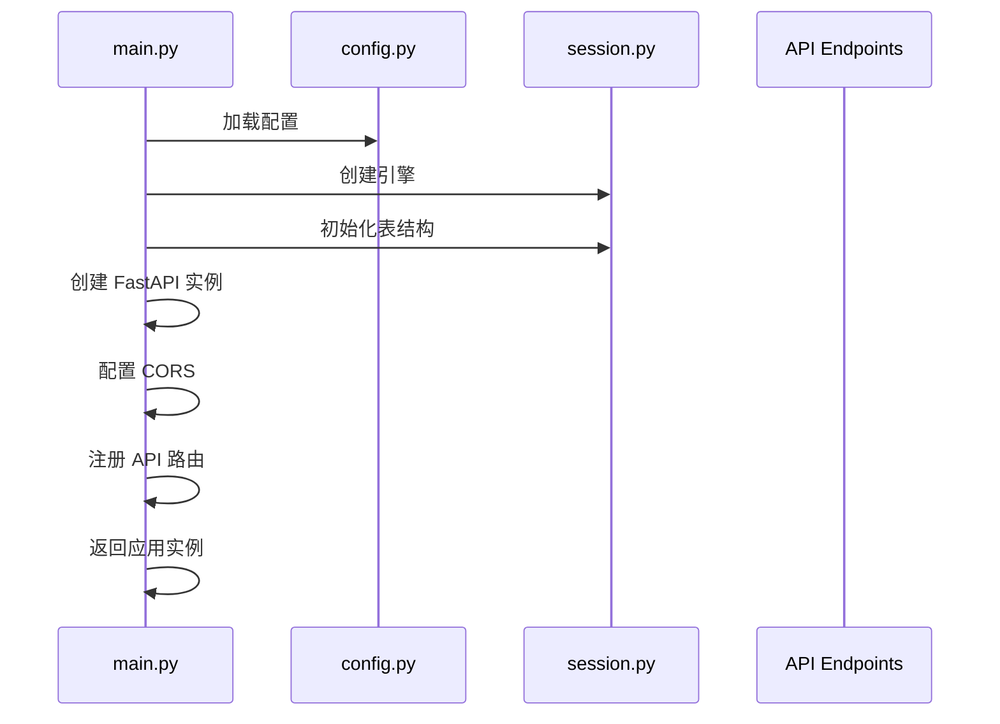
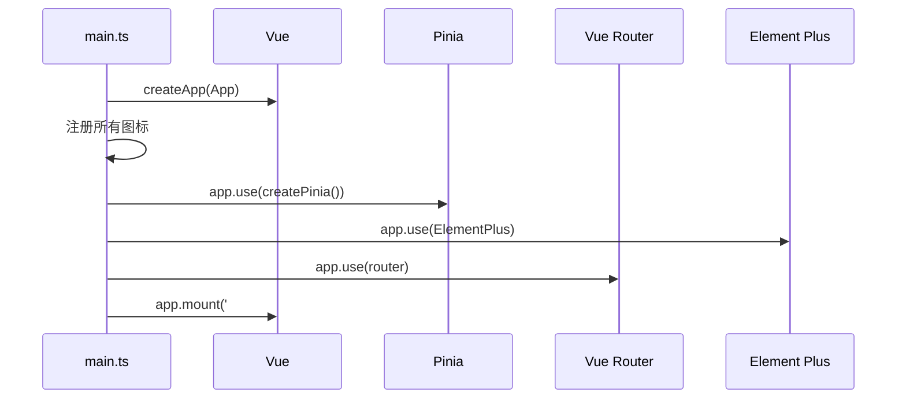
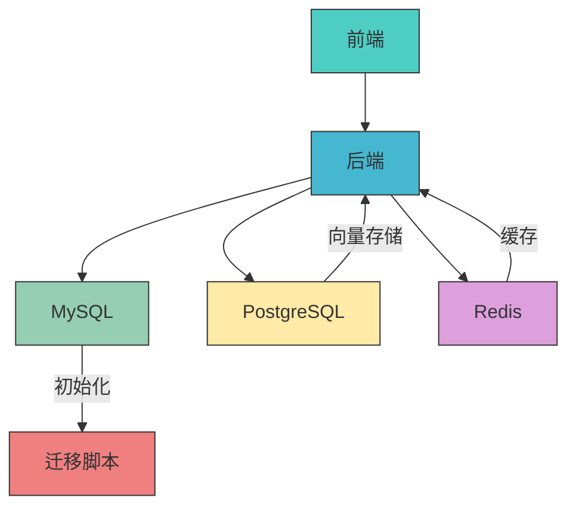

# 项目目录结构

<cite>
**本文档中引用的文件**  
- [main.py](file://backend/app/main.py)
- [main.ts](file://frontend/src/main.ts)
- [docker-compose.yml](file://docker-compose.yml)
- [config.py](file://backend/app/core/config.py)
- [deps.py](file://backend/app/api/deps.py)
- [auth.py](file://backend/app/api/v1/endpoints/auth.py)
- [session.py](file://backend/app/db/session.py)
- [user.ts](file://frontend/src/api/user.ts)
- [router/index.ts](file://frontend/src/router/index.ts)
- [user.ts](file://frontend/src/store/modules/user.ts)
- [Chat/index.vue](file://frontend/src/views/Chat/index.vue)
- [requirements.txt](file://backend/requirements.txt)
</cite>

## 目录

1. [项目结构概览](#项目结构概览)
2. [后端服务 (backend/)](#后端服务-backend)
3. [前端应用 (frontend/)](#前端应用-frontend)
4. [文档中心 (docs/)](#文档中心-docs)
5. [数据库迁移 (migrations/)](#数据库迁移-migrations)
6. [应用启动流程](#应用启动流程)
7. [服务依赖关系](#服务依赖关系)

## 项目结构概览

本项目采用前后端分离的现代化架构设计，主要包含以下核心目录：

- `backend/`：基于 FastAPI 构建的后端服务，提供 RESTful API 接口
- `frontend/`：基于 Vue 3 和 Vite 构建的前端单页应用
- `docs/`：项目文档中心，包含技术文档和用户指南
- `migrations/`：数据库变更脚本，用于初始化和升级数据库结构

项目通过 Docker Compose 进行容器化部署，实现了服务的解耦和可移植性。

## 后端服务 (backend/)

后端服务采用 FastAPI 框架构建，遵循现代 Python Web 应用的最佳实践，具有高性能、类型安全和自动生成 API 文档等特性。

### 核心模块化设计

后端应用的核心逻辑位于 `backend/app/` 目录下，采用清晰的模块化设计：

**目录来源**
- [main.py](file://backend/app/main.py#L1-L35)
- 项目结构

### API 端点 (api/)

`api/` 目录负责定义所有 RESTful API 端点，采用版本化设计（v1），包含以下主要功能模块：

- `auth.py`：用户认证与授权
- `datasource.py`：数据源管理
- `dataset.py`：数据集管理
- `chat.py`：智能对话分析
- `dashboard.py`：看板管理
- `admin.py`：管理员功能
- `deps.py`：依赖注入与安全检查

API 路由通过 `main.py` 中的 `include_router` 方法注册到应用实例中，实现了清晰的路由分发。

**Section sources**
- [main.py](file://backend/app/main.py#L25-L30)
- [auth.py](file://backend/app/api/v1/endpoints/auth.py#L1-L147)

### 核心配置与安全 (core/)

`core/` 目录包含应用的核心配置和安全机制：

- `config.py`：基于 Pydantic Settings 的配置管理，从 `.env` 文件读取配置
- `security.py`：JWT 认证、密码哈希、Token 黑名单等安全功能

配置项包括项目名称、API 版本、JWT 密钥、数据库连接、Redis 缓存、AI 模型参数等。

**Section sources**
- [config.py](file://backend/app/core/config.py#L1-L51)

### 数据库会话管理 (db/)

`db/` 目录负责数据库连接和会话管理：

- `session.py`：创建 SQLAlchemy 引擎和会话工厂，支持 MySQL、PostgreSQL 和 SQLite
- 实现了连接池配置，提高数据库访问性能
- 提供 `get_db()` 依赖函数，用于 FastAPI 的依赖注入

**Section sources**
- [session.py](file://backend/app/db/session.py#L1-L34)

### 数据模型 (models/)

`models/` 目录定义了所有数据库实体模型：

- `base.py`：声明性基类，用于 SQLAlchemy 模型继承
- `metadata.py`：包含 `User` 等核心数据模型
- 模型类映射到数据库表，定义了字段、关系和约束

**Section sources**
- [base.py](file://backend/app/models/base.py#L1-L4)

### 序列化结构 (schemas/)

`schemas/` 目录定义了数据的输入输出结构，基于 Pydantic 模型：

- `user.py`：用户数据结构
- `token.py`：Token 相关结构
- `chat.py`、`dashboard.py` 等：各功能模块的数据结构
- 用于请求验证、响应序列化和类型提示

**Section sources**
- [token.py](file://backend/app/schemas/token.py)
- [user.py](file://backend/app/schemas/user.py)

### 业务逻辑服务 (services/)

`services/` 目录封装了核心业务逻辑：

- `db_inspector.py`：数据库检查器服务
- `vanna_manager.py`：Vanna AI 模型管理服务
- 服务层与 API 端点分离，提高了代码的可测试性和可维护性
- 实现了数据访问逻辑和业务规则

**Section sources**
- [db_inspector.py](file://backend/app/services/db_inspector.py)
- [vanna_manager.py](file://backend/app/services/vanna_manager.py)

## 前端应用 (frontend/)

前端应用基于 Vue 3、Vite、Pinia 和 Element Plus 构建，采用现代化的前端工程化实践。

### 源码组织结构

前端源码位于 `frontend/src/` 目录下，采用功能驱动的组织方式：

**目录来源**
- 项目结构
- [main.ts](file://frontend/src/main.ts#L1-L26)

### 可复用 UI 组件 (components/)

`components/` 目录包含可复用的 UI 组件：

- `Charts/`：图表组件，如 `DynamicChart.vue`
- `DataConnectionHub.vue`：数据连接中心
- `Sidebar.vue`：侧边栏
- `ThemeToggle.vue`：主题切换
- `AddConnectionDialog.vue`：添加连接对话框

这些组件在多个视图中被复用，提高了开发效率和 UI 一致性。

**Section sources**
- [DynamicChart.vue](file://frontend/src/components/Charts/DynamicChart.vue)
- [DataConnectionHub.vue](file://frontend/src/components/DataConnectionHub.vue)

### 页面视图 (views/)

`views/` 目录包含主要的页面视图组件：

- `Chat/`：智能对话分析页面
- `Dashboard/`：看板管理页面
- `Dataset/`：数据集管理页面
- `Login/`：登录页面
- `System/User/`：用户管理页面

每个视图组件负责特定功能模块的 UI 展示和交互逻辑。

**Section sources**
- [Chat/index.vue](file://frontend/src/views/Chat/index.vue#L1-L800)

### HTTP 客户端封装 (api/)

`api/` 目录封装了所有与后端 API 的交互：

- `chat.ts`、`dashboard.ts`、`dataset.ts` 等：各模块的 API 调用
- `user.ts`：用户相关 API
- 统一使用 `http` 工具进行请求，实现了请求拦截、错误处理等

**Section sources**
- [user.ts](file://frontend/src/api/user.ts#L1-L69)

### 路由配置 (router/)

`router/` 目录管理应用的路由：

- `index.ts`：定义所有路由规则和导航守卫
- 实现了基于角色的访问控制（如超级管理员权限）
- 配置了路由元信息，用于页面标题和权限判断

**Section sources**
- [index.ts](file://frontend/src/router/index.ts#L1-L116)

### 状态管理 (store/)

`store/` 目录使用 Pinia 进行全局状态管理：

- `user.ts`：用户状态模块，管理用户信息、Token、权限等
- 实现了用户登录、登出、获取用户信息等操作
- 状态在组件间共享，避免了 prop 逐层传递

**Section sources**
- [user.ts](file://frontend/src/store/modules/user.ts#L1-L81)

## 文档中心 (docs/)

`docs/` 目录是项目的文档中心，按主题组织：

- `backend/`：后端技术文档，如 AI 反馈训练、分析代理、多轮推理等
- `frontend/`：前端用户指南
- `general/`：通用文档，如产品需求、技术栈、项目结构、功能状态

文档采用 Markdown 格式，便于阅读和维护。

**Section sources**
- 项目结构

## 数据库迁移 (migrations/)

`migrations/` 目录包含数据库变更脚本：

- `000_init_schema.sql`：初始化数据库模式
- `001_add_saas_features.sql`：添加 SaaS 功能
- `002_add_user_admin_fields.sql`：添加用户管理字段
- `003_add_training_status_fields.sql`：添加训练状态字段

这些 SQL 脚本在容器启动时自动执行，确保数据库结构的同步。

**Section sources**
- 项目结构

## 应用启动流程

### 后端启动流程

后端应用的启动流程始于 `backend/app/main.py`：

1. 导入 FastAPI 和相关依赖
2. 从 `app.core.config` 加载配置
3. 创建数据库引擎并初始化表结构
4. 创建 FastAPI 应用实例
5. 配置 CORS 中间件
6. 注册各个 API 路由
7. 定义根路径路由

**Diagram sources**
- [main.py](file://backend/app/main.py#L1-L35)
- [config.py](file://backend/app/core/config.py#L1-L51)
- [session.py](file://backend/app/db/session.py#L1-L34)

### 前端启动流程

前端应用的启动流程始于 `frontend/src/main.ts`：

1. 导入 Vue、Pinia、Element Plus 等核心库
2. 创建 Vue 应用实例
3. 注册所有 Element Plus 图标
4. 安装 Pinia（状态管理）
5. 安装 Element Plus（UI 组件库）
6. 安装路由
7. 挂载到 DOM

**Diagram sources**
- [main.ts](file://frontend/src/main.ts#L1-L26)
- [router/index.ts](file://frontend/src/router/index.ts#L1-L116)
- [user.ts](file://frontend/src/store/modules/user.ts#L1-L81)

## 服务依赖关系

项目通过 `docker-compose.yml` 文件定义了多容器服务的依赖关系：

**Diagram sources**
- [docker-compose.yml](file://docker-compose.yml#L1-L141)

### 服务说明

- **MySQL**：主数据库，存储业务数据
- **PostgreSQL**：向量数据库，用于 Vanna AI 模型训练数据存储
- **Redis**：缓存服务，用于 Token 黑名单、结果缓存等
- **Backend**：FastAPI 后端服务，依赖数据库和缓存服务
- **Frontend**：Vue 前端应用，依赖后端 API 服务

### 依赖配置

在 `docker-compose.yml` 中，后端服务通过 `depends_on` 和 `condition: service_healthy` 确保在数据库服务健康后才启动，避免了启动时序问题。

环境变量通过 `.env` 文件注入，实现了配置的外部化和安全性。

**Section sources**
- [docker-compose.yml](file://docker-compose.yml#L1-L141)
- [config.py](file://backend/app/core/config.py#L1-L51)